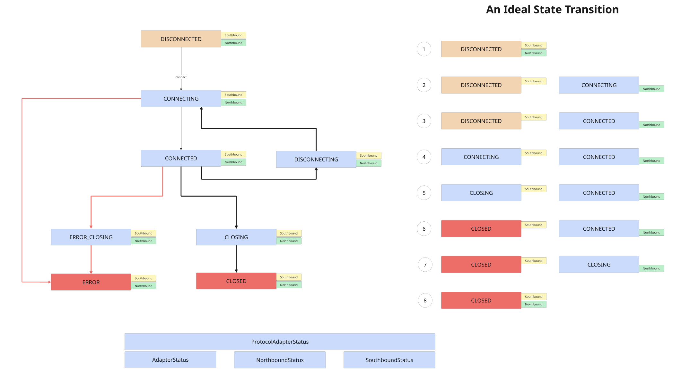

# Protocol Adapter Finite State Machine Specification

## Overview

`ProtocolAdapterFSM` manages three concurrent state machines:

1. **Adapter State** - Lifecycle control (start/stop)
2. **Northbound State** - Connection to HiveMQ broker
3. **Southbound State** - Connection to physical device

All three must coordinate. The adapter controls overall lifecycle. Northbound handles MQTT publishing. Southbound handles device communication.

---

## Adapter State Machine

Four states control adapter lifecycle.

### States

1. **STOPPED**
   - Default state
   - Adapter inactive
   - Transitions: → STARTING

2. **STARTING**
   - Initialization in progress
   - Calls `onStarting()` hook
   - Transitions: → STARTED (success), → STOPPED (failure), → ERROR (non recoverable error)

3. **STARTED**
   - Adapter operational
   - Transitions: → STOPPING, → ERROR (non recoverable error)

4. **STOPPING**
   - Cleanup in progress
   - Calls `onStopping()` hook
   - Transitions: → STOPPED

5. **ERROR**
   - Non-recoverable error, adapter is dead
   - This is a terminal state
   - Transitions: → STARTING

### Transition Rules

```

                    ERROR

STOPPED → STARTING → STARTED → STOPPING → STOPPED
   ↑                                ↓
   └────────────────────────────────┘
```

**Constraint:** Must transition through intermediate states. Cannot jump STOPPED → STARTED.

---

## Connection State Machines

Nine states apply to both northbound and southbound connections. Each connection state machine operates independently but coordinates via the adapter lifecycle.

### States

**Note:** The state-machine.png diagram visualizes these states with color coding for clarity.

1. **DISCONNECTED**
   - No connection established
   - Initial state
   - Transitions: → CONNECTING, → CONNECTED (legacy), → CLOSED (testing)

2. **CONNECTING**
   - Connection attempt in progress
   - Transitions: → CONNECTED, → ERROR, → DISCONNECTED

3. **CONNECTED**
   - Active connection established
   - Data flow operational
   - Transitions: → DISCONNECTING, → CONNECTING, → CLOSING, → ERROR_CLOSING, → DISCONNECTED

4. **DISCONNECTING**
   - Graceful connection teardown
   - Transitions: → DISCONNECTED, → CLOSING

5. **CLOSING**
   - Permanent closure in progress
   - Transitions: → CLOSED

6. **CLOSED**
   - Connection permanently closed
   - Transitions: → DISCONNECTED (restart), → CLOSING (verification)

7. **ERROR**
   - Connection failure
   - Transitions: → CONNECTING (recovery), → DISCONNECTED (abort)

8. **ERROR_CLOSING**
   - Error during closure
   - Transitions: → ERROR

9. **NOT_SUPPORTED**
   - Stateless operation mode
   - No transitions allowed

### Transition Graph



The diagram shows:
- **Left side:** Complete connection state transition graph with all possible states and transitions
- **Right side:** Ideal operational sequence (steps 1-8) showing coordinated northbound and southbound transitions
- **Color coding:**
  - Orange (DISCONNECTED) - Initial/inactive state
  - Blue (CONNECTING, CONNECTED, DISCONNECTING, CLOSING) - Normal operational states
  - Red (ERROR, ERROR_CLOSING, CLOSED) - Error or terminal states

**Ideal Transition Sequence (Right side of diagram, steps 1-8):**
1. **Step 1:** Both connections DISCONNECTED (initial state)
2. **Step 2:** Northbound transitions to CONNECTING while southbound remains DISCONNECTED
3. **Step 3:** Northbound reaches CONNECTED (automatically triggers `startSouthbound()`), southbound still DISCONNECTED
4. **Step 4:** Southbound transitions to CONNECTING, northbound maintains CONNECTED
5. **Step 5:** Southbound transitions to CLOSING (shutdown initiated), northbound maintains CONNECTED
6. **Step 6:** Southbound reaches CLOSED (terminal state), northbound maintains CONNECTED
7. **Step 7:** Northbound transitions to CLOSING, southbound remains CLOSED
8. **Step 8:** Both connections reach CLOSED (shutdown complete)

**ASCII Alternative:**
```
                    ┌──────┐
                    │ERROR │←──────┐
                    └───┬──┘       │
                        │          │
    ┌──DISCONNECTED──┐  ↓          │
    │                │  │          │
    ↓                │  ↓      ┌────────────┐
CONNECTING ←─────────┴─→CONNECTED→ERROR_CLOSING
    │                    │          │
    ↓                    ↓          ↓
DISCONNECTED        DISCONNECTING   ERROR
    ↑                    │
    │                    ↓
    │               DISCONNECTED
    │                    │
CLOSED←─CLOSING←─────────┘
  │       ↑
  └───────┘
```

---

## Operational Sequences

### Startup Sequence

1. Initial state: Adapter STOPPED, both connections DISCONNECTED
2. Call `startAdapter()`
   - Adapter → STARTING
   - Execute `onStarting()`
   - Adapter → STARTED (success) or STOPPED (failure)
3. Transition northbound: DISCONNECTED → CONNECTING → CONNECTED
4. Automatic southbound start when northbound reaches CONNECTED
   - `startSouthbound()` called automatically
   - Override to control behavior

### Normal Operation

```
Adapter:      STARTED
Northbound:   CONNECTED
Southbound:   CONNECTED
```

### Connection Failure (Northbound)

```
Adapter:      STARTED
Northbound:   ERROR
Southbound:   DISCONNECTED
```

Southbound never starts because northbound failed to reach CONNECTED.

### Connection Failure (Southbound)

```
Adapter:      STARTED
Northbound:   CONNECTED
Southbound:   ERROR
```

Valid state. Adapter can communicate with broker but not with device.

### Shutdown Sequence

**Option 1: Adapter Stop Only**
1. Call `stopAdapter()`
   - Adapter → STOPPING
   - Execute `onStopping()`
   - Adapter → STOPPED
2. Connection states preserved
   - Connections maintain current state after adapter stops
   - Northbound and southbound remain in their current states (e.g., CONNECTED)

**Option 2: Full Connection Closure (Ideal Sequence)**
1. Close southbound connection
   - Southbound: CONNECTED → CLOSING → CLOSED
2. Close northbound connection
   - Northbound: CONNECTED → CLOSING → CLOSED
3. Stop adapter
   - Adapter → STOPPING → STOPPED

The diagram's "Ideal State Transition" (steps 5-8) demonstrates Option 2, where connections are explicitly closed before stopping the adapter. This ensures clean resource cleanup and proper connection termination.

---

## API Methods

### Adapter Lifecycle

- `startAdapter()` - Transition STOPPED → STARTING → STARTED
- `stopAdapter()` - Transition STARTED → STOPPING → STOPPED
- `onStarting()` - Override for initialization logic
- `onStopping()` - Override for cleanup logic

### Northbound Control

- `transitionNorthboundState(ConnectionStatus)` - Manual state transition
- `accept(ConnectionStatus)` - Transition + trigger southbound on CONNECTED
- `startDisconnecting()` - Begin graceful disconnect
- `startClosing()` - Begin permanent closure
- `startErrorClosing()` - Error-state closure
- `markAsClosed()` - Confirm CLOSED state
- `recoverFromError()` - Attempt recovery from ERROR
- `restartFromClosed()` - Restart from CLOSED state

### Southbound Control

- `transitionSouthboundState(ConnectionStatus)` - Manual state transition
- `startSouthbound()` - Override to implement southbound startup logic
- `startSouthboundDisconnecting()`
- `startSouthboundClosing()`
- `startSouthboundErrorClosing()`
- `markSouthboundAsClosed()`
- `recoverSouthboundFromError()`
- `restartSouthboundFromClosed()`

### State Queries

- `getNorthboundConnectionStatus()` - Current northbound state
- `getSouthboundConnectionStatus()` - Current southbound state
- `getAdapterState()` - Current adapter state

---

## Concurrency

### Thread Safety

- State transitions use `AtomicReference` with `compareAndSet`
- Multiple threads can safely call transition methods
- CAS loop ensures atomic state updates
- Return value indicates success/failure

### Example

```java
boolean success = fsm.transitionNorthboundState(StateEnum.CONNECTING);
if (!success) {
    // Another thread changed state concurrently
    // Handle race condition
}
```

### State Listeners

- Register listeners via `registerAdapterStateListener()` or `registerConnectionStateListener()`
- Listeners use `CopyOnWriteArrayList` - thread-safe during iteration
- Can add/remove listeners during state transitions

---

## Implementation Requirements

### Adapter Implementation

```java
public class MyAdapter extends ProtocolAdapterFSM {

    @Override
    protected boolean onStarting() {
        // Initialize resources
        // Return true on success, false on failure
        return initializeConnection();
    }

    @Override
    protected void onStopping() {
        // Clean up resources
        closeConnection();
    }

    @Override
    public boolean startSouthbound() {
        // Called automatically when northbound reaches CONNECTED
        return transitionSouthboundState(StateEnum.CONNECTING);
    }
}
```

### State Transition Logic

```java
// Start adapter
fsm.startAdapter();

// Connect northbound
fsm.transitionNorthboundState(StateEnum.CONNECTING);
fsm.transitionNorthboundState(StateEnum.CONNECTED);

// Southbound starts automatically via startSouthbound()

// Stop adapter
fsm.stopAdapter();
```

---

## Valid State Combinations

| Adapter State | Northbound     | Southbound     | Valid | Notes |
|---------------|----------------|----------------|-------|-------|
| STOPPED       | DISCONNECTED   | DISCONNECTED   | Yes   | Initial state |
| STARTING      | DISCONNECTED   | DISCONNECTED   | Yes   | Startup in progress |
| STARTED       | CONNECTED      | CONNECTED      | Yes   | Normal operation |
| STARTED       | CONNECTED      | ERROR          | Yes   | Device communication failed |
| STARTED       | ERROR          | DISCONNECTED   | Yes   | Broker communication failed |
| STARTED       | DISCONNECTED   | CONNECTED      | No    | Invalid - northbound must connect first |
| STOPPING      | *              | *              | Yes   | Any connection state during shutdown |

---

## Validation Rules

1. **Adapter must be STARTED** before northbound/southbound transitions
2. **Transitions must follow** `possibleTransitions` map
3. **Cannot skip intermediate states** in adapter lifecycle
4. **Southbound activation** requires northbound CONNECTED state
5. **Return values** indicate transition success - must be checked

---

## Error Handling

### Transition Failures

```java
// Check return value
if (!fsm.transitionNorthboundState(StateEnum.CONNECTED)) {
    log.error("Transition failed - state changed concurrently");
    // Retry or handle error
}
```

### Illegal Transitions

```java
// Throws IllegalStateException
try {
    fsm.transitionNorthboundState(StateEnum.CLOSING); // From DISCONNECTED
} catch (IllegalStateException e) {
    log.error("Invalid transition: " + e.getMessage());
}
```

### Startup Failures

```java
@Override
protected boolean onStarting() {
    try {
        initializeResources();
        return true;
    } catch (Exception e) {
        log.error("Startup failed", e);
        return false; // Adapter transitions to STOPPED
    }
}
```

---

## Testing Scenarios

### Test 1: Legacy Connection

```java
fsm.startAdapter();
fsm.accept(StateEnum.CONNECTED); // Direct jump to CONNECTED
// Southbound: DISCONNECTED (startSouthbound() not implemented)
```

### Test 2: Standard Connection Flow

```java
fsm.startAdapter();
fsm.accept(StateEnum.CONNECTING);
fsm.accept(StateEnum.CONNECTED);
// Southbound: Starts automatically
```

### Test 3: Northbound Error

```java
fsm.startAdapter();
fsm.transitionNorthboundState(StateEnum.CONNECTING);
fsm.transitionNorthboundState(StateEnum.ERROR);
// Southbound: DISCONNECTED (never started)
```

### Test 4: Southbound Error

```java
fsm.startAdapter();
fsm.accept(StateEnum.CONNECTED); // Northbound CONNECTED
// startSouthbound() called automatically
fsm.transitionSouthboundState(StateEnum.CONNECTING);
fsm.transitionSouthboundState(StateEnum.ERROR);
// Northbound: Still CONNECTED
// Southbound: ERROR
```

---

## State Transition Tables

### Adapter State Transitions

| From     | To       | Method            | Condition |
|----------|----------|-------------------|-----------|
| STOPPED  | STARTING | `startAdapter()`  | Always    |
| STARTING | STARTED  | Internal          | `onStarting()` returns true |
| STARTING | STOPPED  | Internal          | `onStarting()` returns false |
| STARTED  | STOPPING | `stopAdapter()`   | Always    |
| STOPPING | STOPPED  | Internal          | After `onStopping()` |

### Connection State Transitions

| From            | To              | Allowed |
|-----------------|-----------------|---------|
| DISCONNECTED    | CONNECTING      | Yes     |
| DISCONNECTED    | CONNECTED       | Yes (legacy) |
| DISCONNECTED    | CLOSED          | Yes (testing) |
| CONNECTING      | CONNECTED       | Yes     |
| CONNECTING      | ERROR           | Yes     |
| CONNECTING      | DISCONNECTED    | Yes     |
| CONNECTED       | DISCONNECTING   | Yes     |
| CONNECTED       | CONNECTING      | Yes     |
| CONNECTED       | CLOSING         | Yes     |
| CONNECTED       | ERROR_CLOSING   | Yes     |
| CONNECTED       | DISCONNECTED    | Yes     |
| DISCONNECTING   | DISCONNECTED    | Yes     |
| DISCONNECTING   | CLOSING         | Yes     |
| CLOSING         | CLOSED          | Yes     |
| CLOSED          | DISCONNECTED    | Yes     |
| CLOSED          | CLOSING         | Yes     |
| ERROR           | CONNECTING      | Yes     |
| ERROR           | DISCONNECTED    | Yes     |
| ERROR_CLOSING   | ERROR           | Yes     |
| NOT_SUPPORTED   | *               | No      |

---

## Common Implementation Errors

### Error 1: Adapter Not Started

```java
// Incorrect
fsm.transitionNorthboundState(StateEnum.CONNECTING);
// Throws IllegalStateException - adapter not started

// Correct
fsm.startAdapter();
fsm.transitionNorthboundState(StateEnum.CONNECTING);
```

### Error 2: Ignoring Return Values

```java
// Incorrect
fsm.transitionNorthboundState(StateEnum.CONNECTING);
// May fail silently due to concurrent modification

// Correct
boolean success = fsm.transitionNorthboundState(StateEnum.CONNECTING);
if (!success) {
    // Handle race condition
}
```

### Error 3: Missing startSouthbound Implementation

```java
// Incorrect
@Override
public boolean startSouthbound() {
    log.info("Starting southbound");
    return true; // Doesn't actually transition state
}

// Correct
@Override
public boolean startSouthbound() {
    return transitionSouthboundState(StateEnum.CONNECTING);
}
```

---

## Key Constraints

1. Adapter state transitions are sequential - no state skipping
2. Northbound must reach CONNECTED before southbound starts
3. Connection states allow multiple valid transition paths
4. All transitions are atomic via CAS operations
5. State listeners execute synchronously during transitions
6. Adapter ID included in all log messages for debugging

---

## Summary

The `ProtocolAdapterFSM` coordinates three state machines with defined transition rules. Adapter state controls lifecycle. Northbound handles broker communication. Southbound handles device communication. All operations are thread-safe. State transitions must follow defined paths. Return values indicate success. Override `onStarting()`, `onStopping()`, and `startSouthbound()` to implement adapter-specific behavior.
