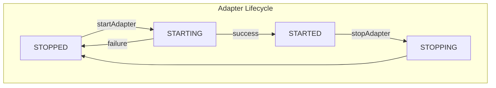
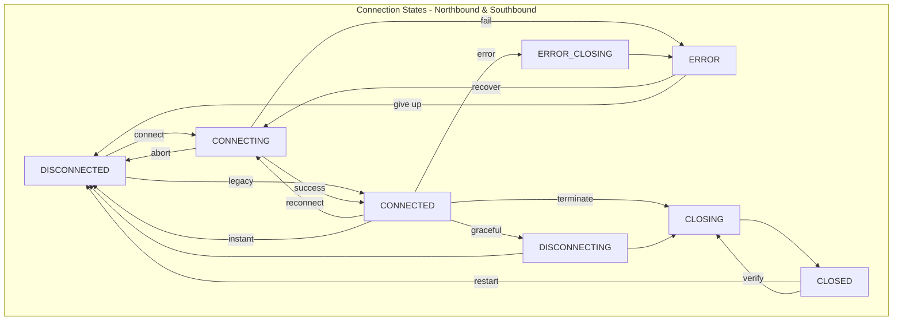
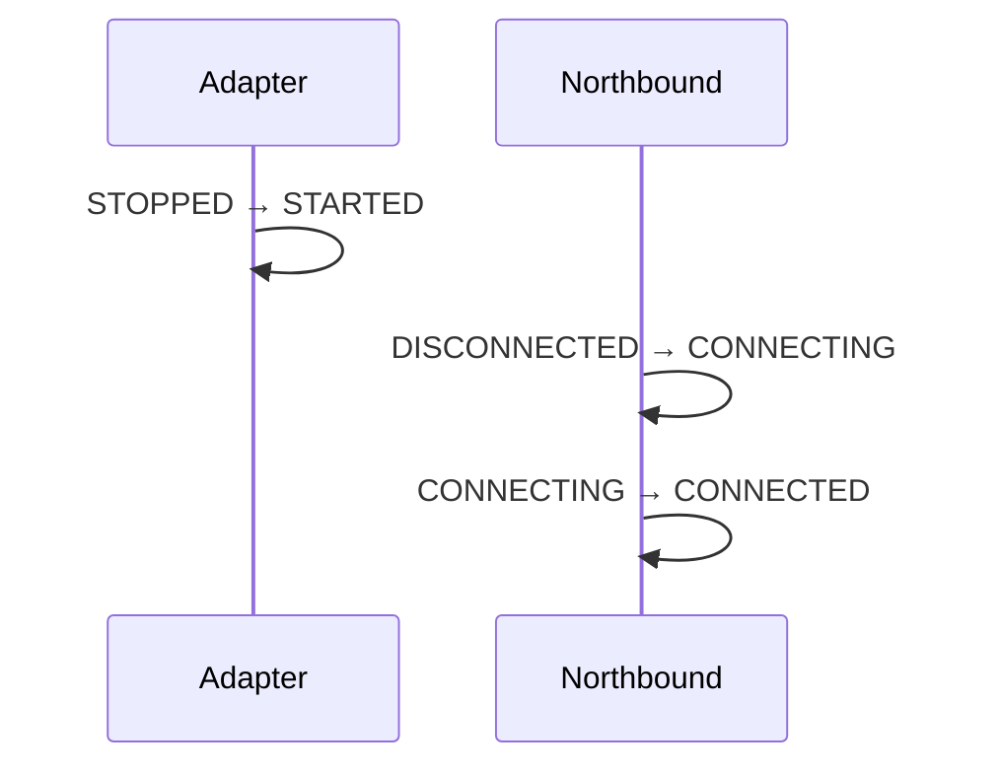
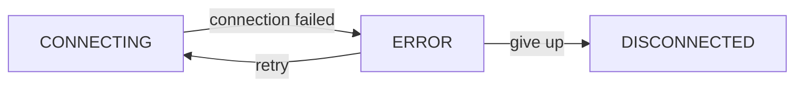
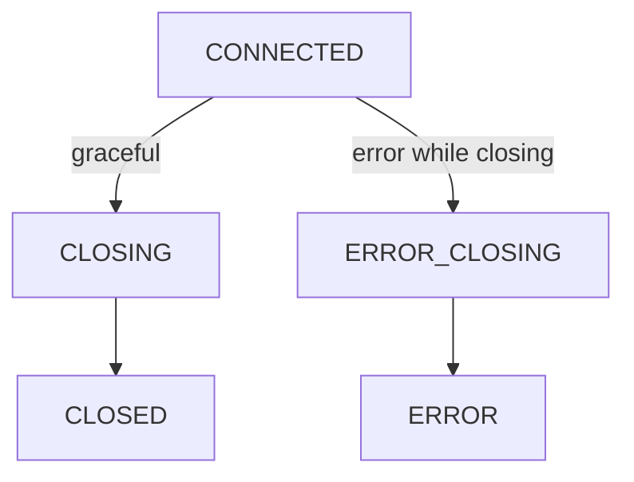
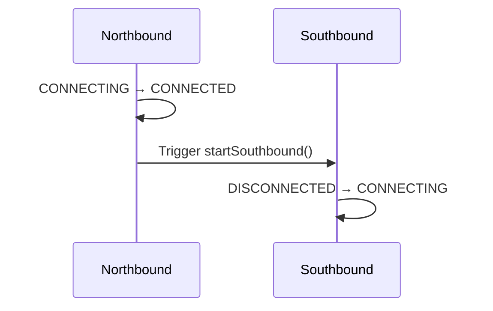
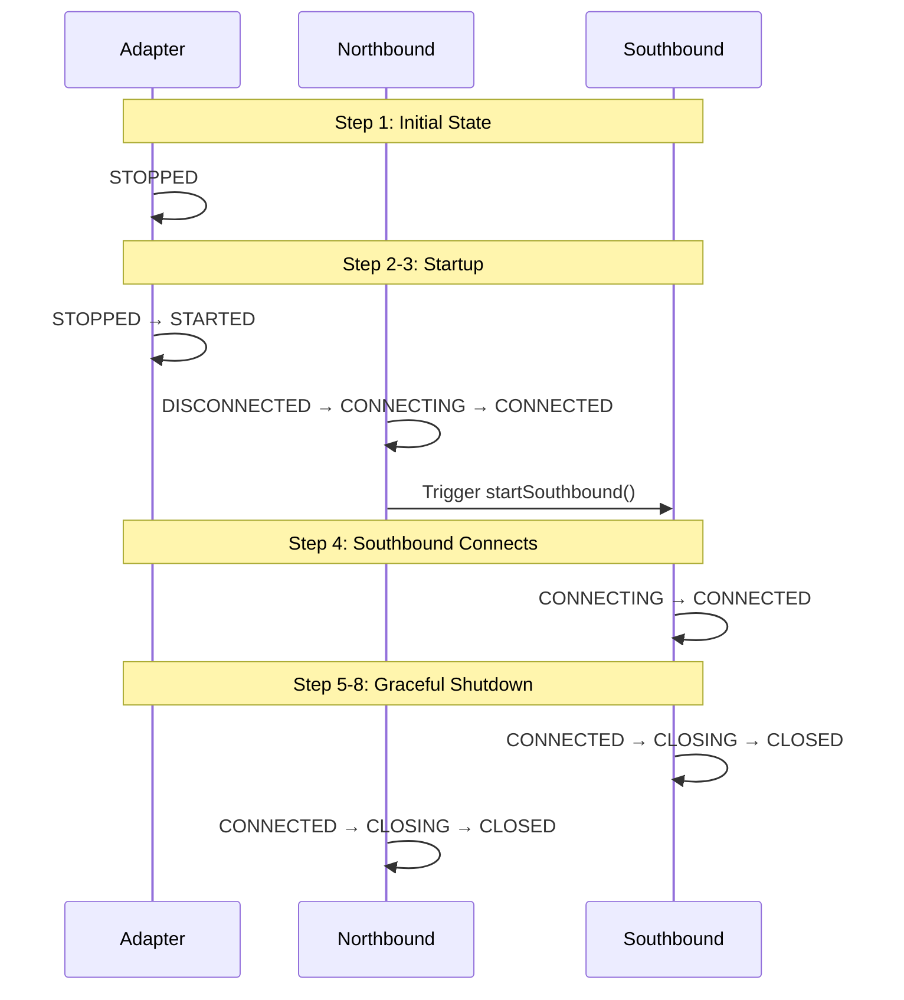
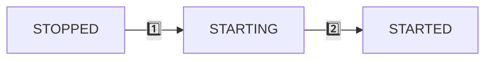
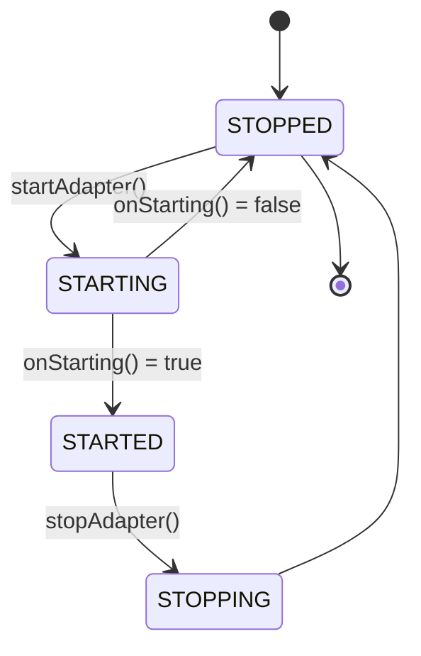
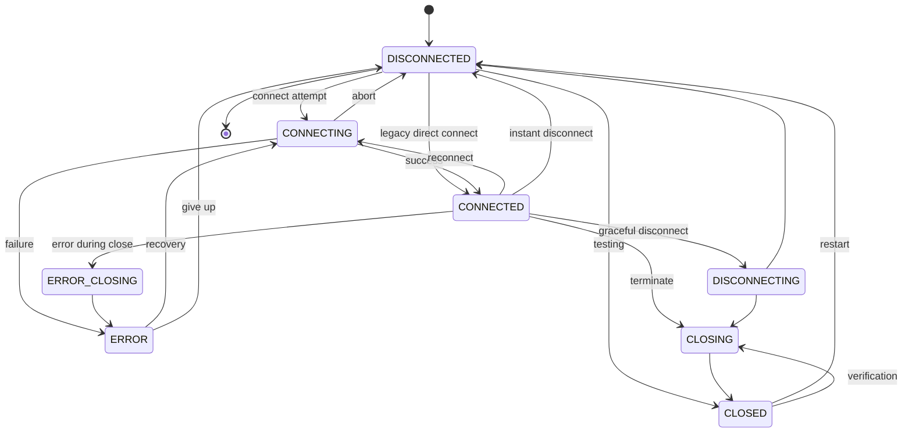

# Understanding Protocol Adapter State Machines: A Test-Driven Journey

*5 min read • Learn how three coordinated state machines manage adapter lifecycle and connections*

---

## What Are We Building?

Protocol adapters connect HiveMQ Edge to physical devices. They need to manage:
1. **Adapter lifecycle** (starting/stopping)
2. **Northbound connection** (to MQTT broker)
3. **Southbound connection** (to physical device)

These three state machines coordinate to ensure reliable communication. Let's explore them through their tests.

---

## The Three State Machines





---

## Adapter Lifecycle: The Boss

The adapter lifecycle controls everything. No connections can transition without the adapter being STARTED.

### Test: Successful Startup

```java
@Test
void adapter_successfulStartup() {
    fsm.startAdapter();
    assertState(fsm, STARTED, DISCONNECTED, DISCONNECTED);
}
```

**What happens:**
- Initial: `STOPPED → STARTING → STARTED`
- Connections stay `DISCONNECTED`
- Ready to establish connections

### Test: Failed Startup

```java
@Test
void adapter_failedStartup_returnsToStopped() {
    // onStarting() returns false
    fsm.startAdapter();
    assertState(fsm, STOPPED, DISCONNECTED, DISCONNECTED);
}
```

**What happens:**
- Attempted: `STOPPED → STARTING → STOPPED`
- Initialization failed, rolled back
- Connections never activated

### Test: Stop Preserves Connections

```java
@Test
void adapter_stopPreservesConnectionStates() {
    fsm.startAdapter();
    fsm.transitionNorthboundState(CONNECTED);
    fsm.stopAdapter();

    assertState(fsm, STOPPED, CONNECTED, DISCONNECTED);
}
```

**Key insight:** Stopping the adapter doesn't disconnect connections. They maintain their state.

---

## Northbound: Connection to MQTT Broker

Northbound manages the connection to HiveMQ broker. It has the most complex state graph.

### Test: Standard Connection Flow

```java
@Test
void northbound_standardConnectFlow() {
    fsm.startAdapter();
    fsm.accept(CONNECTING);
    fsm.accept(CONNECTED);
}
```



### Test: Legacy Direct Connect

```java
@Test
void northbound_legacyDirectConnect() {
    fsm.startAdapter();
    fsm.accept(CONNECTED);  // Skip CONNECTING
}
```

**Why:** Backward compatibility. Old code could jump directly to CONNECTED.

### Test: Error Handling

```java
@Test
void northbound_errorRecovery() {
    fsm.startAdapter();
    fsm.transitionNorthboundState(CONNECTING);
    fsm.transitionNorthboundState(ERROR);

    fsm.recoverFromError();  // ERROR → CONNECTING
}
```

**The error recovery cycle:**


### Test: Graceful Shutdown

```java
@Test
void northbound_closingSequence() {
    fsm.transitionNorthboundState(CONNECTED);
    fsm.startClosing();      // CONNECTED → CLOSING
    fsm.markAsClosed();      // CLOSING → CLOSED
}
```

### Test: Emergency Shutdown

```java
@Test
void northbound_errorClosingSequence() {
    fsm.transitionNorthboundState(CONNECTED);
    fsm.startErrorClosing();  // CONNECTED → ERROR_CLOSING
    // ERROR_CLOSING → ERROR
}
```

**Two shutdown paths:**


### Test: Reconnection

```java
@Test
void northbound_reconnectFromConnected() {
    fsm.transitionNorthboundState(CONNECTED);
    fsm.transitionNorthboundState(CONNECTING);  // Reconnect
}
```

**Use case:** Connection degraded, attempt reconnection without full disconnect.

---

## Southbound: Connection to Physical Device

Southbound mirrors northbound but has a special behavior: **automatic activation**.

### Test: Automatic Start

```java
@Test
void southbound_startsWhenNorthboundConnects() {
    fsm = createFSMWithAutoSouthbound();
    fsm.startAdapter();
    fsm.accept(CONNECTED);  // Northbound connects

    // Southbound automatically starts CONNECTING
}
```

**Why:** Device connection only makes sense when broker connection is established.



### Test: Southbound Error While Northbound Connected

```java
@Test
void southbound_errorWhileNorthboundConnected() {
    fsm.accept(CONNECTED);  // Northbound OK
    // Southbound transitions to ERROR asynchronously

    assertState(fsm, STARTED, CONNECTED, ERROR);
}
```

**This is valid!** Broker connection works, device doesn't. Adapter can receive commands but can't execute them.

### Test: Full Lifecycle

```java
@Test
void southbound_fullLifecycle() {
    fsm.accept(CONNECTED);                      // Auto-start
    fsm.transitionSouthboundState(CONNECTED);   // Connection succeeds
    fsm.startSouthboundClosing();               // Begin shutdown
    fsm.markSouthboundAsClosed();               // Complete shutdown
}
```


---

## Coordination: The Ideal Shutdown Sequence

The most complex test demonstrates all three state machines coordinating.

```java
@Test
void diagramSequence_idealShutdown() {
    // Step 1: Initial state
    assertState(fsm, STOPPED, DISCONNECTED, DISCONNECTED);

    // Step 2: Start adapter, begin northbound connection
    fsm.startAdapter();
    fsm.transitionNorthboundState(CONNECTING);

    // Step 3: Northbound connects (triggers southbound)
    fsm.accept(CONNECTED);

    // Step 4: Southbound connects
    fsm.transitionSouthboundState(CONNECTED);

    // Step 5: Close southbound first
    fsm.startSouthboundClosing();

    // Step 6: Southbound closed
    fsm.markSouthboundAsClosed();

    // Step 7: Close northbound
    fsm.startClosing();

    // Step 8: Northbound closed
    fsm.markAsClosed();
}
```



**Why this order?** Close device connection before broker connection. Ensures clean resource cleanup.

---

## Error Scenarios

### Test: Northbound Fails, Southbound Never Starts

```java
@Test
void northbound_errorState() {
    fsm.startAdapter();
    fsm.accept(CONNECTING);
    fsm.accept(ERROR);

    assertState(fsm, STARTED, ERROR, DISCONNECTED);
}
```

**Southbound stays DISCONNECTED** because northbound never reached CONNECTED.

### Test: Concurrent State Changes

```java
@Test
void concurrentTransition_casFailure() {
    fsm.transitionNorthboundState(CONNECTING);
    fsm.transitionNorthboundState(CONNECTED);    // Succeeds
    fsm.transitionNorthboundState(CONNECTING);   // Also succeeds (reconnect)
}
```

**Thread-safe:** Uses atomic compare-and-set operations. Multiple threads can safely transition states.

---

## Invalid Transitions

Not all transitions are allowed. Tests verify enforcement:

```java
@Test
void invalidTransition_disconnectedToClosing() {
    fsm.startAdapter();
    assertThatThrownBy(() -> fsm.transitionNorthboundState(CLOSING))
        .isInstanceOf(IllegalStateException.class);
}
```

**Rule:** Cannot close what isn't connected. Must go through CONNECTED first.

```java
@Test
void invalidTransition_connectingToErrorClosing() {
    fsm.transitionNorthboundState(CONNECTING);
    assertThatThrownBy(() -> fsm.transitionNorthboundState(ERROR_CLOSING))
        .isInstanceOf(IllegalStateException.class);
}
```

**Rule:** ERROR_CLOSING only valid from CONNECTED state.

---

## State Observers

### Test: Notifications

```java
@Test
void stateListener_multipleNotifications() {
    fsm.registerStateTransitionListener(state -> stateCount.incrementAndGet());

    fsm.startAdapter();                          // +2 (STOPPED→STARTING→STARTED)
    fsm.transitionNorthboundState(CONNECTING);   // +1
    fsm.transitionNorthboundState(CONNECTED);    // +1

    assertThat(stateCount.get()).isEqualTo(4);
}
```

**Key insight:** `startAdapter()` triggers **two** transitions internally.



### Test: Unregister

```java
@Test
void stateListener_unregister() {
    fsm.registerStateTransitionListener(listener);
    fsm.startAdapter();  // Notified

    fsm.unregisterStateTransitionListener(listener);
    fsm.transitionNorthboundState(CONNECTING);  // NOT notified
}
```

---

## State Machine Properties

From analyzing the tests, we can identify key properties:

### 1. **Thread-Safety**
All transitions use atomic operations. Concurrent calls are safe.

### 2. **Separation of Concerns**
Three independent state machines coordinate via triggers, not tight coupling.

### 3. **Fail-Safe**
- Startup failure returns to STOPPED
- Error states have recovery paths
- Invalid transitions throw exceptions

### 4. **Flexibility**
- Legacy direct-connect supported
- Multiple shutdown paths (graceful, error, instant)
- Reconnection without full disconnect

### 5. **Observability**
State listeners enable monitoring and reactive behavior.

---

## Complete State Graphs

### Adapter States



### Connection States (Both Northbound & Southbound)



---

## Key Takeaways

1. **Three coordinated state machines** manage adapter lifecycle and bi-directional connections
2. **Adapter must be STARTED** before connections can transition
3. **Northbound triggers southbound** when reaching CONNECTED state
4. **Error states have recovery paths** - systems can self-heal
5. **Multiple shutdown paths** handle graceful and emergency scenarios
6. **Thread-safe by design** using atomic operations
7. **State preservation** when adapter stops - connections maintain state
8. **Observability built-in** via state transition listeners

---

## Test Coverage

**32 tests** verify:
- ✅ Adapter lifecycle (startup, failure, stop)
- ✅ Northbound transitions (13 scenarios)
- ✅ Southbound transitions (7 scenarios)
- ✅ Invalid transition rejection (3 guards)
- ✅ State listeners (register, notify, unregister)
- ✅ Concurrent modifications (CAS validation)
- ✅ Ideal shutdown sequence (8-step coordination)

---

*Read the code: [`ProtocolAdapterFSMTest.java`](src/test/java/com/hivemq/fsm/ProtocolAdapterFSMTest.java)*
