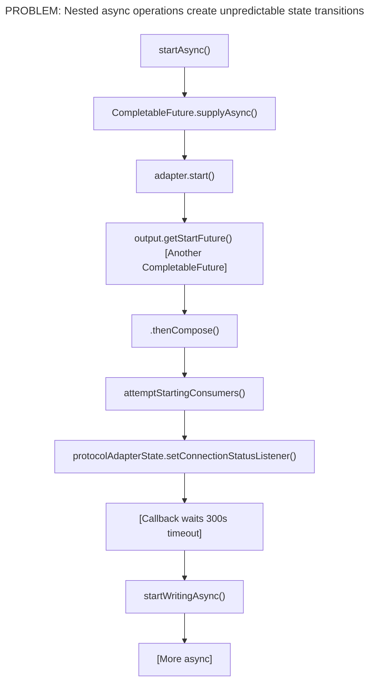
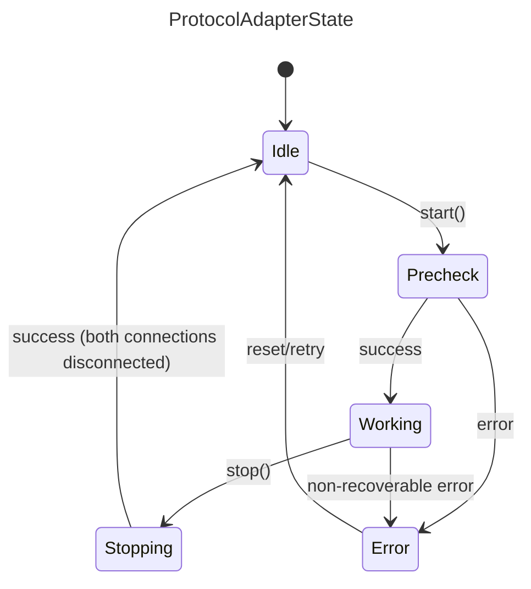
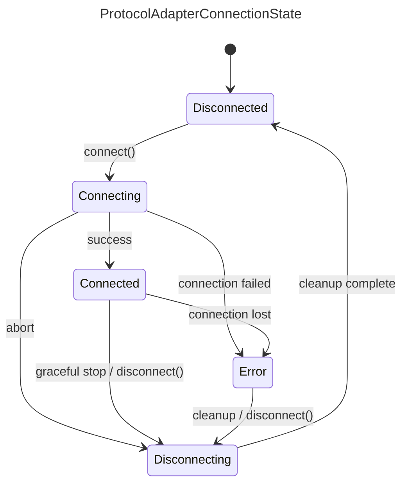
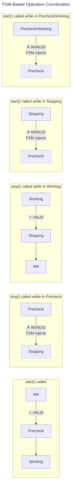

# Protocol Adapter FSM Redesign Plan

## Executive Summary

This document outlines the redesign of the Protocol Adapter state management system from an async-heavy,
callback-based architecture to a clean, synchronous FSM-based architecture. The goal is to eliminate the
complexity introduced by CompletableFuture chains, timeouts, and callback listeners while maintaining
full feature parity.

---

## 1. Analysis of Current Design Problems

### 1.1 Async Operation Complexity

The current `ProtocolAdapterWrapper` suffers from:



**Specific Issues:**

1. **Race Conditions**: The `shuttingDown` flag and `AtomicBoolean futureCompleted` are workarounds for
   async operations completing after stop is initiated.

2. **Timeout Complexity**: A 300-second `ScheduledExecutorService` timeout waits for the adapter to
   reach CONNECTED/STATELESS before enabling writing.

3. **Callback Chaos**: `ConnectionStatusListener` callback must filter initial status, handle multiple
   status types, and coordinate with timeouts.

4. **Unpredictable Transitions**: State changes can happen from any thread at any time, making debugging
   and reasoning about the system difficult.

5. **Error Recovery Complexity**: `stopAfterFailedStart()` must manually clean up polling, writing, and
   call adapter.stop() to handle partial startup failures.

### 1.2 State Dimension Confusion

Current design has **two independent state dimensions**:
- `RuntimeStatus`: STARTED, STOPPED
- `ConnectionStatus`: CONNECTED, DISCONNECTED, STATELESS, UNKNOWN, ERROR, CONNECTING

This creates **ambiguous states** like:
- RuntimeStatus=STARTED + ConnectionStatus=ERROR (Is the adapter running or not?)
- RuntimeStatus=STOPPED + ConnectionStatus=CONNECTED (How can it be connected if stopped?)

### 1.3 Missing State Machine Enforcement

Current design uses `OperationState` enum (IDLE, STARTING, STOPPING) as a guard against concurrent
operations, but it doesn't enforce valid state transitions. Invalid transitions fail silently or
cause unpredictable behavior.

---

## 2. New FSM Design Philosophy

### 2.1 Core Principles

1. **Synchronous by Default**: All state transitions are synchronous. Async operations are pushed to
   the edges (adapter implementation).

2. **Single Source of Truth**: One state machine per component, not multiple state dimensions.

3. **Explicit Transitions**: All valid transitions are defined and enforced by the FSM.

4. **Clear Ownership**:
   - `ProtocolAdapterWrapper2` owns `ProtocolAdapterState` and `ProtocolAdapterConnectionState` (×2: Northbound + Southbound)
   - `ProtocolAdapterManager2` manages the lifecycle of `ProtocolAdapterWrapper2` instances

5. **Separation of Concerns**: The wrapper calls `ProtocolAdapter2.connect()` / `disconnect()`,
   not the other way around.

6. **Optional Southbound Support**: Not all protocol adapters support Southbound communication.
   Adapters that only support Northbound (read-only) do not manage a southbound connection state.

### 2.2 Handling Adapters Without Southbound Support

**Important**: Not all protocol adapters support Southbound (MQTT → Device) communication.

| Adapter Type | Northbound | Southbound |
| ------------ | ---------- | ---------- |
| OPC UA       | ✅ Yes      | ✅ Yes      |
| Modbus       | ✅ Yes      | ❌ No       |
| HTTP         | ✅ Yes      | ❌ No       |
| File         | ✅ Yes      | ❌ No       |
| S7/ADS       | ✅ Yes      | ❌ No       |
| EtherIP      | ✅ Yes      | ❌ No       |
| MTConnect    | ✅ Yes      | ❌ No       |
| Database     | ✅ Yes      | ❌ No       |

**Design Decision**: For adapters without Southbound support:
- The `southboundConnectionState` remains `Disconnected` (never transitions)
- `startSouthbound()` returns `true` immediately (no-op)
- `stopSouthbound()` returns `true` immediately (no-op)
- The adapter's `supportsSouthbound()` method returns `false`
- When checking "both connections Disconnected", we treat non-existent southbound as Disconnected

```java
// Example: Checking if adapter can transition to Idle
boolean canTransitionToIdle() {
    boolean northboundReady = northboundState.isDisconnected();
    boolean southboundReady = !supportsSouthbound() || southboundState.isDisconnected();
    return northboundReady && southboundReady;
}
```

### 2.3 State Machine Definitions

#### ProtocolAdapterState (Manager Level)



Valid Transitions:
- Idle → Precheck (start called)
- Precheck → Working (precheck success)
- Precheck → Error (precheck failed)
- Working → Stopping (stop called)
- Working → Error (non-recoverable error)
- Stopping → Idle (both connections disconnected)
- Error → Idle (reset/retry)

#### ProtocolAdapterConnectionState (Wrapper Level, ×2)



Valid Transitions:
- Disconnected → Connecting
- Connecting → Connected (success)
- Connecting → Error (connection failed)
- Connecting → Disconnecting (abort)
- Connected → Error (connection lost)
- Connected → Disconnecting (graceful stop)
- Error → Disconnecting (cleanup)
- Disconnecting → Disconnected (cleanup complete)

---

## 3. Component Redesign

### 3.1 ProtocolAdapter2 Interface

Create a new interface that separates concerns more clearly:

```java
/**
 * ProtocolAdapter2 - Simplified protocol adapter interface
 *
 * Key differences from ProtocolAdapter:
 * 1. connect() returns synchronously or throws - no CompletableFuture
 * 2. disconnect() returns synchronously or throws - no CompletableFuture
 * 3. Connection state is managed by the caller (ProtocolAdapterWrapper2)
 * 4. Adapter should NOT manage its own state
 */
public interface ProtocolAdapter2 {

    /**
     * Get the adapter's unique identifier.
     */
    @NotNull String getId();

    /**
     * Get adapter information (protocol type, capabilities, etc.)
     */
    @NotNull ProtocolAdapterInformation getProtocolAdapterInformation();

    /**
     * Check if this adapter supports Southbound (MQTT → Device) communication.
     *
     * @return true if southbound is supported, false if this is a read-only adapter
     */
    default boolean supportsSouthbound() {
        return false;  // Default: northbound only
    }

    /**
     * Validate configuration before connecting.
     * Called during Precheck phase.
     *
     * @throws ProtocolAdapterException if configuration is invalid
     */
    void precheck() throws ProtocolAdapterException;

    /**
     * Establish connection to the device/service.
     * Called for BOTH northbound and southbound connections.
     *
     * This method should:
     * - Establish the physical/logical connection
     * - Validate connectivity (handshake, auth, etc.)
     * - Return when connection is ready
     * - Throw on any failure
     *
     * @param direction the connection direction (northbound vs southbound)
     * @throws ProtocolAdapterException on connection failure
     */
    void connect(@NotNull ProtocolAdapterConnectionDirection direction) throws ProtocolAdapterException;

    /**
     * Disconnect from the device/service.
     *
     * This method should:
     * - Gracefully close the connection
     * - Release resources
     * - Return when cleanup is complete
     * - NOT throw on failure (log errors instead)
     *
     * @param direction the connection direction (northbound vs southbound)
     */
    void disconnect(@NotNull ProtocolAdapterConnectionDirection direction);

    /**
     * Destroy the adapter instance.
     * Called after both connections are disconnected.
     * Release ALL resources including configuration.
     */
    void destroy();

    /**
     * Poll data from device (for PollingProtocolAdapter implementations).
     * Called by the polling service when adapter is in Connected state.
     */
    default void poll(@NotNull PollingInput input, @NotNull PollingOutput output) {
        output.notSupported();
    }

    /**
     * Write data to device (for WritingProtocolAdapter implementations).
     * Called by the writing service when adapter is in Connected state.
     */
    default void write(@NotNull WritingInput input, @NotNull WritingOutput output) {
        output.notSupported();
    }

    /**
     * Discover available tags/addresses on the device.
     */
    default void discover(@NotNull DiscoveryInput input, @NotNull DiscoveryOutput output) {
        output.notSupported();
    }
}

/**
 * Direction of a protocol adapter connection.
 */
public enum ProtocolAdapterConnectionDirection {
    Northbound,
    Southbound;

    public boolean isNorthbound() { return this == Northbound; }
    public boolean isSouthbound() { return this == Southbound; }
}
```

### 3.2 ProtocolAdapterWrapper2 Redesign

> **Implementation Status**: ✅ Complete. `ProtocolAdapterWrapper2` includes: FSM-based state management
> with synchronized transitions, full start/stop lifecycle (precheck → connect → services → disconnect),
> southbound capability checks, `ProtocolAdapterStateChangeListener` notifications via `CopyOnWriteArrayList`,
> protected service lifecycle hooks (`startPolling`/`stopPolling`/`startWriting`/`stopWriting`),
> and error cleanup (disconnect northbound on southbound failure). Old adapters are wrapped via
> `ProtocolAdapter2Bridge`. The code below shows the reference design that the implementation follows.

#### 3.2.1 Async Operation Coordination

The Web UI calls start/stop via REST API which expects async responses. The FSM state
transitions themselves provide atomicity and conflict detection:



**Key behaviors:**
| Current State | start() called | stop() called |
|---------------|----------------|---------------|
| Idle          | → Precheck ✓   | FSM rejects (no transition) |
| Precheck      | FSM rejects    | FSM rejects (no transition) |
| Working       | FSM rejects    | → Stopping ✓  |
| Stopping      | FSM rejects    | FSM rejects (already stopping) |
| Error         | FSM rejects    | → Idle ✓ (cleanup) |

The `synchronized` keyword on `start()` and `stop()` ensures only one thread executes
at a time. The FSM transition response tells the caller whether the operation succeeded.

**Async wrapper is simple:**
```java
// In ProtocolAdapterManager2
public CompletableFuture<Boolean> startAsync(String adapterId) {
    return CompletableFuture.supplyAsync(() -> {
        ProtocolAdapterWrapper2 wrapper = getWrapper(adapterId);
        return wrapper.start();  // FSM handles conflicts
    });
}

public CompletableFuture<Boolean> stopAsync(String adapterId, boolean destroy) {
    return CompletableFuture.supplyAsync(() -> {
        ProtocolAdapterWrapper2 wrapper = getWrapper(adapterId);
        return wrapper.stop(destroy);  // FSM handles conflicts
    });
}
```

```java
/**
 * ProtocolAdapterWrapper2 - Manages adapter lifecycle and connection states
 *
 * Responsibilities:
 * 1. Owns ProtocolAdapterState and both ProtocolAdapterConnectionState instances
 * 2. Coordinates transitions between states
 * 3. Calls ProtocolAdapter2 methods synchronously
 * 4. Reports state changes to listeners
 *
 * Threading Model:
 * - All state transitions are synchronized
 * - connect/disconnect operations run on caller's thread
 * - State change notifications are asynchronous (fire-and-forget)
 */
public class ProtocolAdapterWrapper2 {

    private final @NotNull ProtocolAdapter2 adapter;
    private final @NotNull ProtocolAdapterConfig config;
    private final @NotNull ModuleServices moduleServices;

    // State machines - owned by this wrapper
    // FSM transitions are atomic and handle conflict detection
    private volatile @NotNull ProtocolAdapterState state = ProtocolAdapterState.Idle;
    private volatile @NotNull ProtocolAdapterConnectionState northboundState = ProtocolAdapterConnectionState.Disconnected;
    private volatile @NotNull ProtocolAdapterConnectionState southboundState = ProtocolAdapterConnectionState.Disconnected;

    // Services for polling and writing
    private final @NotNull ProtocolAdapterPollingService pollingService;
    private final @NotNull InternalProtocolAdapterWritingService writingService;
    private final @NotNull TagManager tagManager;

    // Listeners for state changes
    private final List<ProtocolAdapterStateChangeListener> stateChangeListeners = new CopyOnWriteArrayList<>();

    /**
     * Start the adapter.
     *
     * This method is synchronized - only one thread can execute at a time.
     * The FSM state transitions handle conflict detection:
     * - If already in Precheck/Working/Stopping, the transition to Precheck fails
     * - Caller receives false and can check the current state for details
     *
     * Flow:
     * 1. Transition to Precheck
     * 2. Call adapter.precheck()
     * 3. Transition to Working (control handed to wrapper)
     * 4. Call startNorthbound() → adapter.connect(NORTHBOUND)
     * 5. Call startSouthbound() → adapter.connect(SOUTHBOUND)
     *
     * If any step fails:
     * - Transition to Error
     * - Call stopNorthbound/stopSouthbound for cleanup
     * - Transition back to Idle
     *
     * @return true if started successfully, false if FSM rejected or error occurred
     */
    public synchronized boolean start() {
        LOGGER.info("Starting adapter {}", getAdapterId());

        // Step 1: Idle → Precheck
        if (!transitionTo(ProtocolAdapterState.Precheck).status().isSuccess()) {
            return false;
        }

        // Step 2: Run precheck
        try {
            adapter.precheck();
        } catch (Exception e) {
            LOGGER.error("Precheck failed for adapter {}", getAdapterId(), e);
            transitionTo(ProtocolAdapterState.Error);
            return false;
        }

        // Step 3: Precheck → Working
        if (!transitionTo(ProtocolAdapterState.Working).status().isSuccess()) {
            return false;
        }

        // Step 4 & 5: Start connections
        boolean northboundSuccess = startNorthbound();
        boolean southboundSuccess = northboundSuccess && startSouthbound();

        if (!northboundSuccess || !southboundSuccess) {
            // Cleanup on failure
            if (northboundSuccess) {
                stopNorthbound();
            }
            transitionTo(ProtocolAdapterState.Error);
            return false;
        }

        // Start polling and writing services
        startPolling();
        startWriting();

        return true;
    }

    /**
     * Stop the adapter.
     *
     * This method is synchronized - only one thread can execute at a time.
     * The FSM state transitions handle conflict detection:
     * - If in Idle/Precheck, the transition to Stopping fails
     * - If already in Stopping, the transition returns "not changed"
     * - Caller receives false and can check the current state for details
     *
     * Flow:
     * 1. Working → Stopping
     * 2. Stop polling and writing services
     * 3. stopSouthbound() → adapter.disconnect(SOUTHBOUND)
     * 4. stopNorthbound() → adapter.disconnect(NORTHBOUND)
     * 5. When BOTH are Disconnected → Stopping → Idle
     *
     * @param destroy Whether to call adapter.destroy() after stop
     * @return true if stopped successfully, false if FSM rejected or error occurred
     */
    public synchronized boolean stop(boolean destroy) {
        LOGGER.info("Stopping adapter {}", getAdapterId());

        // Step 1: Working → Stopping
        if (!transitionTo(ProtocolAdapterState.Stopping).status().isSuccess()) {
            // Already stopping or in error - check if we can proceed
            if (!state.isStopping() && !state.isError()) {
                return false;
            }
        }

        // Step 2: Stop services
        stopPolling();
        stopWriting();

        // Step 3 & 4: Stop connections
        boolean southboundSuccess = stopSouthbound();
        boolean northboundSuccess = stopNorthbound();

        // Step 5: Check if connections are ready for Idle transition
        // For adapters without southbound, treat southbound as always ready
        boolean northboundReady = northboundState.isDisconnected();
        boolean southboundReady = !supportsSouthbound() || southboundState.isDisconnected();

        if (northboundReady && southboundReady) {
            transitionTo(ProtocolAdapterState.Idle);
            if (destroy) {
                adapter.destroy();
            }
            return true;
        }

        // If not fully disconnected, stay in Stopping/Error
        if (!northboundSuccess || !southboundSuccess) {
            transitionTo(ProtocolAdapterState.Error);
        }
        return false;
    }

    /**
     * Check if adapter supports southbound communication.
     */
    private boolean supportsSouthbound() {
        return adapter.supportsSouthbound();
    }

    /**
     * Start northbound connection.
     * Transitions: Disconnected → Connecting → Connected
     */
    protected synchronized boolean startNorthbound() {
        LOGGER.info("Starting northbound for adapter {}", getAdapterId());

        // Disconnected → Connecting
        if (!transitionNorthboundConnectionTo(ProtocolAdapterConnectionState.Connecting).status().isSuccess()) {
            return false;
        }

        try {
            adapter.connect(ProtocolAdapterConnectionDirection.Northbound);

            // Connecting → Connected
            return transitionNorthboundConnectionTo(ProtocolAdapterConnectionState.Connected).status().isSuccess();

        } catch (Exception e) {
            LOGGER.error("Northbound connection failed for adapter {}", getAdapterId(), e);
            // Connecting → Error
            transitionNorthboundConnectionTo(ProtocolAdapterConnectionState.Error);
            return false;
        }
    }

    /**
     * Start southbound connection.
     * Only starts if adapter supports southbound communication.
     */
    protected synchronized boolean startSouthbound() {
        if (!supportsSouthbound()) {
            LOGGER.debug("Adapter {} does not support southbound, skipping", getAdapterId());
            return true;  // No southbound needed
        }

        LOGGER.info("Starting southbound for adapter {}", getAdapterId());

        // Disconnected → Connecting
        if (!transitionSouthboundConnectionTo(ProtocolAdapterConnectionState.Connecting).status().isSuccess()) {
            return false;
        }

        try {
            adapter.connect(ProtocolAdapterConnectionDirection.Southbound);

            // Connecting → Connected
            return transitionSouthboundConnectionTo(ProtocolAdapterConnectionState.Connected).status().isSuccess();

        } catch (Exception e) {
            LOGGER.error("Southbound connection failed for adapter {}", getAdapterId(), e);
            // Connecting → Error
            transitionSouthboundConnectionTo(ProtocolAdapterConnectionState.Error);
            return false;
        }
    }

    /**
     * Stop northbound connection.
     * Transitions: * → Disconnecting → Disconnected
     */
    protected synchronized boolean stopNorthbound() {
        LOGGER.info("Stopping northbound for adapter {}", getAdapterId());

        if (northboundState.isDisconnected()) {
            return true;  // Already disconnected
        }

        // * → Disconnecting
        if (!transitionNorthboundConnectionTo(ProtocolAdapterConnectionState.Disconnecting).status().isSuccess()) {
            return false;
        }

        try {
            adapter.disconnect(ProtocolAdapterConnectionDirection.Northbound);
        } catch (Exception e) {
            LOGGER.warn("Error during northbound disconnect for adapter {}", getAdapterId(), e);
            // Continue anyway - we want to reach Disconnected state
        }

        // Disconnecting → Disconnected
        return transitionNorthboundConnectionTo(ProtocolAdapterConnectionState.Disconnected).status().isSuccess();
    }

    /**
     * Stop southbound connection.
     * Only stops if adapter supports southbound communication.
     */
    protected synchronized boolean stopSouthbound() {
        if (!supportsSouthbound()) {
            return true;  // No southbound to stop
        }

        LOGGER.info("Stopping southbound for adapter {}", getAdapterId());

        if (southboundState.isDisconnected()) {
            return true;
        }

        // * → Disconnecting
        if (!transitionSouthboundConnectionTo(ProtocolAdapterConnectionState.Disconnecting).status().isSuccess()) {
            return false;
        }

        try {
            adapter.disconnect(ProtocolAdapterConnectionDirection.Southbound);
        } catch (Exception e) {
            LOGGER.warn("Error during southbound disconnect for adapter {}", getAdapterId(), e);
        }

        // Disconnecting → Disconnected
        return transitionSouthboundConnectionTo(ProtocolAdapterConnectionState.Disconnected).status().isSuccess();
    }

    // ... transition methods same as current implementation ...
}
```

### 3.3 ProtocolAdapterManager2 Redesign

> **Implementation Status**: ✅ Complete. `ProtocolAdapterManager2` includes: full CRUD operations,
> factory integration (`ProtocolAdapterFactoryManager`), parallel refresh using `CompletableFuture.allOf()`,
> event service integration with event-firing `start()`/`stop()` methods (INFO on success, ERROR/WARN on
> failure), metrics integration, ClassLoader management (`ClassLoaderUtils`), I18n error messages,
> consumer registration with `ProtocolAdapterExtractor`, and `ConcurrentHashMap` for thread-safe adapter
> storage. `start()` throws `ProtocolAdapterException` on failure; `stop()` fires a WARN event but does
> not throw. The code below shows the reference design.

```java
/**
 * ProtocolAdapterManager2 - Manages all adapter instances
 *
 * Responsibilities:
 * 1. Create/delete adapter instances
 * 2. Coordinate start/stop operations
 * 3. Handle configuration refresh
 * 4. Provide thread-safe access to adapters
 *
 * Threading Model:
 * - ConcurrentHashMap provides thread-safe access to adapter map
 * - Start/stop operations are synchronized per adapter (via wrapper)
 * - Refresh operations run on dedicated single-thread executor
 * - Compound operations (check-then-act) use computeIfAbsent/computeIfPresent
 */
public class ProtocolAdapterManager2 {

    // Use ConcurrentHashMap for thread-safe access without explicit locking
    // This is simpler and less error-prone than HashMap + ReentrantReadWriteLock
    private final @NotNull Map<String, ProtocolAdapterWrapper2> adapterMap = new ConcurrentHashMap<>();
    private final @NotNull ExecutorService refreshExecutor = Executors.newSingleThreadExecutor();

    // Dependencies
    private final @NotNull ProtocolAdapterFactoryManager factoryManager;
    private final @NotNull EventService eventService;
    // ... other dependencies ...

    /**
     * Start an adapter by ID.
     *
     * This method:
     * 1. Gets the wrapper (read lock)
     * 2. Calls wrapper.start() (synchronous)
     * 3. Fires success/failure event
     */
    public void start(@NotNull String adapterId) throws ProtocolAdapterException {
        final ProtocolAdapterWrapper2 wrapper = getWrapper(adapterId)
            .orElseThrow(() -> new ProtocolAdapterException("Adapter not found: " + adapterId));

        boolean success = wrapper.start();

        if (success) {
            eventService.createAdapterEvent(adapterId, wrapper.getProtocolId())
                .withSeverity(Event.SEVERITY.INFO)
                .withMessage("Adapter started successfully")
                .fire();
        } else {
            eventService.createAdapterEvent(adapterId, wrapper.getProtocolId())
                .withSeverity(Event.SEVERITY.ERROR)
                .withMessage("Adapter failed to start")
                .fire();
            throw new ProtocolAdapterException("Failed to start adapter: " + adapterId);
        }
    }

    /**
     * Stop an adapter by ID.
     */
    public void stop(@NotNull String adapterId, boolean destroy) throws ProtocolAdapterException {
        final ProtocolAdapterWrapper2 wrapper = getWrapper(adapterId)
            .orElseThrow(() -> new ProtocolAdapterException("Adapter not found: " + adapterId));

        boolean success = wrapper.stop(destroy);

        if (success) {
            eventService.createAdapterEvent(adapterId, wrapper.getProtocolId())
                .withSeverity(Event.SEVERITY.INFO)
                .withMessage("Adapter stopped successfully")
                .fire();
        } else {
            eventService.createAdapterEvent(adapterId, wrapper.getProtocolId())
                .withSeverity(Event.SEVERITY.WARN)
                .withMessage("Adapter stopped with errors")
                .fire();
        }
    }

    /**
     * Refresh adapters from configuration.
     *
     * This method runs on a dedicated executor to avoid blocking callers.
     * Operations are: DELETE → CREATE → UPDATE (stop + delete + create + start)
     */
    public void refresh(@NotNull List<ProtocolAdapterEntity> configs) {
        refreshExecutor.submit(() -> {
            try {
                doRefresh(configs);
            } catch (Exception e) {
                LOGGER.error("Failed to refresh adapters", e);
                eventService.configurationEvent()
                    .withSeverity(Event.SEVERITY.CRITICAL)
                    .withMessage("Configuration refresh failed")
                    .fire();
            }
        });
    }

    private void doRefresh(List<ProtocolAdapterEntity> configs) {
        // Categorize changes
        Set<String> toDelete = calculateDeletes(configs);
        Set<String> toCreate = calculateCreates(configs);
        Set<String> toUpdate = calculateUpdates(configs);

        Set<String> failed = new HashSet<>();

        // Process deletes first
        for (String id : toDelete) {
            try {
                stop(id, true);
                deleteAdapter(id);
            } catch (Exception e) {
                LOGGER.error("Failed to delete adapter {}", id, e);
                failed.add(id);
            }
        }

        // Process creates
        for (String id : toCreate) {
            try {
                createAdapter(configs.stream().filter(c -> c.getId().equals(id)).findFirst().get());
                start(id);
            } catch (Exception e) {
                LOGGER.error("Failed to create adapter {}", id, e);
                failed.add(id);
            }
        }

        // Process updates (stop → delete → create → start)
        for (String id : toUpdate) {
            try {
                stop(id, true);
                deleteAdapter(id);
                createAdapter(configs.stream().filter(c -> c.getId().equals(id)).findFirst().get());
                start(id);
            } catch (Exception e) {
                LOGGER.error("Failed to update adapter {}", id, e);
                failed.add(id);
            }
        }

        // Fire completion event
        if (failed.isEmpty()) {
            eventService.configurationEvent()
                .withSeverity(Event.SEVERITY.INFO)
                .withMessage("Configuration updated successfully")
                .fire();
        } else {
            eventService.configurationEvent()
                .withSeverity(Event.SEVERITY.CRITICAL)
                .withMessage("Configuration update completed with failures: " + failed)
                .fire();
        }
    }
}
```

---

## 4. Async Operation Reduction Strategy

### 4.1 What Changes

| Operation         | Old Design                             | New Design                                         |
| ----------------- | -------------------------------------- | -------------------------------------------------- |
| `adapter.start()` | Returns `CompletableFuture` via output | `adapter.connect()` - synchronous, throws on error |
| `adapter.stop()`  | Returns `CompletableFuture` via output | `adapter.disconnect()` - synchronous, logs errors  |
| Writing startup   | 300s timeout waiting for CONNECTED     | `startSouthbound()` - synchronous, fails fast      |
| State transitions | Via callbacks and listeners            | Direct method calls on wrapper                     |
| Polling startup   | After async start completes            | After `start()` returns successfully               |

### 4.2 Handling Inherently Async Operations

Some operations are inherently async (network I/O, device communication). These are handled by:

1. **Connection Timeout in Adapter**: Each adapter implementation sets its own timeout for `connect()`.
   The method blocks until connected or timeout, then throws `ProtocolAdapterException`.

2. **Polling Remains Async**: Polling runs on scheduled threads but is controlled synchronously:
   - `startPolling()` registers with `PollingService`
   - `stopPolling()` unregisters immediately

3. **Writing Remains Async**: Writing callbacks are event-driven:
   - `startWriting()` registers contexts with `WritingService`
   - `stopWriting()` unregisters immediately
   - Actual writes happen asynchronously but wrapper state is already Connected

### 4.3 Adapter Implementation Responsibility

Adapter implementations must handle their own async operations internally:

```java
// Example: OPC UA Adapter connect() implementation
@Override
public void connect(ProtocolAdapterConnectionDirection direction) throws ProtocolAdapterException {
    try {
        // Create OPC UA client
        client = OpcUaClient.create(endpointUrl, ...);

        // Synchronous connect with timeout
        client.connect().get(connectTimeout, TimeUnit.SECONDS);

        // Connection established - return
    } catch (TimeoutException e) {
        throw new ProtocolAdapterException("Connection timeout", e);
    } catch (ExecutionException e) {
        throw new ProtocolAdapterException("Connection failed", e.getCause());
    }
}
```

---

## 5. Migration Strategy

### 5.1 Phase 1: Foundation

**Status**: ✅ Completed

- [x] Create `ProtocolAdapterState` enum with FSM transitions
- [x] Create `ProtocolAdapterConnectionState` enum with FSM transitions
- [x] Create `ProtocolAdapterTransitionResponse` record
- [x] Create `ProtocolAdapterConnectionTransitionResponse` record
- [x] Create `ProtocolAdapterTransitionStatus` enum
- [x] Create `ProtocolAdapterManagerState` enum
- [x] Create `I18nProtocolAdapterMessage` for localized messages
- [x] Create `ClassLoaderUtils` for classloader context management
- [x] Create basic `ProtocolAdapterWrapper2` with state management
- [x] Create basic `ProtocolAdapterManager2` with CRUD operations
- [x] Add unit tests for FSM transitions (`ProtocolAdapterStateTest`, `ProtocolAdapterConnectionStateTest`, `ProtocolAdapterWrapperTest`)

### 5.2 Phase 2: Interface Design

**Status**: ✅ Completed

**Tasks**:
- [x] Design `ProtocolAdapter2` interface (synchronous connect/disconnect, precheck, supportsSouthbound)
- [x] Design `ProtocolAdapterConnectionDirection` enum (Northbound, Southbound)
- [x] Create bridge for existing `ProtocolAdapter` → `ProtocolAdapter2` (`ProtocolAdapter2Bridge`)
- [x] Update `ProtocolAdapterWrapper2` to use `ProtocolAdapter2`
- [x] Update `ProtocolAdapterManager2` to wrap factory-created adapters with bridge
- [x] Add unit tests for bridge (`ProtocolAdapter2BridgeTest`)

**Note**: In Phase 5, `ProtocolAdapter2`, `ProtocolAdapterConnectionDirection`, and `ProtocolAdapter2Bridge`
were moved from core (`com.hivemq.protocols.fsm`) to the adapter SDK (`com.hivemq.adapter.sdk.api`) to
support the plugin architecture where adapter modules only see the SDK. The bridge uses inline anonymous
`ProtocolAdapterStartOutput`/`ProtocolAdapterStopOutput` implementations instead of core's `*Impl` classes.

**Deliverables**:
- `ProtocolAdapter2.java` (now in adapter SDK)
- `ProtocolAdapterConnectionDirection.java` (now in adapter SDK)
- `ProtocolAdapter2Bridge.java` (now in adapter SDK, wraps old adapters, maps start/stop to connect/disconnect)

### 5.3 Phase 3: Wrapper Completion

**Status**: ✅ Completed

**Tasks**:
- [x] Implement basic `ProtocolAdapterWrapper2.start()` (state transitions and connection lifecycle)
- [x] Implement basic `ProtocolAdapterWrapper2.stop()` (state transitions and connection teardown)
- [x] Add adapter precheck calls (`adapter.precheck()`) during start
- [x] Implement connection error handling (try/catch around adapter connect/disconnect calls)
- [x] Add southbound capability check (`supportsSouthbound()`)
- [x] Add cleanup on partial start failure (disconnect northbound if southbound fails)
- [x] Add `destroy` flag support in `stop(boolean destroy)`
- [x] Add `Error` as valid transition from `Stopping` state
- [x] Fix `ProtocolAdapterTransitionResponse.failure()` — `toState` now stays at `fromState` on failure
- [x] Fix `ProtocolAdapterConnectionTransitionResponse.failure()` — same fix for connection transitions
- [x] Comprehensive unit tests for wrapper (20+ tests covering all edge cases)
- [x] Implement state change notification (`ProtocolAdapterStateChangeListener` functional interface + `CopyOnWriteArrayList`)
- [x] Add polling service integration (protected `startPolling()`/`stopPolling()` extension points)
- [x] Add writing service integration (protected `startWriting()`/`stopWriting()` extension points)
- [x] Unit tests for `ProtocolAdapterStateChangeListener` (7 tests: notification, removal, exception isolation, error transitions)
- [x] Unit tests for service lifecycle hooks (6 tests: ordering, failure cases, error state cleanup)

**Design decisions**:
- Service lifecycle hooks (`startPolling`, `stopPolling`, `startWriting`, `stopWriting`) are protected no-op methods
  that serve as extension points. The `ProtocolAdapterManager2` or subclasses can override or delegate these to
  concrete service implementations (e.g., `ProtocolAdapterPollingService`, `InternalProtocolAdapterWritingService`).
- `ProtocolAdapterStateChangeListener` is a `@FunctionalInterface` that receives `(fromState, toState)` on successful transitions.
  Listeners are stored in a `CopyOnWriteArrayList` for thread-safe iteration. Exceptions in listeners are caught
  and logged — they do not prevent state transitions or other listener notifications.
- Tag manager integration is deferred to Phase 5 (adapter migration) since it is adapter-specific configuration.

**Deliverables**:
- `ProtocolAdapterStateChangeListener.java` — functional interface for state transition notifications
- Completed `ProtocolAdapterWrapper2.java` (full lifecycle with listeners and service hooks)
- Comprehensive unit tests with mock adapters (`ProtocolAdapterWrapperTest.java` — 32 tests)

### 5.4 Phase 4: Manager Completion

**Status**: ✅ Completed

**Tasks**:
- [x] Implement `ProtocolAdapterManager2.createProtocolAdapter()` with factory (`ProtocolAdapterFactoryManager`)
- [x] Implement `ProtocolAdapterManager2.deleteProtocolAdapterByAdapterId()`
- [x] Implement `ProtocolAdapterManager2.refresh()` with parallel `CompletableFuture.allOf()` operations
- [x] Add event service integration (`EventService`)
- [x] Add metrics integration (`ProtocolAdapterMetrics`)
- [x] Handle concurrent operations safely (`ConcurrentHashMap` + single-thread executor)
- [x] Add I18n error messages (`I18nProtocolAdapterMessage`)
- [x] Add ClassLoader management (`ClassLoaderUtils`)
- [x] Register consumer with `ProtocolAdapterExtractor`
- [x] Update `start()` — check wrapper return value, fire INFO/ERROR events, throw `ProtocolAdapterException` on failure
- [x] Update `stop()` — fire INFO/WARN events based on wrapper return value
- [x] Add integration tests with mock services (`ProtocolAdapterManager2Test.java`)

**Design decisions**:
- `start()` fires an `Event.SEVERITY.INFO` event on success, `Event.SEVERITY.ERROR` on failure, and throws
  `ProtocolAdapterException` on failure so callers (e.g., `refresh()`) can catch and handle.
- `stop()` fires `Event.SEVERITY.INFO` on success, `Event.SEVERITY.WARN` on partial failure. It does NOT throw
  on stop failure since partial disconnect is not necessarily an error that should halt the caller.
- Events use the fluent `EventBuilder` API: `eventService.createAdapterEvent(adapterId, protocolId).withSeverity(...).withMessage(...).fire()`.

**Deliverables**:
- Completed `ProtocolAdapterManager2.java` (with event-firing start/stop)
- Integration tests with mock services (`ProtocolAdapterManager2Test.java` — 8 tests)

### 5.5 Phase 5: Adapter Migration (Plugin Architecture)

**Status**: ✅ Complete

**Design Decision**: Both options (A) new implementations AND (B) bridge pattern are used together.
The `ProtocolAdapter2`, `ProtocolAdapterConnectionDirection`, and `ProtocolAdapter2Bridge` types live
in the **adapter SDK** (`com.hivemq.adapter.sdk.api`), not in core. This is required because adapter
modules only see the SDK — they cannot depend on core classes. Each module creates its own
`*ProtocolAdapter2` subclass extending `ProtocolAdapter2Bridge` from the SDK.

**Architecture**:
- `ProtocolAdapter2` interface → `hivemq-edge-adapter-sdk` (`com.hivemq.adapter.sdk.api`)
- `ProtocolAdapterConnectionDirection` enum → `hivemq-edge-adapter-sdk` (`com.hivemq.adapter.sdk.api`)
- `ProtocolAdapter2Bridge` base class → `hivemq-edge-adapter-sdk` (`com.hivemq.adapter.sdk.api`)
- `ProtocolAdapterFactory.createProtocolAdapter2()` default method → returns `new ProtocolAdapter2Bridge(...)`
- Per-module `*ProtocolAdapter2` classes → each adapter module's own package
- Per-module factory overrides `createProtocolAdapter2()` → returns module-specific subclass
- Core `ProtocolAdapterManager2` calls `factory.createProtocolAdapter2(adapter, moduleServices)`

**SDK constraints addressed**:
- No SLF4J in SDK: `ProtocolAdapter2Bridge` silently catches disconnect errors (caller handles reporting)
- No core output impl classes in SDK: uses inline anonymous `ProtocolAdapterStartOutput`/`ProtocolAdapterStopOutput`
  with `CompletableFuture` and `AtomicReference<String>` for error messages

**Tasks**:
- [x] Move `ProtocolAdapter2`, `ProtocolAdapterConnectionDirection`, `ProtocolAdapter2Bridge` to adapter SDK
- [x] Add `createProtocolAdapter2()` default method to `ProtocolAdapterFactory`
- [x] Update `ProtocolAdapterManager2` to call `factory.createProtocolAdapter2()` instead of direct construction
- [x] Delete core versions of `ProtocolAdapter2.java`, `ProtocolAdapter2Bridge.java`, `ProtocolAdapterConnectionDirection.java`
- [x] Update core imports in `ProtocolAdapterWrapper2`, `ProtocolAdapterManager2`, and their tests
- [x] Create per-module `*ProtocolAdapter2` subclasses (10 modules):
  - [x] OPC UA (`OpcUaProtocolAdapter2` — `supportsSouthbound() → true`)
  - [x] Modbus (`ModbusProtocolAdapter2`)
  - [x] HTTP (`HttpProtocolAdapter2`)
  - [x] File (`FileProtocolAdapter2`)
  - [x] S7 (`S7ProtocolAdapter2`)
  - [x] ADS (`ADSProtocolAdapter2`)
  - [x] EtherIP (`EipProtocolAdapter2`)
  - [x] MTConnect (`MtConnectProtocolAdapter2`)
  - [x] Databases (`DatabasesProtocolAdapter2`)
  - [x] BACnet/IP (`BacnetIpProtocolAdapter2`)
- [x] Update all 10 factory classes to override `createProtocolAdapter2()`
- [x] Create per-module tests for all 10 adapters

**Deliverables**:
- SDK: `ProtocolAdapter2.java`, `ProtocolAdapterConnectionDirection.java`, `ProtocolAdapter2Bridge.java`
- SDK: Updated `ProtocolAdapterFactory.java` with `createProtocolAdapter2()` default method
- 10 per-module `*ProtocolAdapter2` classes
- 10 updated `*ProtocolAdapterFactory` classes
- 10 per-module `*ProtocolAdapter2Test` test classes

### 5.6 Phase 6: Switchover

**Status**: 🔲 Not Started

**Strategy**: No new tests are created. We leverage the existing comprehensive test suite in `hivemq-edge-test`
as the validation gate. The new implementation is wired in alongside the old code — nothing is removed yet.
The switchover is validated when all existing tests pass against the new implementation.

**Tasks**:
- [ ] Wire new FSM implementation (`ProtocolAdapterWrapper2`, `ProtocolAdapterManager2`) into DI bindings
- [ ] Keep all old code (`ProtocolAdapterWrapper`, `ProtocolAdapterManager`, etc.) in place — do not remove
- [ ] Run the full `hivemq-edge-test` suite against the new implementation
- [ ] Fix any test failures by adjusting the new implementation (not the tests)
- [ ] Iterate until all existing tests in `hivemq-edge-test` pass

**Principle**: The existing tests define the correct behavior. If a test fails, the new implementation is wrong,
not the test. Fix the implementation to match the expected behavior.

**Deliverables**:
- New FSM implementation wired into production code paths
- All existing `hivemq-edge-test` tests passing

### 5.7 Phase 7: Merge `ProtocolAdapter2` into `ProtocolAdapter`

**Status**: 🔲 Not Started

**Goal**: `ProtocolAdapter2` is a temporary parallel interface. Its API (`connect(direction)`,
`disconnect(direction)`, `precheck()`, `supportsSouthbound()`, `destroy()`) is merged into the existing
`ProtocolAdapter` interface, replacing the old async `start(input, output)` / `stop(input, output)` contract.

**Tasks**:
- [ ] Add the `ProtocolAdapter2` methods to the `ProtocolAdapter` interface
- [ ] Update all adapter implementations to implement the new methods directly on `ProtocolAdapter`
- [ ] Remove the `ProtocolAdapter2` interface
- [ ] Remove `ProtocolAdapter2Bridge` from the adapter SDK (no longer needed — adapters implement `ProtocolAdapter` directly)
- [ ] Remove per-module `*ProtocolAdapter2` classes (their logic moves into the adapter classes themselves)
- [ ] Remove `ProtocolAdapterFactory.createProtocolAdapter2()` — the factory returns `ProtocolAdapter` directly
- [ ] Update core (`ProtocolAdapterWrapper2`, `ProtocolAdapterManager2`) to use `ProtocolAdapter` instead of `ProtocolAdapter2`
- [ ] Run the full `hivemq-edge-test` suite — fix implementation until all tests pass

**Deliverables**:
- Single `ProtocolAdapter` interface with synchronous FSM-based lifecycle
- No `ProtocolAdapter2`, no `ProtocolAdapter2Bridge`, no per-module `*ProtocolAdapter2` classes
- All existing `hivemq-edge-test` tests passing

### 5.8 Phase 8: Old Code Removal

**Status**: 🔲 Not Started

**Goal**: Remove all old implementation code that is no longer referenced after the switchover.

**Tasks**:
- [ ] Remove old `ProtocolAdapterWrapper` from core
- [ ] Remove old `ProtocolAdapterManager` from core
- [ ] Remove old async start/stop methods from `ProtocolAdapter` (if any remain)
- [ ] Remove old output impl classes (`ProtocolAdapterStartOutputImpl`, `ProtocolAdapterStopOutputImpl`) if unused
- [ ] Remove any other dead code left over from the old design
- [ ] Run the full `hivemq-edge-test` suite — fix until all tests pass

**Deliverables**:
- Clean codebase with no dead old-design code
- All existing `hivemq-edge-test` tests passing

### 5.9 Phase 9: Remove `2` Suffix from Class Names

**Status**: 🔲 Not Started

**Goal**: With the old implementations removed, the `2` suffix on new classes is no longer meaningful.
Rename all `*2` classes to drop the suffix so the codebase uses clean, final names.

**Renames**:
- `ProtocolAdapterWrapper2` → `ProtocolAdapterWrapper`
- `ProtocolAdapterManager2` → `ProtocolAdapterManager`
- Any other classes or test files with a `2` suffix introduced by this redesign

**Tasks**:
- [ ] Rename classes and files
- [ ] Update all references (imports, DI bindings, configuration, etc.)
- [ ] Rename corresponding test classes (e.g., `ProtocolAdapterWrapper2Test` → `ProtocolAdapterWrapperTest`)
- [ ] Run the full `hivemq-edge-test` suite — fix until all tests pass

**Deliverables**:
- No `*2` suffixed class names remain
- All existing `hivemq-edge-test` tests passing

---

## 6. Test Strategy

### 6.1 Primary Validation: `hivemq-edge-test`

The existing comprehensive test suite in `hivemq-edge-test` is the primary validation gate for the migration.
No new integration tests are created specifically for the FSM redesign. Instead, the new implementation must
pass all existing tests — this ensures behavioral compatibility with the old design.

**Validation command** (from `hivemq-edge-composite`):
```
./gradlew :hivemq-edge-test:test
```

### 6.2 Unit Tests (Phase 1–5)

The following unit tests validate individual FSM components in isolation:

```
com.hivemq.protocols.fsm.ProtocolAdapterConnectionStateTest  # Connection FSM transitions
com.hivemq.protocols.fsm.ProtocolAdapterStateTest            # Adapter FSM transitions
com.hivemq.protocols.fsm.ProtocolAdapter2BridgeTest          # Bridge: old → new adapter interface
com.hivemq.protocols.fsm.ProtocolAdapterWrapperTest          # Wrapper lifecycle, listeners, hooks
com.hivemq.protocols.fsm.ProtocolAdapterManager2Test         # Manager tests with mocks
```

Per-module smoke tests (10 modules) validate adapter-specific `ProtocolAdapter2` classes and factory wiring.

### 6.3 Failure Resolution Principle

If an existing test fails after switchover, the **implementation is fixed**, not the test.
The existing tests define the correct behavior contract.

---

## 7. Risks and Mitigations

| Risk                                           | Impact | Mitigation                                   |
| ---------------------------------------------- | ------ | -------------------------------------------- |
| Adapter implementations rely on async patterns | High   | Use bridge pattern or migrate incrementally  |
| State transition timing changes                | Medium | Thorough integration testing                 |
| Performance regression                         | Medium | Benchmark before/after                       |
| Hidden dependencies on callbacks               | Medium | Code review all adapter implementations      |
| Concurrent operation handling                  | High   | Use proper synchronization, add stress tests |

---

## 8. Success Criteria

1. All existing `hivemq-edge-test` tests pass against the new implementation
2. All adapter types can start/stop successfully
3. State transitions are deterministic and traceable
4. Error recovery works correctly
5. No performance regression (< 5% slower startup)
6. Code complexity reduced (fewer callbacks, no nested futures)
7. Single `ProtocolAdapter` interface — no `ProtocolAdapter2`, no bridge
8. No old dead code remaining (`ProtocolAdapterWrapper`, `ProtocolAdapterManager`, etc.)

---

## 9. Open Questions

1. **Adapter Migration Strategy**: Should we:
   - (A) Create new `ProtocolAdapter2` implementations for each adapter?
   - (B) Use a bridge pattern to wrap existing adapters?
   - (C) Modify existing adapters to support both interfaces?

   **Decision**: Combined (A) + (B). `ProtocolAdapter2Bridge` in the SDK provides the bridge base class.
   Each module creates a per-module subclass (e.g., `ModbusProtocolAdapter2 extends ProtocolAdapter2Bridge`)
   that can override behavior like `supportsSouthbound()`. The factory default returns the generic bridge
   for unmigrated modules. This was chosen because the plugin architecture requires types to live in the SDK.

2. **Connection Timeout Configuration**: Should timeout be:
   - (A) Configured per-adapter in adapter config?
   - (B) Global default with per-adapter override?
   - (C) Hardcoded per adapter type?

   **Recommendation**: Option (B) with sensible defaults.

3. **Error State Recovery**: Should error state:
   - (A) Require manual intervention (stop + start)?
   - (B) Support automatic retry with backoff?
   - (C) Transition directly to retry (Connecting)?

   **Recommendation**: Option (A) for simplicity, with option for (B) in future.

---

## 10. Appendix: File List

### Source Files (Phase 1–4 deliverables, core)

```
hivemq-edge/hivemq-edge/src/main/java/com/hivemq/protocols/fsm/
├── ClassLoaderUtils.java                          # ClassLoader context utility (Phase 1)
├── I18nProtocolAdapterMessage.java                # I18n error/message templates (Phase 1)
├── ProtocolAdapterConnectionState.java            # Connection FSM enum (Phase 1)
├── ProtocolAdapterConnectionTransitionResponse.java # Connection transition response record (Phase 1)
├── ProtocolAdapterManager2.java                   # Manager with CRUD, refresh, event-firing start/stop (Phase 4)
├── ProtocolAdapterManagerState.java               # Manager-level state enum (Phase 1)
├── ProtocolAdapterState.java                      # Adapter FSM enum (Phase 1)
├── ProtocolAdapterTransitionResponse.java         # Adapter transition response record (Phase 1)
├── ProtocolAdapterTransitionStatus.java           # Transition status enum (Phase 1)
├── ProtocolAdapterWrapper2.java                   # Wrapper with FSM, listeners, service hooks (Phase 3)
└── ProtocolAdapterStateChangeListener.java        # State change notification interface (Phase 3)
```

### Source Files (Phase 5, adapter SDK)

```
hivemq-edge-adapter-sdk/src/main/java/com/hivemq/adapter/sdk/api/
├── ProtocolAdapter2.java                          # New adapter interface (moved from core in Phase 5)
├── ProtocolAdapter2Bridge.java                    # Bridge: old ProtocolAdapter → ProtocolAdapter2 (moved from core in Phase 5)
├── ProtocolAdapterConnectionDirection.java        # Connection direction enum (moved from core in Phase 5)
└── factories/
    └── ProtocolAdapterFactory.java                # Updated with createProtocolAdapter2() default method (Phase 5)
```

### Source Files (Phase 5, per-module ProtocolAdapter2 classes)

```
hivemq-edge/modules/hivemq-edge-module-opcua/.../opcua/OpcUaProtocolAdapter2.java           # supportsSouthbound() → true
hivemq-edge/modules/hivemq-edge-module-modbus/.../modbus/ModbusProtocolAdapter2.java
hivemq-edge/modules/hivemq-edge-module-http/.../http/HttpProtocolAdapter2.java
hivemq-edge/modules/hivemq-edge-module-file/.../file/FileProtocolAdapter2.java
hivemq-edge/modules/hivemq-edge-module-plc4x/.../plc4x/types/siemens/S7ProtocolAdapter2.java
hivemq-edge/modules/hivemq-edge-module-plc4x/.../plc4x/types/ads/ADSProtocolAdapter2.java
hivemq-edge/modules/hivemq-edge-module-etherip/.../etherip/EipProtocolAdapter2.java
hivemq-edge/modules/hivemq-edge-module-mtconnect/.../mtconnect/MtConnectProtocolAdapter2.java
hivemq-edge/modules/hivemq-edge-module-databases/.../databases/DatabasesProtocolAdapter2.java
hivemq-edge-module-bacnetip/.../bacnetip/BacnetIpProtocolAdapter2.java
```

### Test Files (core)

```
hivemq-edge/hivemq-edge/src/test/java/com/hivemq/protocols/fsm/
├── ProtocolAdapter2BridgeTest.java                # Bridge tests (Phase 2, 10 tests)
├── ProtocolAdapterConnectionStateTest.java        # Connection FSM transition tests (Phase 1)
├── ProtocolAdapterManager2Test.java               # Manager tests with mocks (Phase 4, 8 tests)
├── ProtocolAdapterStateTest.java                  # Adapter FSM transition tests (Phase 1)
└── ProtocolAdapterWrapperTest.java                # Wrapper lifecycle, listeners, hooks (Phase 3, 32 tests)
```

### Test Files (Phase 5, per-module)

```
hivemq-edge/modules/hivemq-edge-module-opcua/.../opcua/OpcUaProtocolAdapter2Test.java
hivemq-edge/modules/hivemq-edge-module-modbus/.../modbus/ModbusProtocolAdapter2Test.java
hivemq-edge/modules/hivemq-edge-module-http/.../http/HttpProtocolAdapter2Test.java
hivemq-edge/modules/hivemq-edge-module-file/.../file/FileProtocolAdapter2Test.java
hivemq-edge/modules/hivemq-edge-module-plc4x/.../plc4x/types/siemens/S7ProtocolAdapter2Test.java
hivemq-edge/modules/hivemq-edge-module-plc4x/.../plc4x/types/ads/ADSProtocolAdapter2Test.java
hivemq-edge/modules/hivemq-edge-module-etherip/.../etherip/EipProtocolAdapter2Test.java
hivemq-edge/modules/hivemq-edge-module-mtconnect/.../mtconnect/MtConnectProtocolAdapter2Test.java
hivemq-edge/modules/hivemq-edge-module-databases/.../databases/DatabasesProtocolAdapter2Test.java
hivemq-edge-module-bacnetip/.../bacnetip/BacnetIpProtocolAdapter2Test.java
```

### Files to Keep Unchanged (Old Design)

```
hivemq-edge/hivemq-edge/src/main/java/com/hivemq/protocols/
├── ProtocolAdapterManager.java             # Old manager
├── ProtocolAdapterWrapper.java             # Old wrapper
└── ... all other existing files ...
```

---

**Document Version**: 1.6
**Last Updated**: 2026-03-19
**Author**: Claude (AI Assistant)
**Status**: IN PROGRESS (Phase 1–5 complete, Phase 6–9 not started)
