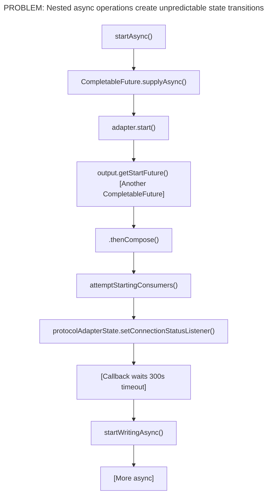
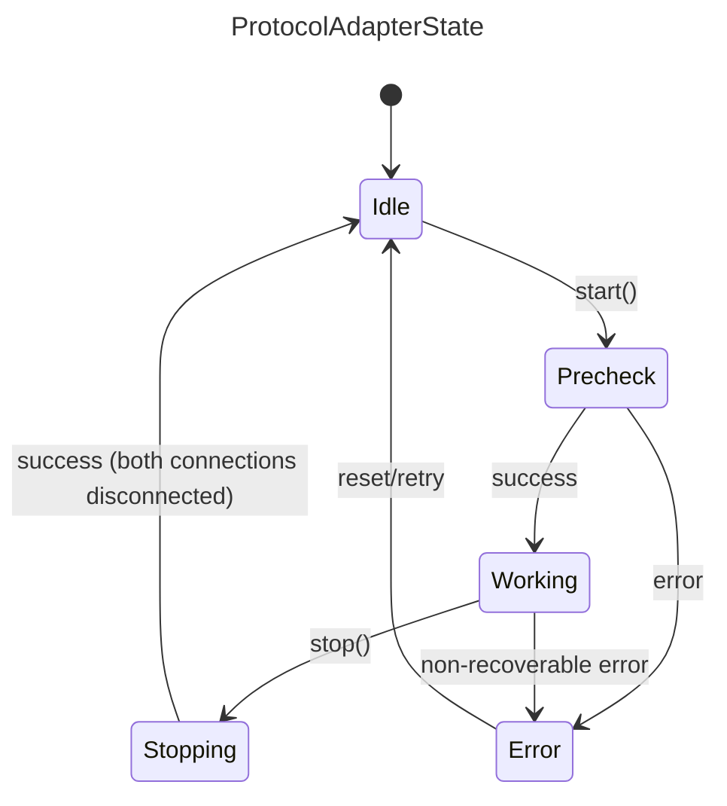
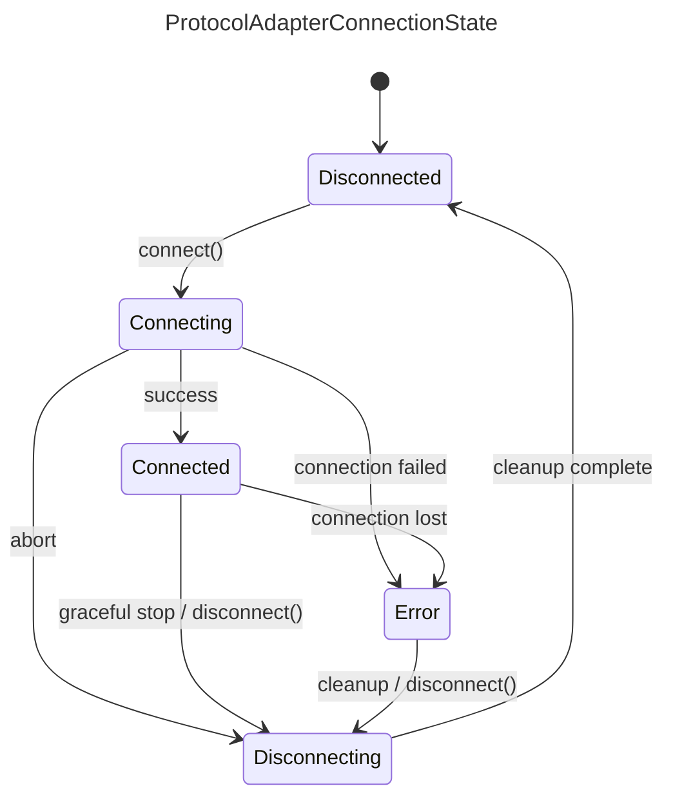
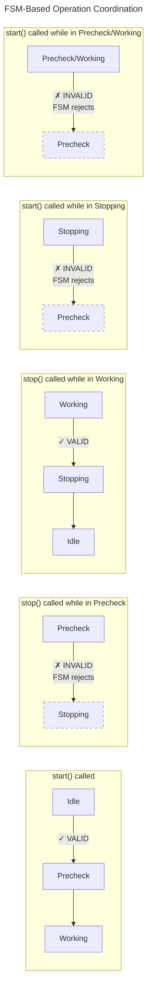

# Protocol Adapter FSM Redesign Plan

## Executive Summary

This document outlines the redesign of the Protocol Adapter state management system from an async-heavy,
callback-based architecture to a clean, synchronous FSM-based architecture. The goal is to eliminate the
complexity introduced by CompletableFuture chains, timeouts, and callback listeners while maintaining
full feature parity.

---

## 1. Analysis of Current Design Problems

### 1.1 Async Operation Complexity

The current `ProtocolAdapterWrapper` suffers from:



**Specific Issues:**

1. **Race Conditions**: The `shuttingDown` flag and `AtomicBoolean futureCompleted` are workarounds for
   async operations completing after stop is initiated.

2. **Timeout Complexity**: A 300-second `ScheduledExecutorService` timeout waits for the adapter to
   reach CONNECTED/STATELESS before enabling writing.

3. **Callback Chaos**: `ConnectionStatusListener` callback must filter initial status, handle multiple
   status types, and coordinate with timeouts.

4. **Unpredictable Transitions**: State changes can happen from any thread at any time, making debugging
   and reasoning about the system difficult.

5. **Error Recovery Complexity**: `stopAfterFailedStart()` must manually clean up polling, writing, and
   call adapter.stop() to handle partial startup failures.

### 1.2 State Dimension Confusion

Current design has **two independent state dimensions**:
- `RuntimeStatus`: STARTED, STOPPED
- `ConnectionStatus`: CONNECTED, DISCONNECTED, STATELESS, UNKNOWN, ERROR, CONNECTING

This creates **ambiguous states** like:
- RuntimeStatus=STARTED + ConnectionStatus=ERROR (Is the adapter running or not?)
- RuntimeStatus=STOPPED + ConnectionStatus=CONNECTED (How can it be connected if stopped?)

### 1.3 Missing State Machine Enforcement

Current design uses `OperationState` enum (IDLE, STARTING, STOPPING) as a guard against concurrent
operations, but it doesn't enforce valid state transitions. Invalid transitions fail silently or
cause unpredictable behavior.

---

## 2. New FSM Design Philosophy

### 2.1 Core Principles

1. **Synchronous by Default**: All state transitions are synchronous. Async operations are pushed to
   the edges (adapter implementation).

2. **Single Source of Truth**: One state machine per component, not multiple state dimensions.

3. **Explicit Transitions**: All valid transitions are defined and enforced by the FSM.

4. **Clear Ownership**:
   - `ProtocolAdapterWrapper2` owns `ProtocolAdapterState` and `ProtocolAdapterConnectionState` (×2: Northbound + Southbound)
   - `ProtocolAdapterManager2` manages the lifecycle of `ProtocolAdapterWrapper2` instances

5. **Separation of Concerns**: The wrapper calls `ProtocolAdapter2.connect()` / `disconnect()`,
   not the other way around.

6. **Optional Southbound Support**: Not all protocol adapters support Southbound communication.
   Adapters that only support Northbound (read-only) do not manage a southbound connection state.

### 2.2 Handling Adapters Without Southbound Support

**Important**: Not all protocol adapters support Southbound (MQTT → Device) communication.

| Adapter Type | Northbound | Southbound |
| ------------ | ---------- | ---------- |
| OPC UA       | ✅ Yes      | ✅ Yes      |
| Modbus       | ✅ Yes      | ❌ No       |
| HTTP         | ✅ Yes      | ❌ No       |
| File         | ✅ Yes      | ❌ No       |
| S7/ADS       | ✅ Yes      | ❌ No       |
| EtherIP      | ✅ Yes      | ❌ No       |
| MTConnect    | ✅ Yes      | ❌ No       |
| Database     | ✅ Yes      | ❌ No       |

**Design Decision**: For adapters without Southbound support:
- The `southboundConnectionState` remains `Disconnected` (never transitions)
- `startSouthbound()` returns `true` immediately (no-op)
- `stopSouthbound()` returns `true` immediately (no-op)
- The adapter's `supportsSouthbound()` method returns `false`
- When checking "both connections Disconnected", we treat non-existent southbound as Disconnected

```java
// Example: Checking if adapter can transition to Idle
boolean canTransitionToIdle() {
    boolean northboundReady = northboundState.isDisconnected();
    boolean southboundReady = !supportsSouthbound() || southboundState.isDisconnected();
    return northboundReady && southboundReady;
}
```

### 2.3 State Machine Definitions

#### ProtocolAdapterState (Manager Level)



Valid Transitions:
- Idle → Precheck (start called)
- Precheck → Working (precheck success)
- Precheck → Error (precheck failed)
- Working → Stopping (stop called)
- Working → Error (non-recoverable error)
- Stopping → Idle (both connections disconnected)
- Error → Idle (reset/retry)

#### ProtocolAdapterConnectionState (Wrapper Level, ×2)



Valid Transitions:
- Disconnected → Connecting
- Connecting → Connected (success)
- Connecting → Error (connection failed)
- Connecting → Disconnecting (abort)
- Connected → Error (connection lost)
- Connected → Disconnecting (graceful stop)
- Error → Disconnecting (cleanup)
- Disconnecting → Disconnected (cleanup complete)

---

## 3. Component Redesign

### 3.1 ProtocolAdapter2 Interface

Create a new interface that separates concerns more clearly:

```java
/**
 * ProtocolAdapter2 - Simplified protocol adapter interface
 *
 * Key differences from ProtocolAdapter:
 * 1. connect() returns synchronously or throws - no CompletableFuture
 * 2. disconnect() returns synchronously or throws - no CompletableFuture
 * 3. Connection state is managed by the caller (ProtocolAdapterWrapper2)
 * 4. Adapter should NOT manage its own state
 */
public interface ProtocolAdapter2 {

    /**
     * Get the adapter's unique identifier.
     */
    @NotNull String getId();

    /**
     * Get adapter information (protocol type, capabilities, etc.)
     */
    @NotNull ProtocolAdapterInformation getProtocolAdapterInformation();

    /**
     * Check if this adapter supports Southbound (MQTT → Device) communication.
     *
     * @return true if southbound is supported, false if this is a read-only adapter
     */
    default boolean supportsSouthbound() {
        return false;  // Default: northbound only
    }

    /**
     * Validate configuration before connecting.
     * Called during Precheck phase.
     *
     * @throws ProtocolAdapterException if configuration is invalid
     */
    void precheck() throws ProtocolAdapterException;

    /**
     * Establish connection to the device/service.
     * Called for BOTH northbound and southbound connections.
     *
     * This method should:
     * - Establish the physical/logical connection
     * - Validate connectivity (handshake, auth, etc.)
     * - Return when connection is ready
     * - Throw on any failure
     *
     * The connection type (northbound vs southbound) is determined by
     * the ConnectionContext parameter.
     *
     * @param context Contains connection direction and configuration
     * @throws ProtocolAdapterException on connection failure
     */
    void connect(@NotNull ConnectionContext context) throws ProtocolAdapterException;

    /**
     * Disconnect from the device/service.
     *
     * This method should:
     * - Gracefully close the connection
     * - Release resources
     * - Return when cleanup is complete
     * - NOT throw on failure (log errors instead)
     *
     * @param context Contains connection direction and configuration
     */
    void disconnect(@NotNull ConnectionContext context);

    /**
     * Destroy the adapter instance.
     * Called after both connections are disconnected.
     * Release ALL resources including configuration.
     */
    void destroy();

    /**
     * Poll data from device (for PollingProtocolAdapter implementations).
     * Called by the polling service when adapter is in Connected state.
     */
    default void poll(@NotNull PollingInput input, @NotNull PollingOutput output) {
        output.notSupported();
    }

    /**
     * Write data to device (for WritingProtocolAdapter implementations).
     * Called by the writing service when adapter is in Connected state.
     */
    default void write(@NotNull WritingInput input, @NotNull WritingOutput output) {
        output.notSupported();
    }

    /**
     * Discover available tags/addresses on the device.
     */
    default void discover(@NotNull DiscoveryInput input, @NotNull DiscoveryOutput output) {
        output.notSupported();
    }
}

/**
 * Context provided during connect/disconnect operations
 */
public interface ConnectionContext {
    enum Direction { NORTHBOUND, SOUTHBOUND }

    @NotNull Direction getDirection();
    @NotNull ModuleServices getModuleServices();
    @NotNull List<? extends Tag> getTags();
    @NotNull List<NorthboundMapping> getNorthboundMappings();  // Only for NORTHBOUND
    @NotNull List<SouthboundMapping> getSouthboundMappings();  // Only for SOUTHBOUND
}
```

### 3.2 ProtocolAdapterWrapper2 Redesign

> **Current Implementation Status**: A basic `ProtocolAdapterWrapper2` has been implemented with
> FSM-based state management, synchronized transitions, and start/stop lifecycle methods.
> It currently uses the existing `ProtocolAdapter` SDK interface (not `ProtocolAdapter2` which is
> Phase 2 work). The current implementation does not yet include adapter precheck calls,
> polling/writing/tag manager integration, southbound capability checks, or state change listeners.
> These are planned for Phase 3. The code below shows the **target design** for the completed wrapper.

#### 3.2.1 Async Operation Coordination

The Web UI calls start/stop via REST API which expects async responses. The FSM state
transitions themselves provide atomicity and conflict detection:



**Key behaviors:**
| Current State | start() called | stop() called |
|---------------|----------------|---------------|
| Idle          | → Precheck ✓   | FSM rejects (no transition) |
| Precheck      | FSM rejects    | FSM rejects (no transition) |
| Working       | FSM rejects    | → Stopping ✓  |
| Stopping      | FSM rejects    | FSM rejects (already stopping) |
| Error         | FSM rejects    | → Idle ✓ (cleanup) |

The `synchronized` keyword on `start()` and `stop()` ensures only one thread executes
at a time. The FSM transition response tells the caller whether the operation succeeded.

**Async wrapper is simple:**
```java
// In ProtocolAdapterManager2
public CompletableFuture<Boolean> startAsync(String adapterId) {
    return CompletableFuture.supplyAsync(() -> {
        ProtocolAdapterWrapper2 wrapper = getWrapper(adapterId);
        return wrapper.start();  // FSM handles conflicts
    });
}

public CompletableFuture<Boolean> stopAsync(String adapterId, boolean destroy) {
    return CompletableFuture.supplyAsync(() -> {
        ProtocolAdapterWrapper2 wrapper = getWrapper(adapterId);
        return wrapper.stop(destroy);  // FSM handles conflicts
    });
}
```

```java
/**
 * ProtocolAdapterWrapper2 - Manages adapter lifecycle and connection states
 *
 * Responsibilities:
 * 1. Owns ProtocolAdapterState and both ProtocolAdapterConnectionState instances
 * 2. Coordinates transitions between states
 * 3. Calls ProtocolAdapter2 methods synchronously
 * 4. Reports state changes to listeners
 *
 * Threading Model:
 * - All state transitions are synchronized
 * - connect/disconnect operations run on caller's thread
 * - State change notifications are asynchronous (fire-and-forget)
 */
public class ProtocolAdapterWrapper2 {

    private final @NotNull ProtocolAdapter2 adapter;
    private final @NotNull ProtocolAdapterConfig config;
    private final @NotNull ModuleServices moduleServices;

    // State machines - owned by this wrapper
    // FSM transitions are atomic and handle conflict detection
    private volatile @NotNull ProtocolAdapterState state = ProtocolAdapterState.Idle;
    private volatile @NotNull ProtocolAdapterConnectionState northboundState = ProtocolAdapterConnectionState.Disconnected;
    private volatile @NotNull ProtocolAdapterConnectionState southboundState = ProtocolAdapterConnectionState.Disconnected;

    // Services for polling and writing
    private final @NotNull ProtocolAdapterPollingService pollingService;
    private final @NotNull InternalProtocolAdapterWritingService writingService;
    private final @NotNull TagManager tagManager;

    // Listeners for state changes
    private final List<StateChangeListener> stateListeners = new CopyOnWriteArrayList<>();

    /**
     * Start the adapter.
     *
     * This method is synchronized - only one thread can execute at a time.
     * The FSM state transitions handle conflict detection:
     * - If already in Precheck/Working/Stopping, the transition to Precheck fails
     * - Caller receives false and can check the current state for details
     *
     * Flow:
     * 1. Transition to Precheck
     * 2. Call adapter.precheck()
     * 3. Transition to Working (control handed to wrapper)
     * 4. Call startNorthbound() → adapter.connect(NORTHBOUND)
     * 5. Call startSouthbound() → adapter.connect(SOUTHBOUND)
     *
     * If any step fails:
     * - Transition to Error
     * - Call stopNorthbound/stopSouthbound for cleanup
     * - Transition back to Idle
     *
     * @return true if started successfully, false if FSM rejected or error occurred
     */
    public synchronized boolean start() {
        LOGGER.info("Starting adapter {}", getAdapterId());

        // Step 1: Idle → Precheck
        if (!transitionTo(ProtocolAdapterState.Precheck).status().isSuccess()) {
            return false;
        }

        // Step 2: Run precheck
        try {
            adapter.precheck();
        } catch (Exception e) {
            LOGGER.error("Precheck failed for adapter {}", getAdapterId(), e);
            transitionTo(ProtocolAdapterState.Error);
            return false;
        }

        // Step 3: Precheck → Working
        if (!transitionTo(ProtocolAdapterState.Working).status().isSuccess()) {
            return false;
        }

        // Step 4 & 5: Start connections
        boolean northboundSuccess = startNorthbound();
        boolean southboundSuccess = northboundSuccess && startSouthbound();

        if (!northboundSuccess || !southboundSuccess) {
            // Cleanup on failure
            if (northboundSuccess) {
                stopNorthbound();
            }
            transitionTo(ProtocolAdapterState.Error);
            return false;
        }

        // Start polling and writing services
        startPolling();
        startWriting();

        return true;
    }

    /**
     * Stop the adapter.
     *
     * This method is synchronized - only one thread can execute at a time.
     * The FSM state transitions handle conflict detection:
     * - If in Idle/Precheck, the transition to Stopping fails
     * - If already in Stopping, the transition returns "not changed"
     * - Caller receives false and can check the current state for details
     *
     * Flow:
     * 1. Working → Stopping
     * 2. Stop polling and writing services
     * 3. stopSouthbound() → adapter.disconnect(SOUTHBOUND)
     * 4. stopNorthbound() → adapter.disconnect(NORTHBOUND)
     * 5. When BOTH are Disconnected → Stopping → Idle
     *
     * @param destroy Whether to call adapter.destroy() after stop
     * @return true if stopped successfully, false if FSM rejected or error occurred
     */
    public synchronized boolean stop(boolean destroy) {
        LOGGER.info("Stopping adapter {}", getAdapterId());

        // Step 1: Working → Stopping
        if (!transitionTo(ProtocolAdapterState.Stopping).status().isSuccess()) {
            // Already stopping or in error - check if we can proceed
            if (!state.isStopping() && !state.isError()) {
                return false;
            }
        }

        // Step 2: Stop services
        stopPolling();
        stopWriting();

        // Step 3 & 4: Stop connections
        boolean southboundSuccess = stopSouthbound();
        boolean northboundSuccess = stopNorthbound();

        // Step 5: Check if connections are ready for Idle transition
        // For adapters without southbound, treat southbound as always ready
        boolean northboundReady = northboundState.isDisconnected();
        boolean southboundReady = !supportsSouthbound() || southboundState.isDisconnected();

        if (northboundReady && southboundReady) {
            transitionTo(ProtocolAdapterState.Idle);
            if (destroy) {
                adapter.destroy();
            }
            return true;
        }

        // If not fully disconnected, stay in Stopping/Error
        if (!northboundSuccess || !southboundSuccess) {
            transitionTo(ProtocolAdapterState.Error);
        }
        return false;
    }

    /**
     * Check if adapter supports southbound communication.
     */
    private boolean supportsSouthbound() {
        return adapter.supportsSouthbound();
    }

    /**
     * Start northbound connection.
     * Transitions: Disconnected → Connecting → Connected
     */
    protected synchronized boolean startNorthbound() {
        LOGGER.info("Starting northbound for adapter {}", getAdapterId());

        // Disconnected → Connecting
        if (!transitionNorthboundConnectionTo(ProtocolAdapterConnectionState.Connecting).status().isSuccess()) {
            return false;
        }

        try {
            ConnectionContext context = createContext(ConnectionContext.Direction.NORTHBOUND);
            adapter.connect(context);

            // Connecting → Connected
            return transitionNorthboundConnectionTo(ProtocolAdapterConnectionState.Connected).status().isSuccess();

        } catch (Exception e) {
            LOGGER.error("Northbound connection failed for adapter {}", getAdapterId(), e);
            // Connecting → Error
            transitionNorthboundConnectionTo(ProtocolAdapterConnectionState.Error);
            return false;
        }
    }

    /**
     * Start southbound connection.
     * Only starts if adapter supports southbound communication.
     */
    protected synchronized boolean startSouthbound() {
        if (!supportsSouthbound()) {
            LOGGER.debug("Adapter {} does not support southbound, skipping", getAdapterId());
            return true;  // No southbound needed
        }

        LOGGER.info("Starting southbound for adapter {}", getAdapterId());

        // Disconnected → Connecting
        if (!transitionSouthboundConnectionTo(ProtocolAdapterConnectionState.Connecting).status().isSuccess()) {
            return false;
        }

        try {
            ConnectionContext context = createContext(ConnectionContext.Direction.SOUTHBOUND);
            adapter.connect(context);

            // Connecting → Connected
            return transitionSouthboundConnectionTo(ProtocolAdapterConnectionState.Connected).status().isSuccess();

        } catch (Exception e) {
            LOGGER.error("Southbound connection failed for adapter {}", getAdapterId(), e);
            // Connecting → Error
            transitionSouthboundConnectionTo(ProtocolAdapterConnectionState.Error);
            return false;
        }
    }

    /**
     * Stop northbound connection.
     * Transitions: * → Disconnecting → Disconnected
     */
    protected synchronized boolean stopNorthbound() {
        LOGGER.info("Stopping northbound for adapter {}", getAdapterId());

        if (northboundState.isDisconnected()) {
            return true;  // Already disconnected
        }

        // * → Disconnecting
        if (!transitionNorthboundConnectionTo(ProtocolAdapterConnectionState.Disconnecting).status().isSuccess()) {
            return false;
        }

        try {
            ConnectionContext context = createContext(ConnectionContext.Direction.NORTHBOUND);
            adapter.disconnect(context);
        } catch (Exception e) {
            LOGGER.warn("Error during northbound disconnect for adapter {}", getAdapterId(), e);
            // Continue anyway - we want to reach Disconnected state
        }

        // Disconnecting → Disconnected
        return transitionNorthboundConnectionTo(ProtocolAdapterConnectionState.Disconnected).status().isSuccess();
    }

    /**
     * Stop southbound connection.
     * Only stops if adapter supports southbound communication.
     */
    protected synchronized boolean stopSouthbound() {
        if (!supportsSouthbound()) {
            return true;  // No southbound to stop
        }

        LOGGER.info("Stopping southbound for adapter {}", getAdapterId());

        if (southboundState.isDisconnected()) {
            return true;
        }

        // * → Disconnecting
        if (!transitionSouthboundConnectionTo(ProtocolAdapterConnectionState.Disconnecting).status().isSuccess()) {
            return false;
        }

        try {
            ConnectionContext context = createContext(ConnectionContext.Direction.SOUTHBOUND);
            adapter.disconnect(context);
        } catch (Exception e) {
            LOGGER.warn("Error during southbound disconnect for adapter {}", getAdapterId(), e);
        }

        // Disconnecting → Disconnected
        return transitionSouthboundConnectionTo(ProtocolAdapterConnectionState.Disconnected).status().isSuccess();
    }

    // ... transition methods same as current implementation ...
}
```

### 3.3 ProtocolAdapterManager2 Redesign

> **Current Implementation Status**: `ProtocolAdapterManager2` has been implemented with full
> CRUD operations, factory integration (`ProtocolAdapterFactoryManager`), parallel refresh using
> `CompletableFuture.allOf()`, event service and metrics integration, ClassLoader management
> (`ClassLoaderUtils`), I18n error messages (`I18nProtocolAdapterMessage`), and consumer registration
> with `ProtocolAdapterExtractor`. The start/stop methods delegate synchronously to `ProtocolAdapterWrapper2`
> and throw `ProtocolAdapterException` on failure. The code below shows the **target design** for the
> completed manager; the current implementation already exceeds this baseline with parallel refresh
> and full service integration.

```java
/**
 * ProtocolAdapterManager2 - Manages all adapter instances
 *
 * Responsibilities:
 * 1. Create/delete adapter instances
 * 2. Coordinate start/stop operations
 * 3. Handle configuration refresh
 * 4. Provide thread-safe access to adapters
 *
 * Threading Model:
 * - ConcurrentHashMap provides thread-safe access to adapter map
 * - Start/stop operations are synchronized per adapter (via wrapper)
 * - Refresh operations run on dedicated single-thread executor
 * - Compound operations (check-then-act) use computeIfAbsent/computeIfPresent
 */
public class ProtocolAdapterManager2 {

    // Use ConcurrentHashMap for thread-safe access without explicit locking
    // This is simpler and less error-prone than HashMap + ReentrantReadWriteLock
    private final @NotNull Map<String, ProtocolAdapterWrapper2> adapterMap = new ConcurrentHashMap<>();
    private final @NotNull ExecutorService refreshExecutor = Executors.newSingleThreadExecutor();

    // Dependencies
    private final @NotNull ProtocolAdapterFactoryManager factoryManager;
    private final @NotNull EventService eventService;
    // ... other dependencies ...

    /**
     * Start an adapter by ID.
     *
     * This method:
     * 1. Gets the wrapper (read lock)
     * 2. Calls wrapper.start() (synchronous)
     * 3. Fires success/failure event
     */
    public void start(@NotNull String adapterId) throws ProtocolAdapterException {
        final ProtocolAdapterWrapper2 wrapper = getWrapper(adapterId)
            .orElseThrow(() -> new ProtocolAdapterException("Adapter not found: " + adapterId));

        boolean success = wrapper.start();

        if (success) {
            eventService.createAdapterEvent(adapterId, wrapper.getProtocolId())
                .withSeverity(Event.SEVERITY.INFO)
                .withMessage("Adapter started successfully")
                .fire();
        } else {
            eventService.createAdapterEvent(adapterId, wrapper.getProtocolId())
                .withSeverity(Event.SEVERITY.ERROR)
                .withMessage("Adapter failed to start")
                .fire();
            throw new ProtocolAdapterException("Failed to start adapter: " + adapterId);
        }
    }

    /**
     * Stop an adapter by ID.
     */
    public void stop(@NotNull String adapterId, boolean destroy) throws ProtocolAdapterException {
        final ProtocolAdapterWrapper2 wrapper = getWrapper(adapterId)
            .orElseThrow(() -> new ProtocolAdapterException("Adapter not found: " + adapterId));

        boolean success = wrapper.stop(destroy);

        if (success) {
            eventService.createAdapterEvent(adapterId, wrapper.getProtocolId())
                .withSeverity(Event.SEVERITY.INFO)
                .withMessage("Adapter stopped successfully")
                .fire();
        } else {
            eventService.createAdapterEvent(adapterId, wrapper.getProtocolId())
                .withSeverity(Event.SEVERITY.WARN)
                .withMessage("Adapter stopped with errors")
                .fire();
        }
    }

    /**
     * Refresh adapters from configuration.
     *
     * This method runs on a dedicated executor to avoid blocking callers.
     * Operations are: DELETE → CREATE → UPDATE (stop + delete + create + start)
     */
    public void refresh(@NotNull List<ProtocolAdapterEntity> configs) {
        refreshExecutor.submit(() -> {
            try {
                doRefresh(configs);
            } catch (Exception e) {
                LOGGER.error("Failed to refresh adapters", e);
                eventService.configurationEvent()
                    .withSeverity(Event.SEVERITY.CRITICAL)
                    .withMessage("Configuration refresh failed")
                    .fire();
            }
        });
    }

    private void doRefresh(List<ProtocolAdapterEntity> configs) {
        // Categorize changes
        Set<String> toDelete = calculateDeletes(configs);
        Set<String> toCreate = calculateCreates(configs);
        Set<String> toUpdate = calculateUpdates(configs);

        Set<String> failed = new HashSet<>();

        // Process deletes first
        for (String id : toDelete) {
            try {
                stop(id, true);
                deleteAdapter(id);
            } catch (Exception e) {
                LOGGER.error("Failed to delete adapter {}", id, e);
                failed.add(id);
            }
        }

        // Process creates
        for (String id : toCreate) {
            try {
                createAdapter(configs.stream().filter(c -> c.getId().equals(id)).findFirst().get());
                start(id);
            } catch (Exception e) {
                LOGGER.error("Failed to create adapter {}", id, e);
                failed.add(id);
            }
        }

        // Process updates (stop → delete → create → start)
        for (String id : toUpdate) {
            try {
                stop(id, true);
                deleteAdapter(id);
                createAdapter(configs.stream().filter(c -> c.getId().equals(id)).findFirst().get());
                start(id);
            } catch (Exception e) {
                LOGGER.error("Failed to update adapter {}", id, e);
                failed.add(id);
            }
        }

        // Fire completion event
        if (failed.isEmpty()) {
            eventService.configurationEvent()
                .withSeverity(Event.SEVERITY.INFO)
                .withMessage("Configuration updated successfully")
                .fire();
        } else {
            eventService.configurationEvent()
                .withSeverity(Event.SEVERITY.CRITICAL)
                .withMessage("Configuration update completed with failures: " + failed)
                .fire();
        }
    }
}
```

---

## 4. Async Operation Reduction Strategy

### 4.1 What Changes

| Operation         | Old Design                             | New Design                                         |
| ----------------- | -------------------------------------- | -------------------------------------------------- |
| `adapter.start()` | Returns `CompletableFuture` via output | `adapter.connect()` - synchronous, throws on error |
| `adapter.stop()`  | Returns `CompletableFuture` via output | `adapter.disconnect()` - synchronous, logs errors  |
| Writing startup   | 300s timeout waiting for CONNECTED     | `startSouthbound()` - synchronous, fails fast      |
| State transitions | Via callbacks and listeners            | Direct method calls on wrapper                     |
| Polling startup   | After async start completes            | After `start()` returns successfully               |

### 4.2 Handling Inherently Async Operations

Some operations are inherently async (network I/O, device communication). These are handled by:

1. **Connection Timeout in Adapter**: Each adapter implementation sets its own timeout for `connect()`.
   The method blocks until connected or timeout, then throws `ProtocolAdapterException`.

2. **Polling Remains Async**: Polling runs on scheduled threads but is controlled synchronously:
   - `startPolling()` registers with `PollingService`
   - `stopPolling()` unregisters immediately

3. **Writing Remains Async**: Writing callbacks are event-driven:
   - `startWriting()` registers contexts with `WritingService`
   - `stopWriting()` unregisters immediately
   - Actual writes happen asynchronously but wrapper state is already Connected

### 4.3 Adapter Implementation Responsibility

Adapter implementations must handle their own async operations internally:

```java
// Example: OPC UA Adapter connect() implementation
@Override
public void connect(ConnectionContext context) throws ProtocolAdapterException {
    try {
        // Create OPC UA client
        client = OpcUaClient.create(endpointUrl, ...);

        // Synchronous connect with timeout
        client.connect().get(connectTimeout, TimeUnit.SECONDS);

        // Connection established - return
    } catch (TimeoutException e) {
        throw new ProtocolAdapterException("Connection timeout", e);
    } catch (ExecutionException e) {
        throw new ProtocolAdapterException("Connection failed", e.getCause());
    }
}
```

---

## 5. Migration Strategy

### 5.1 Phase 1: Foundation

**Status**: ✅ Completed

- [x] Create `ProtocolAdapterState` enum with FSM transitions
- [x] Create `ProtocolAdapterConnectionState` enum with FSM transitions
- [x] Create `ProtocolAdapterTransitionResponse` record
- [x] Create `ProtocolAdapterConnectionTransitionResponse` record
- [x] Create `ProtocolAdapterTransitionStatus` enum
- [x] Create `ProtocolAdapterManagerState` enum
- [x] Create `I18nProtocolAdapterMessage` for localized messages
- [x] Create `ClassLoaderUtils` for classloader context management
- [x] Create basic `ProtocolAdapterWrapper2` with state management
- [x] Create basic `ProtocolAdapterManager2` with CRUD operations
- [x] Add unit tests for FSM transitions (`ProtocolAdapterStateTest`, `ProtocolAdapterConnectionStateTest`, `ProtocolAdapterWrapperTest`)

### 5.2 Phase 2: Interface Design

**Status**: 🔲 Not Started

**Tasks**:
- [ ] Design `ProtocolAdapter2` interface
- [ ] Design `ConnectionContext` interface
- [ ] Design new input/output types for connect/disconnect
- [ ] Create adapter for existing `ProtocolAdapter` → `ProtocolAdapter2` (bridge pattern)
- [ ] Update `ProtocolAdapterWrapper2` to use `ProtocolAdapter2`

**Deliverables**:
- `ProtocolAdapter2.java`
- `ConnectionContext.java`
- `ProtocolAdapter2Bridge.java` (wraps old adapters)

### 5.3 Phase 3: Wrapper Completion

**Status**: 🔶 In Progress

**Tasks**:
- [x] Implement basic `ProtocolAdapterWrapper2.start()` (state transitions and connection lifecycle)
- [x] Implement basic `ProtocolAdapterWrapper2.stop()` (state transitions and connection teardown)
- [ ] Add adapter precheck calls (`adapter.precheck()`) during start
- [ ] Implement connection error handling (try/catch around adapter connect/disconnect calls)
- [ ] Add southbound capability check (`supportsSouthbound()`)
- [ ] Implement state change notification (`StateChangeListener`)
- [ ] Add polling service integration
- [ ] Add writing service integration
- [ ] Add tag manager integration

**Deliverables**:
- Completed `ProtocolAdapterWrapper2.java`
- Integration tests with mock adapters

### 5.4 Phase 4: Manager Completion

**Status**: 🔶 In Progress

**Tasks**:
- [x] Implement `ProtocolAdapterManager2.createProtocolAdapter()` with factory (`ProtocolAdapterFactoryManager`)
- [x] Implement `ProtocolAdapterManager2.deleteProtocolAdapterByAdapterId()`
- [x] Implement `ProtocolAdapterManager2.refresh()` with parallel `CompletableFuture.allOf()` operations
- [x] Add event service integration (`EventService`)
- [x] Add metrics integration (`ProtocolAdapterMetrics`)
- [x] Handle concurrent operations safely (`ConcurrentHashMap` + single-thread executor)
- [x] Add I18n error messages (`I18nProtocolAdapterMessage`)
- [x] Add ClassLoader management (`ClassLoaderUtils`)
- [x] Register consumer with `ProtocolAdapterExtractor`
- [ ] Add integration tests with mock services

**Deliverables**:
- Completed `ProtocolAdapterManager2.java`
- Integration tests with mock services

### 5.5 Phase 5: Adapter Migration

**Status**: 🔲 Not Started

**Tasks**:
- [ ] Create `ProtocolAdapter2` implementations for each adapter type:
  - [ ] OPC UA
  - [ ] Modbus
  - [ ] HTTP
  - [ ] File
  - [ ] S7/ADS (PLC4X)
  - [ ] EtherIP
  - [ ] MTConnect
  - [ ] Database adapters
- [ ] OR use bridge pattern to wrap existing adapters

**Deliverables**:
- `ProtocolAdapter2` implementations or bridge

### 5.6 Phase 6: Integration & Testing

**Status**: 🔲 Not Started

**Tasks**:
- [ ] Create integration tests with real adapter implementations
- [ ] Test state transitions under various scenarios
- [ ] Test error recovery
- [ ] Test concurrent operations
- [ ] Performance testing
- [ ] Memory leak testing

**Deliverables**:
- Comprehensive test suite in `hivemq-edge-test`

### 5.7 Phase 7: Switchover

**Status**: 🔲 Not Started

**Tasks**:
- [ ] Add feature flag for new FSM design
- [ ] Update DI bindings to use new implementations
- [ ] Create migration documentation
- [ ] Deploy to staging environment
- [ ] Monitor for issues
- [ ] Remove old implementations after validation

**Deliverables**:
- Feature flag configuration
- Migration documentation
- Production deployment plan

---

## 6. Test Strategy

### 6.1 Existing Tests Must Pass

The following tests must continue to pass throughout migration:

```
com.hivemq.protocols.fsm.ProtocolAdapterConnectionStateTest
com.hivemq.protocols.fsm.ProtocolAdapterStateTest
com.hivemq.protocols.fsm.ProtocolAdapterWrapperTest
```

### 6.2 New Test Categories

1. **Unit Tests**: FSM transition tests (existing)
2. **Component Tests**: Wrapper and Manager tests with mocks
3. **Integration Tests**: Full adapter lifecycle with real services
4. **Stress Tests**: Concurrent start/stop operations
5. **Error Recovery Tests**: Failure scenarios and recovery

### 6.3 Test Isolation

Until switchover:
- New code lives in `com.hivemq.protocols.fsm` package
- Old code remains in `com.hivemq.protocols` package
- Tests don't interfere with production code
- Feature flag controls which implementation is used

---

## 7. Risks and Mitigations

| Risk                                           | Impact | Mitigation                                   |
| ---------------------------------------------- | ------ | -------------------------------------------- |
| Adapter implementations rely on async patterns | High   | Use bridge pattern or migrate incrementally  |
| State transition timing changes                | Medium | Thorough integration testing                 |
| Performance regression                         | Medium | Benchmark before/after                       |
| Hidden dependencies on callbacks               | Medium | Code review all adapter implementations      |
| Concurrent operation handling                  | High   | Use proper synchronization, add stress tests |

---

## 8. Success Criteria

1. All existing FSM tests pass
2. All adapter types can start/stop successfully
3. State transitions are deterministic and traceable
4. Error recovery works correctly
5. No performance regression (< 5% slower startup)
6. Code complexity reduced (fewer callbacks, no nested futures)
7. Easier to debug and reason about

---

## 9. Open Questions

1. **Adapter Migration Strategy**: Should we:
   - (A) Create new `ProtocolAdapter2` implementations for each adapter?
   - (B) Use a bridge pattern to wrap existing adapters?
   - (C) Modify existing adapters to support both interfaces?

   **Recommendation**: Option (B) for initial migration, then (A) for new adapters.

2. **Connection Timeout Configuration**: Should timeout be:
   - (A) Configured per-adapter in adapter config?
   - (B) Global default with per-adapter override?
   - (C) Hardcoded per adapter type?

   **Recommendation**: Option (B) with sensible defaults.

3. **Error State Recovery**: Should error state:
   - (A) Require manual intervention (stop + start)?
   - (B) Support automatic retry with backoff?
   - (C) Transition directly to retry (Connecting)?

   **Recommendation**: Option (A) for simplicity, with option for (B) in future.

---

## 10. Appendix: File List

### Existing Files (Phase 1 & partial Phase 3/4 deliverables)

```
src/main/java/com/hivemq/protocols/fsm/
├── ClassLoaderUtils.java                          # ClassLoader context utility
├── I18nProtocolAdapterMessage.java                # I18n error/message templates
├── ProtocolAdapterConnectionState.java            # Connection FSM enum (Phase 1)
├── ProtocolAdapterConnectionTransitionResponse.java # Connection transition response record (Phase 1)
├── ProtocolAdapterManager2.java                   # New manager with CRUD & refresh (Phase 4, in progress)
├── ProtocolAdapterManagerState.java               # Manager-level state enum (Phase 1)
├── ProtocolAdapterState.java                      # Adapter FSM enum (Phase 1)
├── ProtocolAdapterTransitionResponse.java         # Adapter transition response record (Phase 1)
├── ProtocolAdapterTransitionStatus.java           # Transition status enum (Phase 1)
└── ProtocolAdapterWrapper2.java                   # New wrapper with FSM (Phase 3, in progress)
```

### New Files to Create

```
src/main/java/com/hivemq/protocols/fsm/
├── ProtocolAdapter2.java                    # New adapter interface (Phase 2)
├── ConnectionContext.java                   # Connection context interface (Phase 2)
├── ProtocolAdapter2Bridge.java              # Bridge for old adapters (Phase 2)
├── ProtocolAdapterStartException.java       # Start failure exception
├── ProtocolAdapterConnectException.java     # Connect failure exception
└── StateChangeListener.java                 # State change notification (Phase 3)
```

### Files to Modify

```
src/main/java/com/hivemq/protocols/fsm/
├── ProtocolAdapterWrapper2.java            # Complete full implementation (Phase 3)
└── ProtocolAdapterManager2.java            # Add integration tests (Phase 4)
```

### Files to Keep Unchanged (Old Design)

```
src/main/java/com/hivemq/protocols/
├── ProtocolAdapterManager.java             # Old manager
├── ProtocolAdapterWrapper.java             # Old wrapper
└── ... all other existing files ...
```

---

**Document Version**: 1.1
**Last Updated**: 2026-03-17
**Author**: Claude (AI Assistant)
**Status**: IN PROGRESS (Phase 1 complete, Phase 3 & 4 in progress)
