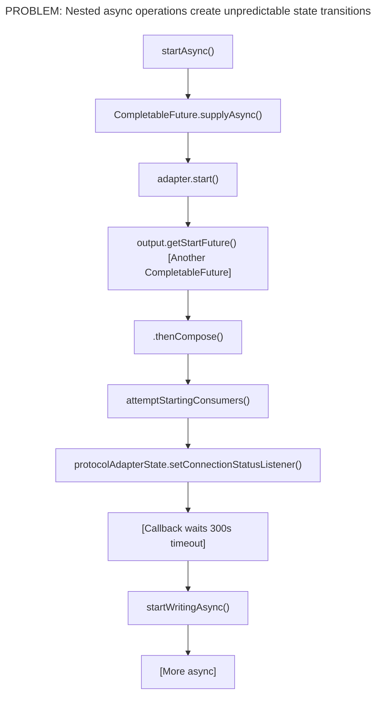
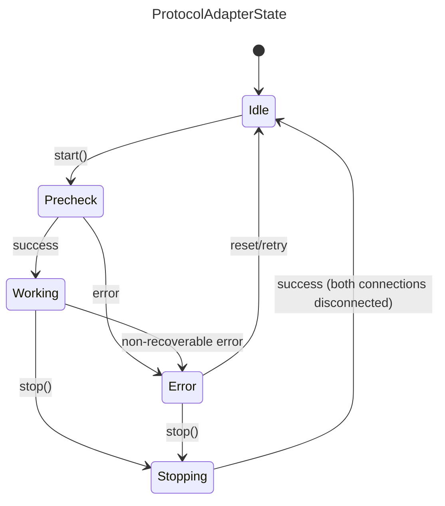
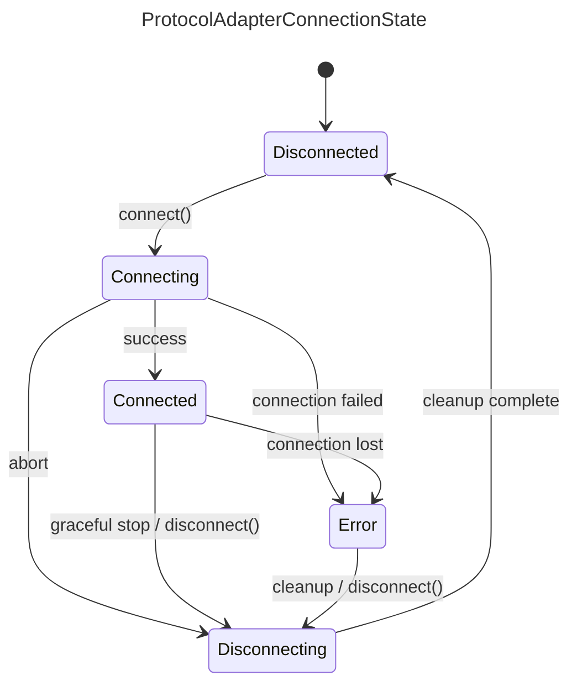
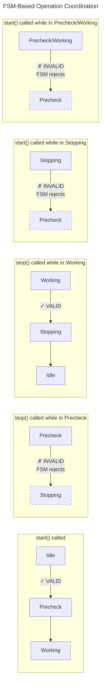

# Protocol Adapter FSM Redesign Plan

## Executive Summary

This document outlines the redesign of the Protocol Adapter state management system from an async-heavy,
callback-based architecture to a clean, synchronous FSM-based architecture. The goal is to eliminate the
complexity introduced by CompletableFuture chains, timeouts, and callback listeners while maintaining
full feature parity.

## 0. Implementation Sync (2026-03-20)

This section is the authoritative implementation delta for the latest review pass.

| Item | Status | Current Implementation |
| --- | --- | --- |
| 1. `refresh()` restarts unchanged adapters | ✅ Fixed | `ProtocolAdapterManager2.refresh()` now skips stop/delete/create/start when config is unchanged. |
| 2. `createProtocolAdapter()` atomicity | ✅ Fixed | Uses `ConcurrentHashMap.computeIfAbsent` so duplicate creation and duplicate metric increments are prevented under concurrency. |
| 3. Bridge-specific behavior in wrapper path | ✅ Fixed | `ProtocolAdapter2Bridge` removed from SDK; `ProtocolAdapter2` eliminated; wrapper always uses `start(direction)/stop(direction)`. |
| 4. Event severity text mismatch | ✅ Plan updated | Design text now matches code: start failure is `CRITICAL`, stop failure is `CRITICAL`. |
| 5. Listener threading mismatch | ✅ Plan updated | Listener invocation is synchronous on caller thread (not fire-and-forget). |
| 6. Manager busy/state model | ✅ Fixed | `ProtocolAdapterManager2` tracks queued/running refresh work via `refreshTasksInProgress`; `isBusy()` + `getState()` reflect refresh lifecycle (`Idle`/`Running`). |
| 7. `ClassLoaderUtils` claim mismatch | ✅ Plan updated | Actual implementation uses `ProtocolAdapterManager2.runWithContextLoader(...)` helper (no `ClassLoaderUtils` class). |

**Working-log note (2026-03-20)**: Sections 5.5–5.7 contain historical intermediate steps where
`ProtocolAdapter2` existed temporarily. The current runtime path is `ProtocolAdapter` with
`start(direction, ...)` / `stop(direction, ...)`.

---

## 1. Analysis of Current Design Problems

### 1.1 Async Operation Complexity

The current `ProtocolAdapterWrapper` suffers from:



**Specific Issues:**

1. **Race Conditions**: The `shuttingDown` flag and `AtomicBoolean futureCompleted` are workarounds for
   async operations completing after stop is initiated.

2. **Timeout Complexity**: A 300-second `ScheduledExecutorService` timeout waits for the adapter to
   reach CONNECTED/STATELESS before enabling writing.

3. **Callback Chaos**: `ConnectionStatusListener` callback must filter initial status, handle multiple
   status types, and coordinate with timeouts.

4. **Unpredictable Transitions**: State changes can happen from any thread at any time, making debugging
   and reasoning about the system difficult.

5. **Error Recovery Complexity**: `stopAfterFailedStart()` must manually clean up polling, writing, and
   call adapter.stop() to handle partial startup failures.

### 1.2 State Dimension Confusion

Current design has **two independent state dimensions**:
- `RuntimeStatus`: STARTED, STOPPED
- `ConnectionStatus`: CONNECTED, DISCONNECTED, STATELESS, UNKNOWN, ERROR, CONNECTING

This creates **ambiguous states** like:
- RuntimeStatus=STARTED + ConnectionStatus=ERROR (Is the adapter running or not?)
- RuntimeStatus=STOPPED + ConnectionStatus=CONNECTED (How can it be connected if stopped?)

### 1.3 Missing State Machine Enforcement

Current design uses `OperationState` enum (IDLE, STARTING, STOPPING) as a guard against concurrent
operations, but it doesn't enforce valid state transitions. Invalid transitions fail silently or
cause unpredictable behavior.

---

## 2. New FSM Design Philosophy

### 2.1 Core Principles

1. **Synchronous by Default**: All state transitions are synchronous. Async operations are pushed to
   the edges (adapter implementation).

2. **Single Source of Truth**: One state machine per component, not multiple state dimensions.

3. **Explicit Transitions**: All valid transitions are defined and enforced by the FSM.

4. **Clear Ownership**:
   - `ProtocolAdapterWrapper2` owns `ProtocolAdapterRuntimeState` and `ProtocolAdapterConnectionState` (×2: Northbound + Southbound)
   - `ProtocolAdapterManager2` manages the lifecycle of `ProtocolAdapterWrapper2` instances

5. **Separation of Concerns**: The wrapper calls `ProtocolAdapter.start(direction)` / `stop(direction)`,
   not the other way around.

6. **Optional Southbound Support**: Not all protocol adapters support Southbound communication.
   Adapters that only support Northbound (read-only) do not manage a southbound connection state.

### 2.2 Handling Adapters Without Southbound Support

**Important**: Not all protocol adapters support Southbound (MQTT → Device) communication.

| Adapter Type | Northbound | Southbound |
| ------------ | ---------- | ---------- |
| OPC UA       | ✅ Yes      | ✅ Yes      |
| Modbus       | ✅ Yes      | ❌ No       |
| HTTP         | ✅ Yes      | ❌ No       |
| File         | ✅ Yes      | ❌ No       |
| S7/ADS       | ✅ Yes      | ❌ No       |
| EtherIP      | ✅ Yes      | ❌ No       |
| MTConnect    | ✅ Yes      | ❌ No       |
| Database     | ✅ Yes      | ❌ No       |

**Design Decision**: For adapters without Southbound support:
- The `southboundConnectionState` remains `Disconnected` (never transitions)
- `startSouthbound()` returns `true` immediately (no-op)
- `stopSouthbound()` returns `true` immediately (no-op)
- The adapter's `supportsSouthbound()` method returns `false`
- When checking "both connections Disconnected", we treat non-existent southbound as Disconnected

```java
// Example: Checking if adapter can transition to Idle
boolean canTransitionToIdle() {
    boolean northboundReady = northboundState.isDisconnected();
    boolean southboundReady = !supportsSouthbound() || southboundState.isDisconnected();
    return northboundReady && southboundReady;
}
```

### 2.3 State Machine Definitions

#### ProtocolAdapterRuntimeState (Manager Level)



Valid Transitions:
- Idle → Precheck (start called)
- Precheck → Working (precheck success)
- Precheck → Error (precheck failed)
- Working → Stopping (stop called)
- Working → Error (non-recoverable error)
- Stopping → Idle (both connections disconnected)
- Error → Stopping (stop called, cleanup before returning to Idle)
- Error → Idle (reset/retry)

#### ProtocolAdapterConnectionState (Wrapper Level, ×2)



Valid Transitions:
- Disconnected → Connecting
- Connecting → Connected (success)
- Connecting → Error (connection failed)
- Connecting → Disconnecting (abort)
- Connected → Error (connection lost)
- Connected → Disconnecting (graceful stop)
- Error → Disconnecting (cleanup)
- Disconnecting → Disconnected (cleanup complete)

---

## 3. Component Redesign

### 3.1 ProtocolAdapter2 Interface

Create a new interface that separates concerns more clearly:

```java
/**
 * ProtocolAdapter2 - Simplified protocol adapter interface
 *
 * Key differences from ProtocolAdapter:
 * 1. connect() returns synchronously or throws - no CompletableFuture
 * 2. disconnect() returns synchronously or throws - no CompletableFuture
 * 3. Connection state is managed by the caller (ProtocolAdapterWrapper2)
 * 4. Adapter should NOT manage its own state
 */
public interface ProtocolAdapter2 {

    /**
     * Get the adapter's unique identifier.
     */
    @NotNull String getId();

    /**
     * Get adapter information (protocol type, capabilities, etc.)
     */
    @NotNull ProtocolAdapterInformation getProtocolAdapterInformation();

    /**
     * Check if this adapter supports Southbound (MQTT → Device) communication.
     *
     * @return true if southbound is supported, false if this is a read-only adapter
     */
    default boolean supportsSouthbound() {
        return false;  // Default: northbound only
    }

    /**
     * Validate configuration before connecting.
     * Called during Precheck phase.
     *
     * @throws ProtocolAdapterException if configuration is invalid
     */
    void precheck() throws ProtocolAdapterException;

    /**
     * Establish connection to the device/service.
     * Called for BOTH northbound and southbound connections.
     *
     * This method should:
     * - Establish the physical/logical connection
     * - Validate connectivity (handshake, auth, etc.)
     * - Return when connection is ready
     * - Throw on any failure
     *
     * @param direction the connection direction (northbound vs southbound)
     * @throws ProtocolAdapterException on connection failure
     */
    void connect(@NotNull ProtocolAdapterConnectionDirection direction) throws ProtocolAdapterException;

    /**
     * Disconnect from the device/service.
     *
     * This method should:
     * - Gracefully close the connection
     * - Release resources
     * - Return when cleanup is complete
     * - NOT throw on failure (log errors instead)
     *
     * @param direction the connection direction (northbound vs southbound)
     */
    void disconnect(@NotNull ProtocolAdapterConnectionDirection direction);

    /**
     * Destroy the adapter instance.
     * Called after both connections are disconnected.
     * Release ALL resources including configuration.
     */
    void destroy();

    /**
     * Poll data from device (for PollingProtocolAdapter implementations).
     * Called by the polling service when adapter is in Connected state.
     */
    default void poll(@NotNull PollingInput input, @NotNull PollingOutput output) {
        output.notSupported();
    }

    /**
     * Write data to device (for WritingProtocolAdapter implementations).
     * Called by the writing service when adapter is in Connected state.
     */
    default void write(@NotNull WritingInput input, @NotNull WritingOutput output) {
        output.notSupported();
    }

    /**
     * Discover available tags/addresses on the device.
     */
    default void discover(@NotNull DiscoveryInput input, @NotNull DiscoveryOutput output) {
        output.notSupported();
    }
}

/**
 * Direction of a protocol adapter connection.
 */
public enum ProtocolAdapterConnectionDirection {
    Northbound,
    Southbound;

    public boolean isNorthbound() { return this == Northbound; }
    public boolean isSouthbound() { return this == Southbound; }
}
```

### 3.2 ProtocolAdapterWrapper2 Redesign

> **Implementation Status**: ✅ Complete. `ProtocolAdapterWrapper2` (in `com.hivemq.protocols`) includes:
> FSM-based state management with synchronized transitions, full start/stop lifecycle
> (precheck → connect → services → disconnect), southbound capability checks,
> `ProtocolAdapterStateChangeListener` notifications via `CopyOnWriteArrayList`, protected service
> lifecycle hooks (`startPolling`/`stopPolling`/`startWriting`/`stopWriting`), error cleanup
> (disconnect northbound on southbound failure), `clearShuttingDown()`/`markShuttingDown()` calls
> on `ProtocolAdapterStateImpl` for race-condition safety, and `ModuleServices` as a constructor
> parameter. Wrapper connection lifecycle now always goes through `ProtocolAdapter2.connect()` /
> `ProtocolAdapter2.disconnect()`. Legacy delegation is handled inside `ProtocolAdapter2` default
> methods in the adapter SDK. The code below shows the reference design.

#### 3.2.1 Async Operation Coordination

The Web UI calls start/stop via REST API which expects async responses. The FSM state
transitions themselves provide atomicity and conflict detection:



**Key behaviors:**
| Current State | start() called | stop() called |
|---------------|----------------|---------------|
| Idle          | → Precheck ✓   | FSM rejects (no transition) |
| Precheck      | FSM rejects    | FSM rejects (no transition) |
| Working       | FSM rejects    | → Stopping ✓  |
| Stopping      | FSM rejects    | FSM rejects (already stopping) |
| Error         | FSM rejects    | → Stopping ✓ (cleanup, then → Idle) |

The `synchronized` keyword on `start()` and `stop()` ensures only one thread executes
at a time. The FSM transition response tells the caller whether the operation succeeded.

**Async wrapper is simple:**
```java
// In ProtocolAdapterManager2
public CompletableFuture<Boolean> startAsync(String adapterId) {
    return CompletableFuture.supplyAsync(() -> {
        ProtocolAdapterWrapper2 wrapper = getWrapper(adapterId);
        return wrapper.start();  // FSM handles conflicts
    });
}

public CompletableFuture<Boolean> stopAsync(String adapterId, boolean destroy) {
    return CompletableFuture.supplyAsync(() -> {
        ProtocolAdapterWrapper2 wrapper = getWrapper(adapterId);
        return wrapper.stop(destroy);  // FSM handles conflicts
    });
}
```

```java
/**
 * ProtocolAdapterWrapper2 - Manages adapter lifecycle and connection states
 *
 * Responsibilities:
 * 1. Owns ProtocolAdapterRuntimeState and both ProtocolAdapterConnectionState instances
 * 2. Coordinates transitions between states
 * 3. Calls ProtocolAdapter2 methods synchronously
 * 4. Reports state changes to listeners
 *
 * Threading Model:
 * - All state transitions are synchronized
 * - connect/disconnect operations run on caller's thread
 * - State change notifications are synchronous on caller's thread
 */
public class ProtocolAdapterWrapper2 {

    private final @NotNull ProtocolAdapter2 adapter;
    private final @NotNull ProtocolAdapterConfig config;
    private final @NotNull ModuleServices moduleServices;

    // State machines - owned by this wrapper
    // FSM transitions are atomic and handle conflict detection
    private volatile @NotNull ProtocolAdapterRuntimeState state = ProtocolAdapterRuntimeState.Idle;
    private volatile @NotNull ProtocolAdapterConnectionState northboundState = ProtocolAdapterConnectionState.Disconnected;
    private volatile @NotNull ProtocolAdapterConnectionState southboundState = ProtocolAdapterConnectionState.Disconnected;

    // Services for polling and writing
    private final @NotNull ProtocolAdapterPollingService pollingService;
    private final @NotNull InternalProtocolAdapterWritingService writingService;
    private final @NotNull TagManager tagManager;

    // Listeners for state changes
    private final List<ProtocolAdapterStateChangeListener> stateChangeListeners = new CopyOnWriteArrayList<>();

    /**
     * Start the adapter.
     *
     * This method is synchronized - only one thread can execute at a time.
     * The FSM state transitions handle conflict detection:
     * - If already in Precheck/Working/Stopping, the transition to Precheck fails
     * - Caller receives false and can check the current state for details
     *
     * Flow:
     * 1. Transition to Precheck
     * 2. Call adapter.precheck()
     * 3. Transition to Working (control handed to wrapper)
     * 4. Call startNorthbound() → adapter.connect(NORTHBOUND)
     * 5. Call startSouthbound() → adapter.connect(SOUTHBOUND)
     *
     * If any step fails:
     * - Transition to Error
     * - Call stopNorthbound/stopSouthbound for cleanup
     * - Transition back to Idle
     *
     * @return true if started successfully, false if FSM rejected or error occurred
     */
    public synchronized boolean start() {
        LOGGER.info("Starting adapter {}", getAdapterId());

        // Step 1: Idle → Precheck
        if (!transitionTo(ProtocolAdapterRuntimeState.Precheck).status().isSuccess()) {
            return false;
        }

        // Step 2: Run precheck
        try {
            adapter.precheck();
        } catch (Exception e) {
            LOGGER.error("Precheck failed for adapter {}", getAdapterId(), e);
            transitionTo(ProtocolAdapterRuntimeState.Error);
            return false;
        }

        // Step 3: Precheck → Working
        if (!transitionTo(ProtocolAdapterRuntimeState.Working).status().isSuccess()) {
            return false;
        }

        // Step 4 & 5: Start connections
        boolean northboundSuccess = startNorthbound();
        boolean southboundSuccess = northboundSuccess && startSouthbound();

        if (!northboundSuccess || !southboundSuccess) {
            // Cleanup on failure
            if (northboundSuccess) {
                stopNorthbound();
            }
            transitionTo(ProtocolAdapterRuntimeState.Error);
            return false;
        }

        // Start polling and writing services
        startPolling();
        startWriting();

        return true;
    }

    /**
     * Stop the adapter.
     *
     * This method is synchronized - only one thread can execute at a time.
     * The FSM state transitions handle conflict detection:
     * - If in Idle/Precheck, the transition to Stopping fails
     * - If already in Stopping, the transition returns "not changed"
     * - Caller receives false and can check the current state for details
     *
     * Flow:
     * 1. Working → Stopping
     * 2. Stop polling and writing services
     * 3. stopSouthbound() → adapter.disconnect(SOUTHBOUND)
     * 4. stopNorthbound() → adapter.disconnect(NORTHBOUND)
     * 5. When BOTH are Disconnected → Stopping → Idle
     *
     * @param destroy Whether to call adapter.destroy() after stop
     * @return true if stopped successfully, false if FSM rejected or error occurred
     */
    public synchronized boolean stop(boolean destroy) {
        LOGGER.info("Stopping adapter {}", getAdapterId());

        // Step 1: Working → Stopping (or Error → Stopping)
        if (!transitionTo(ProtocolAdapterRuntimeState.Stopping).status().isSuccess()) {
            return false;
        }

        protocolAdapterState.markShuttingDown();

        // Step 2: Stop services
        removeTagConsumers();
        stopPolling();
        stopWriting();

        // Step 3 & 4: Stop connections
        stopSouthbound();
        stopNorthbound();

        // Step 5: Transition to Idle
        transitionTo(ProtocolAdapterRuntimeState.Idle);
        protocolAdapterState.setRuntimeStatus(RuntimeStatus.STOPPED);
        if (destroy) {
            adapter.destroy();
        }
        return true;
    }

    /**
     * Check if adapter supports southbound communication.
     */
    private boolean supportsSouthbound() {
        return adapter.supportsSouthbound();
    }

    /**
     * Start northbound connection.
     * Transitions: Disconnected → Connecting → Connected
     */
    protected synchronized boolean startNorthbound() {
        LOGGER.info("Starting northbound for adapter {}", getAdapterId());

        // Disconnected → Connecting
        if (!transitionNorthboundConnectionTo(ProtocolAdapterConnectionState.Connecting).status().isSuccess()) {
            return false;
        }

        try {
            adapter.connect(ProtocolAdapterConnectionDirection.Northbound);

            // Connecting → Connected
            return transitionNorthboundConnectionTo(ProtocolAdapterConnectionState.Connected).status().isSuccess();

        } catch (Exception e) {
            LOGGER.error("Northbound connection failed for adapter {}", getAdapterId(), e);
            // Connecting → Error
            transitionNorthboundConnectionTo(ProtocolAdapterConnectionState.Error);
            return false;
        }
    }

    /**
     * Start southbound connection.
     * Only starts if adapter supports southbound communication.
     */
    protected synchronized boolean startSouthbound() {
        if (!supportsSouthbound()) {
            LOGGER.debug("Adapter {} does not support southbound, skipping", getAdapterId());
            return true;  // No southbound needed
        }

        LOGGER.info("Starting southbound for adapter {}", getAdapterId());

        // Disconnected → Connecting
        if (!transitionSouthboundConnectionTo(ProtocolAdapterConnectionState.Connecting).status().isSuccess()) {
            return false;
        }

        try {
            adapter.connect(ProtocolAdapterConnectionDirection.Southbound);

            // Connecting → Connected
            return transitionSouthboundConnectionTo(ProtocolAdapterConnectionState.Connected).status().isSuccess();

        } catch (Exception e) {
            LOGGER.error("Southbound connection failed for adapter {}", getAdapterId(), e);
            // Connecting → Error
            transitionSouthboundConnectionTo(ProtocolAdapterConnectionState.Error);
            return false;
        }
    }

    /**
     * Stop northbound connection.
     * Transitions: * → Disconnecting → Disconnected
     */
    protected synchronized boolean stopNorthbound() {
        LOGGER.info("Stopping northbound for adapter {}", getAdapterId());

        if (northboundState.isDisconnected()) {
            return true;  // Already disconnected
        }

        // * → Disconnecting
        if (!transitionNorthboundConnectionTo(ProtocolAdapterConnectionState.Disconnecting).status().isSuccess()) {
            return false;
        }

        try {
            adapter.disconnect(ProtocolAdapterConnectionDirection.Northbound);
        } catch (Exception e) {
            LOGGER.warn("Error during northbound disconnect for adapter {}", getAdapterId(), e);
            // Continue anyway - we want to reach Disconnected state
        }

        // Disconnecting → Disconnected
        return transitionNorthboundConnectionTo(ProtocolAdapterConnectionState.Disconnected).status().isSuccess();
    }

    /**
     * Stop southbound connection.
     * Only stops if adapter supports southbound communication.
     */
    protected synchronized boolean stopSouthbound() {
        if (!supportsSouthbound()) {
            return true;  // No southbound to stop
        }

        LOGGER.info("Stopping southbound for adapter {}", getAdapterId());

        if (southboundState.isDisconnected()) {
            return true;
        }

        // * → Disconnecting
        if (!transitionSouthboundConnectionTo(ProtocolAdapterConnectionState.Disconnecting).status().isSuccess()) {
            return false;
        }

        try {
            adapter.disconnect(ProtocolAdapterConnectionDirection.Southbound);
        } catch (Exception e) {
            LOGGER.warn("Error during southbound disconnect for adapter {}", getAdapterId(), e);
        }

        // Disconnecting → Disconnected
        return transitionSouthboundConnectionTo(ProtocolAdapterConnectionState.Disconnected).status().isSuccess();
    }

    // ... transition methods same as current implementation ...
}
```

### 3.3 ProtocolAdapterManager2 Redesign

> **Implementation Status**: ✅ Complete. `ProtocolAdapterManager2` (in `com.hivemq.protocols`) includes:
> full CRUD operations, factory integration (`ProtocolAdapterFactoryManager`), serialized refresh with
> flattened sequential create/update/delete loops, event service integration with event-firing `start()`/`stop()` methods
> (INFO on success, CRITICAL on failure), `HiveMQEdgeRemoteEvent` usage tracking
> (`ADAPTER_STARTED`/`ADAPTER_ERROR` with `adapterType` user data) via `remoteService.fireUsageEvent()`,
> metrics integration, ClassLoader management (`runWithContextLoader(...)` helper), I18n error messages, consumer
> registration with `ProtocolAdapterExtractor`, and `ConcurrentHashMap` for thread-safe adapter storage.
> Log messages match the old `ProtocolAdapterManager` exactly. `start()` throws `ProtocolAdapterException`
> on failure; `stop()` emits a CRITICAL event on failure but does not throw. The code below shows the reference design.

```java
/**
 * ProtocolAdapterManager2 - Manages all adapter instances
 *
 * Responsibilities:
 * 1. Create/delete adapter instances
 * 2. Coordinate start/stop operations
 * 3. Handle configuration refresh
 * 4. Provide thread-safe access to adapters
 *
 * Threading Model:
 * - ConcurrentHashMap provides thread-safe access to adapter map
 * - Start/stop operations are synchronized per adapter (via wrapper)
 * - Refresh operations run on dedicated single-thread executor
 * - Compound operations (check-then-act) use computeIfAbsent/computeIfPresent
 */
public class ProtocolAdapterManager2 {

    // Use ConcurrentHashMap for thread-safe access without explicit locking
    // This is simpler and less error-prone than HashMap + ReentrantReadWriteLock
    private final @NotNull Map<String, ProtocolAdapterWrapper2> adapterMap = new ConcurrentHashMap<>();
    private final @NotNull ExecutorService refreshExecutor = Executors.newSingleThreadExecutor();

    // Dependencies
    private final @NotNull ProtocolAdapterFactoryManager factoryManager;
    private final @NotNull EventService eventService;
    // ... other dependencies ...

    /**
     * Start an adapter by ID.
     *
     * This method:
     * 1. Gets the wrapper (read lock)
     * 2. Calls wrapper.start() (synchronous)
     * 3. Fires success/failure event
     */
    public void start(@NotNull String adapterId) throws ProtocolAdapterException {
        final ProtocolAdapterWrapper2 wrapper = getWrapper(adapterId)
            .orElseThrow(() -> new ProtocolAdapterException("Adapter not found: " + adapterId));

        boolean success = wrapper.start();

        if (success) {
            eventService.createAdapterEvent(adapterId, wrapper.getProtocolId())
                .withSeverity(Event.SEVERITY.INFO)
                .withMessage("Adapter started successfully")
                .fire();
        } else {
            eventService.createAdapterEvent(adapterId, wrapper.getProtocolId())
                .withSeverity(Event.SEVERITY.CRITICAL)
                .withMessage("Adapter failed to start")
                .fire();
            throw new ProtocolAdapterException("Failed to start adapter: " + adapterId);
        }
    }

    /**
     * Stop an adapter by ID.
     */
    public void stop(@NotNull String adapterId, boolean destroy) throws ProtocolAdapterException {
        final ProtocolAdapterWrapper2 wrapper = getWrapper(adapterId)
            .orElseThrow(() -> new ProtocolAdapterException("Adapter not found: " + adapterId));

        boolean success = wrapper.stop(destroy);

        if (success) {
            eventService.createAdapterEvent(adapterId, wrapper.getProtocolId())
                .withSeverity(Event.SEVERITY.INFO)
                .withMessage("Adapter stopped successfully")
                .fire();
        } else {
            eventService.createAdapterEvent(adapterId, wrapper.getProtocolId())
                .withSeverity(Event.SEVERITY.CRITICAL)
                .withMessage("Adapter stopped with errors")
                .fire();
        }
    }

    /**
     * Refresh adapters from configuration.
     *
     * This method runs on a dedicated executor to avoid blocking callers.
     * Operations are: DELETE → CREATE → UPDATE (stop + delete + create + start)
     */
    public void refresh(@NotNull List<ProtocolAdapterEntity> configs) {
        refreshExecutor.submit(() -> {
            try {
                doRefresh(configs);
            } catch (Exception e) {
                LOGGER.error("Failed to refresh adapters", e);
                eventService.configurationEvent()
                    .withSeverity(Event.SEVERITY.CRITICAL)
                    .withMessage("Configuration refresh failed")
                    .fire();
            }
        });
    }

    private void doRefresh(List<ProtocolAdapterEntity> configs) {
        // Categorize changes
        Set<String> toDelete = calculateDeletes(configs);
        Set<String> toCreate = calculateCreates(configs);
        Set<String> toUpdate = calculateUpdates(configs);

        Set<String> failed = new HashSet<>();

        // Process deletes first
        for (String id : toDelete) {
            try {
                stop(id, true);
                deleteAdapter(id);
            } catch (Exception e) {
                LOGGER.error("Failed to delete adapter {}", id, e);
                failed.add(id);
            }
        }

        // Process creates
        for (String id : toCreate) {
            try {
                createAdapter(configs.stream().filter(c -> c.getId().equals(id)).findFirst().get());
                start(id);
            } catch (Exception e) {
                LOGGER.error("Failed to create adapter {}", id, e);
                failed.add(id);
            }
        }

        // Process updates (stop → delete → create → start)
        for (String id : toUpdate) {
            try {
                stop(id, true);
                deleteAdapter(id);
                createAdapter(configs.stream().filter(c -> c.getId().equals(id)).findFirst().get());
                start(id);
            } catch (Exception e) {
                LOGGER.error("Failed to update adapter {}", id, e);
                failed.add(id);
            }
        }

        // Fire completion event
        if (failed.isEmpty()) {
            eventService.configurationEvent()
                .withSeverity(Event.SEVERITY.INFO)
                .withMessage("Configuration updated successfully")
                .fire();
        } else {
            eventService.configurationEvent()
                .withSeverity(Event.SEVERITY.CRITICAL)
                .withMessage("Configuration update completed with failures: " + failed)
                .fire();
        }
    }
}
```

---

## 4. Async Operation Reduction Strategy

### 4.1 What Changes

| Operation         | Old Design                             | New Design                                         |
| ----------------- | -------------------------------------- | -------------------------------------------------- |
| `adapter.start()` | Returns `CompletableFuture` via output | `adapter.connect()` - synchronous, throws on error |
| `adapter.stop()`  | Returns `CompletableFuture` via output | `adapter.disconnect()` - synchronous, logs errors  |
| Writing startup   | 300s timeout waiting for CONNECTED     | `startSouthbound()` - synchronous, fails fast      |
| State transitions | Via callbacks and listeners            | Direct method calls on wrapper                     |
| Polling startup   | After async start completes            | After `start()` returns successfully               |

### 4.2 Handling Inherently Async Operations

Some operations are inherently async (network I/O, device communication). These are handled by:

1. **Connection Timeout in Adapter**: Each adapter implementation sets its own timeout for `connect()`.
   The method blocks until connected or timeout, then throws `ProtocolAdapterException`.

2. **Polling Remains Async**: Polling runs on scheduled threads but is controlled synchronously:
   - `startPolling()` registers with `PollingService`
   - `stopPolling()` unregisters immediately

3. **Writing Remains Async**: Writing callbacks are event-driven:
   - `startWriting()` registers contexts with `WritingService`
   - `stopWriting()` unregisters immediately
   - Actual writes happen asynchronously but wrapper state is already Connected

### 4.3 Adapter Implementation Responsibility

Adapter implementations must handle their own async operations internally:

```java
// Example: OPC UA Adapter connect() implementation
@Override
public void connect(ProtocolAdapterConnectionDirection direction) throws ProtocolAdapterException {
    try {
        // Create OPC UA client
        client = OpcUaClient.create(endpointUrl, ...);

        // Synchronous connect with timeout
        client.connect().get(connectTimeout, TimeUnit.SECONDS);

        // Connection established - return
    } catch (TimeoutException e) {
        throw new ProtocolAdapterException("Connection timeout", e);
    } catch (ExecutionException e) {
        throw new ProtocolAdapterException("Connection failed", e.getCause());
    }
}
```

---

## 5. Migration Strategy

### 5.1 Phase 1: Foundation

**Status**: ✅ Completed

- [x] Create `ProtocolAdapterRuntimeState` enum with FSM transitions
- [x] Create `ProtocolAdapterConnectionState` enum with FSM transitions
- [x] Create `ProtocolAdapterTransitionResponse` record
- [x] Create `ProtocolAdapterConnectionTransitionResponse` record
- [x] Create `ProtocolAdapterTransitionStatus` enum
- [x] Create `ProtocolAdapterManagerState` enum
- [x] Create `I18nProtocolAdapterMessage` for localized messages
- [x] Add classloader context management via `ProtocolAdapterManager2.runWithContextLoader(...)`
- [x] Create basic `ProtocolAdapterWrapper2` with state management
- [x] Create basic `ProtocolAdapterManager2` with CRUD operations
- [x] Add unit tests for FSM transitions (`ProtocolAdapterRuntimeStateTest`, `ProtocolAdapterConnectionStateTest`, `ProtocolAdapterWrapperTest`)

### 5.2 Phase 2: Interface Design (Historical Intermediate Step)

**Status**: ✅ Completed

**Tasks**:
- [x] Design `ProtocolAdapter2` interface (historical interim design, later merged back into `ProtocolAdapter`)
- [x] Design `ProtocolAdapterConnectionDirection` enum (Northbound, Southbound)
- [x] Add legacy compatibility path for existing `ProtocolAdapter` implementations
- [x] Update `ProtocolAdapterWrapper2` to use `ProtocolAdapter` directional lifecycle methods
- [x] Update `ProtocolAdapterManager2` to create adapters via `ProtocolAdapterFactory.createAdapter()`
- [x] Add unit tests for default-method compatibility path (`ProtocolAdapterDefaultMethodsTest`)

**Note**: In Phase 5, `ProtocolAdapter2` and `ProtocolAdapterConnectionDirection`
were moved from core (`com.hivemq.protocols.fsm`) to the adapter SDK (`com.hivemq.adapter.sdk.api`) to
support the plugin architecture where adapter modules only see the SDK.

**Deliverables**:
- `ProtocolAdapter.java` (SDK, directional lifecycle defaults)
- `ProtocolAdapterConnectionDirection.java` (SDK)
- `ProtocolAdapterDefaultMethodsTest.java` (core test validating default-method legacy delegation)

### 5.3 Phase 3: Wrapper Completion

**Status**: ✅ Completed

**Tasks**:
- [x] Implement basic `ProtocolAdapterWrapper2.start()` (state transitions and connection lifecycle)
- [x] Implement basic `ProtocolAdapterWrapper2.stop()` (state transitions and connection teardown)
- [x] Add adapter precheck calls (`adapter.precheck()`) during start
- [x] Implement connection error handling (try/catch around adapter connect/disconnect calls)
- [x] Add southbound capability check (`supportsSouthbound()`)
- [x] Add cleanup on partial start failure (disconnect northbound if southbound fails)
- [x] Add `destroy` flag support in `stop(boolean destroy)`
- [x] Add `Error` as valid transition from `Stopping` state
- [x] Fix `ProtocolAdapterTransitionResponse.failure()` — `toState` now stays at `fromState` on failure
- [x] Fix `ProtocolAdapterConnectionTransitionResponse.failure()` — same fix for connection transitions
- [x] Comprehensive unit tests for wrapper (20+ tests covering all edge cases)
- [x] Implement state change notification (`ProtocolAdapterStateChangeListener` functional interface + `CopyOnWriteArrayList`)
- [x] Add polling service integration (protected `startPolling()`/`stopPolling()` extension points)
- [x] Add writing service integration (protected `startWriting()`/`stopWriting()` extension points)
- [x] Unit tests for `ProtocolAdapterStateChangeListener` (7 tests: notification, removal, exception isolation, error transitions)
- [x] Unit tests for service lifecycle hooks (6 tests: ordering, failure cases, error state cleanup)

**Design decisions**:
- Service lifecycle hooks (`startPolling`, `stopPolling`, `startWriting`, `stopWriting`) are protected methods with
  concrete default integration in `ProtocolAdapterWrapper2`; they remain overrideable extension points for tests/subclasses.
- `ProtocolAdapterStateChangeListener` is a `@FunctionalInterface` that receives `(fromState, toState)` on successful transitions.
  Listeners are stored in a `CopyOnWriteArrayList` for thread-safe iteration. Exceptions in listeners are caught
  and logged — they do not prevent state transitions or other listener notifications. Listener callbacks are synchronous
  on the caller thread (no fire-and-forget dispatch).
- Tag manager integration is deferred to Phase 5 (adapter migration) since it is adapter-specific configuration.

**Deliverables**:
- `ProtocolAdapterStateChangeListener.java` — functional interface for state transition notifications
- Completed `ProtocolAdapterWrapper2.java` (full lifecycle with listeners and service hooks)
- Comprehensive unit tests with mock adapters (`ProtocolAdapterWrapperTest.java` — 32 tests)

### 5.4 Phase 4: Manager Completion

**Status**: ✅ Completed

**Tasks**:
- [x] Implement `ProtocolAdapterManager2.createProtocolAdapter()` with factory (`ProtocolAdapterFactoryManager`)
- [x] Implement `ProtocolAdapterManager2.deleteProtocolAdapterByAdapterId()`
- [x] Implement `ProtocolAdapterManager2.refresh()` with serialized refresh execution and flattened sequential create/update/delete loops
- [x] Add event service integration (`EventService`)
- [x] Add metrics integration (`ProtocolAdapterMetrics`)
- [x] Handle concurrent operations safely (`ConcurrentHashMap` + single-thread executor)
- [x] Add I18n error messages (`I18nProtocolAdapterMessage`)
- [x] Add ClassLoader management (`runWithContextLoader(...)` helper in `ProtocolAdapterManager2`)
- [x] Register consumer with `ProtocolAdapterExtractor`
- [x] Update `start()` — check wrapper return value, fire INFO/CRITICAL events, throw `ProtocolAdapterException` on failure
- [x] Update `stop()` — fire INFO/CRITICAL events based on wrapper return value
- [x] Add integration tests with mock services (`ProtocolAdapterManager2Test.java`)

**Design decisions**:
- `start()` fires an `Event.SEVERITY.INFO` event on success, `Event.SEVERITY.CRITICAL` on failure, and throws
  `ProtocolAdapterException` on failure so callers (e.g., `refresh()`) can catch and handle.
- `stop()` fires `Event.SEVERITY.INFO` on success, `Event.SEVERITY.CRITICAL` on partial failure. It does NOT throw
  on stop failure; wrapper stop now returns `false` on disconnect errors so event severity remains parity-consistent.
- Events use the fluent `EventBuilder` API: `eventService.createAdapterEvent(adapterId, protocolId).withSeverity(...).withMessage(...).fire()`.

**Deliverables**:
- Completed `ProtocolAdapterManager2.java` (with event-firing start/stop)
- Integration tests with mock services (`ProtocolAdapterManager2Test.java` — 8 tests)

### 5.5 Phase 5: Adapter Migration (Plugin Architecture, Historical Intermediate Step)

**Status**: ✅ Complete

**Design Decision (historical)**: This phase introduced a temporary `ProtocolAdapter2`-based architecture.
That intermediate design was later merged back into `ProtocolAdapter` (see Phase 7 Step 1).

**Architecture (current after merge)**:
- `ProtocolAdapter` interface → `hivemq-edge-adapter-sdk` (`com.hivemq.adapter.sdk.api`)
- `ProtocolAdapterConnectionDirection` enum → `hivemq-edge-adapter-sdk` (`com.hivemq.adapter.sdk.api`)
- `ProtocolAdapterFactory.createAdapter()` creates `ProtocolAdapter` directly
- `ProtocolAdapterManager2` calls `factory.createAdapter(...)`

**SDK constraints addressed**:
- No SLF4J in SDK: default `disconnect()` catches and suppresses legacy stop errors (caller handles reporting).
- No core output impl classes in SDK: default methods use inline anonymous `ProtocolAdapterStartOutput`/
  `ProtocolAdapterStopOutput` with `CompletableFuture` and `AtomicReference<String>` for error propagation.
- `ProtocolAdapterWrapper2` no longer has bridge-specific branches; it always calls
  `ProtocolAdapter.start(direction,...)/stop(direction,...)`.

**Tasks** (historical log; superseded by Phase 7 Step 1 merge):
- [x] Move `ProtocolAdapter2` and `ProtocolAdapterConnectionDirection` to adapter SDK
- [x] Add `createProtocolAdapter2()` default method to `ProtocolAdapterFactory`
- [x] Update `ProtocolAdapterManager2` to call `factory.createProtocolAdapter2()` instead of direct construction
- [x] Delete core versions of `ProtocolAdapter2.java`, `ProtocolAdapter2Bridge.java`, `ProtocolAdapterConnectionDirection.java`
- [x] Delete SDK `ProtocolAdapter2Bridge.java`
- [x] Update core imports in `ProtocolAdapterWrapper2`, `ProtocolAdapterManager2`, and their tests
- [x] Create per-module `*ProtocolAdapter2` subclasses (10 modules):
  - [x] OPC UA (`OpcUaProtocolAdapter2` — `supportsSouthbound() → true`)
  - [x] Modbus (`ModbusProtocolAdapter2`)
  - [x] HTTP (`HttpProtocolAdapter2`)
  - [x] File (`FileProtocolAdapter2`)
  - [x] S7 (`S7ProtocolAdapter2`)
  - [x] ADS (`ADSProtocolAdapter2`)
  - [x] EtherIP (`EipProtocolAdapter2`)
  - [x] MTConnect (`MtConnectProtocolAdapter2`)
  - [x] Databases (`DatabasesProtocolAdapter2`)
  - [x] BACnet/IP (`BacnetIpProtocolAdapter2`)
- [x] Update all 10 factory classes to override `createProtocolAdapter2()`
- [x] Create per-module tests for all 10 adapters

**Deliverables** (historical interim deliverables, later merged/removed):
- SDK: `ProtocolAdapter2.java`, `ProtocolAdapterConnectionDirection.java` (with default legacy delegation behavior)
- SDK: Updated `ProtocolAdapterFactory.java` with `createProtocolAdapter2()` default method
- 10 per-module `*ProtocolAdapter2` classes
- 10 updated `*ProtocolAdapterFactory` classes
- 10 per-module `*ProtocolAdapter2Test` test classes

### 5.6 Phase 6: Switchover

**Status**: ✅ DI wiring complete, code moved to `com.hivemq.protocols` — awaiting `hivemq-edge-test` validation

**Strategy**: The new implementation is reviewed and hardened with edge case tests first, then wired
in alongside the old code — nothing is removed yet. We leverage the existing comprehensive test suite
in `hivemq-edge-test` as the validation gate. The switchover is validated when all existing tests pass
against the new implementation.

**Review findings and fixes applied**:
- **Bug fix**: `ProtocolAdapterManager2.refresh()` used a non-thread-safe `HashSet` for
  `failedAdapterSet` which is written concurrently from `CompletableFuture.runAsync()` threads.
  Fixed to use `ConcurrentHashMap.newKeySet()`.
- **Parity fix**: `refresh()` no longer restarts unchanged adapters. Update flow now checks
  `config.equals(existingWrapper.getConfig())` and skips restart when unchanged.
- **Concurrency fix**: `createProtocolAdapter()` now uses `computeIfAbsent` so concurrent create calls
  for the same adapter ID do not double-create wrappers or double-count metrics.
- **Bridge removal completion**: `ProtocolAdapter2Bridge` was removed from the SDK. Wrapper and manager
  now follow a pure `ProtocolAdapter` path (`start(direction)`/`stop(direction)`); compatibility behavior
  lives in default methods on `ProtocolAdapter`.
- **Busy-state fix**: `ProtocolAdapterManager2.isBusy()` is now backed by `refreshTasksInProgress`,
  covering queued and running refresh operations; `getState()` exposes `Idle`/`Running`.
- **Javadoc**: Added class-level Javadoc to `ProtocolAdapterManager2` documenting responsibilities
  and threading model.
- **Edge case tests added**:
  - `ProtocolAdapterManager2Test`: unchanged refresh no-op, concurrent create atomicity, `isBusy()` lifecycle
  - `ProtocolAdapterDefaultMethodsTest`: SDK default-method lifecycle behavior (legacy adapter delegation)
- **Package move**: `ProtocolAdapterWrapper2` and `ProtocolAdapterManager2` moved from
  `com.hivemq.protocols.fsm` to `com.hivemq.protocols`. Tests moved to match.
- **Feature parity fixes**: `clearShuttingDown()`/`markShuttingDown()` state handling retained;
  manager usage tracking (`HiveMQEdgeRemoteEvent`) retained.
- **Test-only constructor removed**: Removed the `ProtocolAdapterWrapper2(ProtocolAdapter)` test-only shortcut constructor
  that was only used in tests. All tests now use the full 12-argument constructor.

**Tasks**:
- [x] Review implementation for correctness against the design
- [x] Fix `failedAdapterSet` thread-safety bug in `ProtocolAdapterManager2.refresh()`
- [x] Add class-level Javadoc to `ProtocolAdapterManager2`
- [x] Add edge case tests for `ProtocolAdapterWrapper2`
- [x] Add edge case tests for `ProtocolAdapterManager2`
- [x] Add edge case tests for SDK default-method behavior (`ProtocolAdapterDefaultMethodsTest`)
- [x] Run updated FSM + module adapter test set
- [x] Wire new FSM implementation (`ProtocolAdapterWrapper2`, `ProtocolAdapterManager2`) into DI bindings
- [x] Keep all old code (`ProtocolAdapterWrapper`, `ProtocolAdapterManager`, etc.) in place — do not remove
- [ ] Run the full `hivemq-edge-test` suite against the new implementation (pending user/manual run)
- [ ] Fix any test failures by adjusting the new implementation (not the tests)
- [ ] Iterate until all existing tests in `hivemq-edge-test` pass

**DI wiring changes made**:
- `Injector.java`: return type changed to `ProtocolAdapterManager2`
- `AfterHiveMQStartBootstrapService.java` + `AfterHiveMQStartBootstrapServiceImpl.java`: field/return type → `ProtocolAdapterManager2`
- `HiveMQEdgeGateway.java`: field/constructor → `ProtocolAdapterManager2`
- `ProtocolAdaptersResourceImpl.java`: field/constructor → `ProtocolAdapterManager2`/`ProtocolAdapterWrapper2`
- `FrontendResourceImpl.java`: field/constructor → `ProtocolAdapterManager2`
- `ProtocolAdapterApiUtils.java`: param → `ProtocolAdapterManager2`
- `AdapterStatusModelConversionUtils.java`: param → `ProtocolAdapterWrapper2`
- `AbstractSubscriptionSampler.java`: field → `ProtocolAdapterWrapper2`
- `NorthboundConsumerFactory.java`, `NorthboundTagConsumer.java`: → `ProtocolAdapterWrapper2`
- `PerAdapterSampler.java`, `PerContextSampler.java`: constructor param → `ProtocolAdapterWrapper2`
- `ExtendedAfterHiveMQStartBootstrapService.java` (commercial): → `ProtocolAdapterManager2`
- Old `ProtocolAdapterManager.java`: `@Inject`/`@Singleton` removed (kept as dead code)
- Old `ProtocolAdapterWrapper.java`: private methods stubbed to `UnsupportedOperationException` (dead code)
- Old tests (`ProtocolAdapterManagerTest`, `ProtocolAdapterWrapperShutdownRaceConditionTest`): `@Disabled`
- `ProtocolAdaptersResourceImplTest.java`: updated mock type to `ProtocolAdapterManager2`

**Principle**: The existing tests define the correct behavior. If a test fails, the new implementation is wrong,
not the test. Fix the implementation to match the expected behavior.

**Deliverables**:
- Hardened implementation with thread-safety fix and Javadoc
- 75 passing unit tests covering all edge cases
- New FSM implementation wired into production code paths (done)
- `hivemq-edge` compiles cleanly (main + test), FSM + protocols tests pass
- `com.hivemq.protocols.*` unit tests passing (`./gradlew :hivemq-edge-build:hivemq-edge:test --tests "com.hivemq.protocols.*"`).
- `hivemq-edge-test` adapter integration suite remains pending user/manual run.

### 5.7 Phase 7: Rename, Merge, and Remove Old Code

**Status**: 🟡 In Progress (Steps 1-2 complete)

**Goal**: Remove the `2` suffix from all classes created in this redesign, merge the old interfaces
into their replacements, remove all dead old code, and leave a clean codebase with no parallel
implementations. All renamed classes stay in the `fsm` package (or the adapter SDK for SDK types).

**Inventory of all `*2` classes to rename or remove**:

| Current Name | Action | Final Name / Location |
|---|---|---|
| `ProtocolAdapter2` (SDK) | Merge into `ProtocolAdapter` | `ProtocolAdapter` (`com.hivemq.adapter.sdk.api`) |
| `ProtocolAdapter2Bridge` (SDK) | Delete | _(bridge logic becomes default methods on `ProtocolAdapter`)_ |
| `ProtocolAdapterWrapper2` (`com.hivemq.protocols`) | Rename | `ProtocolAdapterWrapper` (`com.hivemq.protocols`) |
| `ProtocolAdapterManager2` (`com.hivemq.protocols`) | Rename | `ProtocolAdapterManager` (`com.hivemq.protocols`) |
| `ProtocolAdapterDefaultMethodsTest` (fsm test) | Keep | _(covers default-method compatibility path after bridge removal)_ |
| `ProtocolAdapterManager2Test` (`com.hivemq.protocols` test) | Rename | `ProtocolAdapterManagerTest` (`com.hivemq.protocols`) |
| 10× per-module `*ProtocolAdapter2` | Delete | _(bridge subclasses; no longer needed)_ |
| 10× per-module `*ProtocolAdapter2Test` | Rename (drop `2`) | Same package, test factory wiring + `supportsSouthbound()` |

**Old code to delete**:

| File | Package | Reason |
|---|---|---|
| `ProtocolAdapterWrapper.java` | `com.hivemq.protocols` | Replaced by fsm `ProtocolAdapterWrapper` |
| `ProtocolAdapterManager.java` | `com.hivemq.protocols` | Replaced by fsm `ProtocolAdapterManager` |
| `ProtocolAdapterManagerTest.java` | `com.hivemq.protocols` | `@Disabled`, coverage carried over |
| `ProtocolAdapterWrapperShutdownRaceConditionTest.java` | `com.hivemq.protocols` | `@Disabled`, coverage carried over |
| Any other code only referenced by the above | — | Dead code cleanup |

#### Step 1: Merge `ProtocolAdapter2` into `ProtocolAdapter`, remove bridge (SDK)

The old `ProtocolAdapter` interface absorbs the new lifecycle methods from `ProtocolAdapter2`.
The key change is that `start(input, output)` and `stop(input, output)` gain a `direction`
parameter: `start(direction, input, output)` and `stop(direction, input, output)`.
This unifies the lifecycle into a single pair of methods that handle both northbound and southbound.

**Method signatures on `ProtocolAdapter`**:

```java
// Called by the wrapper for each direction. Default delegates DOWN to the 2-arg overload.
// Only OPC UA overrides this (direction-aware behavior).
default void start(
        @NotNull ProtocolAdapterConnectionDirection direction,
        @NotNull ProtocolAdapterStartInput input,
        @NotNull ProtocolAdapterStartOutput output) {
    start(input, output);  // delegates to 2-arg
}

// Base case — most adapters override this (northbound-only).
default void start(
        @NotNull ProtocolAdapterStartInput input,
        @NotNull ProtocolAdapterStartOutput output) {
    output.startedSuccessfully();
}

// Called by the wrapper for each direction. Default delegates DOWN to the 2-arg overload.
// Only OPC UA overrides this (direction-aware behavior).
default void stop(
        @NotNull ProtocolAdapterConnectionDirection direction,
        @NotNull ProtocolAdapterStopInput input,
        @NotNull ProtocolAdapterStopOutput output) {
    stop(input, output);  // delegates to 2-arg
}

// Base case — most adapters override this (northbound-only).
default void stop(
        @NotNull ProtocolAdapterStopInput input,
        @NotNull ProtocolAdapterStopOutput output) {
    output.stoppedSuccessfully();
}

// Validate configuration before starting. Default is no-op.
default void precheck() throws ProtocolAdapterException {}

// Whether this adapter supports southbound (MQTT → device).
// Default checks capabilities for WRITE.
default boolean supportsSouthbound() {
    return getProtocolAdapterInformation().getCapabilities()
            .contains(ProtocolAdapterCapability.WRITE);
}
```

**Delegation pattern**: The 3-arg `start(direction, input, output)` default delegates DOWN to the
2-arg `start(input, output)`. The 2-arg default is the base case (`output.startedSuccessfully()`).
Northbound-only adapters override the 2-arg version — the wrapper calls the 3-arg version which
delegates to their override. Adapters needing direction-awareness (OPC UA) override the 3-arg
version directly. Same pattern for `stop`.

**Tasks**:
- [x] Add `start(direction, input, output)`, `stop(direction, input, output)`, `precheck()`,
      `supportsSouthbound()` to `ProtocolAdapter` with default implementations
- [x] Add backward-compatible `start(input, output)` and `stop(input, output)` convenience
      overloads that delegate to the 3-arg versions with `Northbound` direction
- [x] Update adapter implementations:
  - OPC UA adapter (`OpcUaProtocolAdapter`) — overrides 3-arg version, handles Southbound as no-op
  - All other adapters override 2-arg `start(input, output)` / `stop(input, output)` (no direction param needed):
    Modbus, HTTP, File, S7/ADS (AbstractPlc4xAdapter), EtherIP, MTConnect, Databases, BACnet/IP, Simulation
- [x] Update `ProtocolAdapterWrapper2` to call `adapter.start(direction, input, output)` /
      `adapter.stop(direction, input, output)` (via `invokeStart`/`invokeStop` helpers)
- [x] Delete `ProtocolAdapter2.java` from the SDK
- [x] Delete `ProtocolAdapter2Bridge.java` from the SDK
- [x] Replace `ProtocolAdapter2BridgeTest.java` with `ProtocolAdapterDefaultMethodsTest.java`
- [x] Remove `ProtocolAdapterFactory.createProtocolAdapter2()`
- [x] Update `ProtocolAdapterWrapper2` to use `ProtocolAdapter` instead of `ProtocolAdapter2`
- [x] Update `ProtocolAdapterManager2.createProtocolAdapter()` to use `factory.createAdapter()` directly
- [x] Update all remaining imports that referenced `ProtocolAdapter2` or `ProtocolAdapter2Bridge`
- [x] Update all tests that mock or test `start()`/`stop()` to use `start(direction)`/`stop(direction)`
- [x] Use `ProtocolAdapterStartInputImpl`/`ProtocolAdapterStopInputImpl` instead of anonymous classes
- [x] Use `ProtocolAdapterStartOutputImpl`/`ProtocolAdapterStopOutputImpl` instead of anonymous classes

#### Step 2: Remove per-module `*ProtocolAdapter2` classes, rename tests (10 modules)

The per-module bridge subclasses are no longer needed — `ProtocolAdapter` has a default
`supportsSouthbound()` that checks capabilities, so no per-module override is required.

The per-module tests are kept — they validate that each factory creates an adapter with the
correct `supportsSouthbound()` behavior and other factory wiring. They are renamed to drop the
`2` suffix.

- [x] Delete all 10 per-module `*ProtocolAdapter2.java` source files
- [x] Rename all 10 per-module `*ProtocolAdapter2Test.java` → drop the `2` suffix
- [x] Update renamed tests to call `factory.createAdapter()` and assert `supportsSouthbound()`,
      `start()`, `stop()` behavior directly on the returned `ProtocolAdapter`

Source files deleted:
```
modules/hivemq-edge-module-opcua/.../OpcUaProtocolAdapter2.java
modules/hivemq-edge-module-modbus/.../ModbusProtocolAdapter2.java
modules/hivemq-edge-module-http/.../HttpProtocolAdapter2.java
modules/hivemq-edge-module-file/.../FileProtocolAdapter2.java
modules/hivemq-edge-module-plc4x/.../siemens/S7ProtocolAdapter2.java
modules/hivemq-edge-module-plc4x/.../ads/ADSProtocolAdapter2.java
modules/hivemq-edge-module-etherip/.../EipProtocolAdapter2.java
modules/hivemq-edge-module-mtconnect/.../MtConnectProtocolAdapter2.java
modules/hivemq-edge-module-databases/.../DatabasesProtocolAdapter2.java
hivemq-edge-module-bacnetip/.../BacnetIpProtocolAdapter2.java
```

Test files renamed:
```
OpcUaProtocolAdapter2Test     → OpcUaProtocolAdapterTest
ModbusProtocolAdapter2Test    → ModbusProtocolAdapterTest
HttpProtocolAdapter2Test      → HttpProtocolAdapterTest
FileProtocolAdapter2Test      → FileProtocolAdapterTest
S7ProtocolAdapter2Test        → S7ProtocolAdapterTest
ADSProtocolAdapter2Test       → ADSProtocolAdapterTest
EipProtocolAdapter2Test       → EipProtocolAdapterTest
MtConnectProtocolAdapter2Test → MtConnectProtocolAdapterTest
DatabasesProtocolAdapter2Test → DatabasesProtocolAdapterTest
BacnetIpProtocolAdapter2Test  → BacnetIpProtocolAdapterTest
```

#### Step 3: Rename core classes

The `*2` classes already live in `com.hivemq.protocols`. After old code is deleted (Step 4),
they are renamed in-place to drop the `2` suffix.

- [ ] Rename `ProtocolAdapterWrapper2.java` → `ProtocolAdapterWrapper.java` (in `com.hivemq.protocols`)
- [ ] Rename `ProtocolAdapterManager2.java` → `ProtocolAdapterManager.java` (in `com.hivemq.protocols`)
- [ ] Rename `ProtocolAdapterWrapper2Test.java` → `ProtocolAdapterWrapperTest.java`
- [ ] Rename `ProtocolAdapterManager2Test.java` → `ProtocolAdapterManagerTest.java`
- [ ] Update all references:
  - `Injector.java`: `ProtocolAdapterManager2` → `ProtocolAdapterManager`
  - `AfterHiveMQStartBootstrapService.java` + `Impl`: same
  - `HiveMQEdgeGateway.java`: same
  - `ProtocolAdaptersResourceImpl.java`: both manager and wrapper
  - `FrontendResourceImpl.java`: manager
  - `ProtocolAdapterApiUtils.java`: manager
  - `AdapterStatusModelConversionUtils.java`: wrapper
  - `AbstractSubscriptionSampler.java`: wrapper
  - `NorthboundConsumerFactory.java`, `NorthboundTagConsumer.java`: wrapper
  - `PerAdapterSampler.java`, `PerContextSampler.java`: wrapper
  - `ExtendedAfterHiveMQStartBootstrapService.java` (commercial): manager
  - `ProtocolAdaptersResourceImplTest.java`: manager
  - `AdapterAssertions.java` (hivemq-edge-test): manager and wrapper
- [ ] Compile and run `./gradlew :hivemq-edge-build:hivemq-edge:test --tests "com.hivemq.protocols.*"`

#### Step 4: Delete old code

With the renamed classes in place and all references updated, the old parallel implementation is dead code.

- [ ] Delete `com.hivemq.protocols.ProtocolAdapterWrapper.java` (old)
- [ ] Delete `com.hivemq.protocols.ProtocolAdapterManager.java` (old)
- [ ] Delete `com.hivemq.protocols.ProtocolAdapterManagerTest.java` (`@Disabled`)
- [ ] Delete `com.hivemq.protocols.ProtocolAdapterWrapperShutdownRaceConditionTest.java` (`@Disabled`)
- [ ] Scan for any remaining dead code only referenced by the above (output classes, listener interfaces, etc.)
- [ ] Run adapter integration tests — fix implementation until all tests pass:
      `./gradlew :hivemq-edge-test:test --tests "com.hivemq.edge.modules.*"`

#### Step 5: Final verification

- [ ] `./gradlew :hivemq-edge-build:hivemq-edge:test --tests "com.hivemq.protocols.*"` — all unit tests pass
- [ ] `./gradlew :hivemq-edge-test:test --tests "com.hivemq.edge.modules.*"` — all adapter integration tests pass
- [ ] No class in the codebase has a `2` suffix from this redesign
- [ ] `grep -r "ProtocolAdapter2\|ProtocolAdapterWrapper2\|ProtocolAdapterManager2" --include="*.java" --exclude-dir=build` returns zero results

**Principle**: The existing tests define the correct behavior. If a test fails, the implementation
is fixed, not the test. Each step should be compilable and testable before proceeding to the next.

**Deliverables**:
- Single `ProtocolAdapter` interface with `start(direction, input, output)` / `stop(direction, input, output)` (SDK)
- Backward-compatible `start(input, output)` / `stop(input, output)` convenience overloads for northbound-only adapters
- No `ProtocolAdapter2` interface remains
- No bridge class remains in SDK
- `ProtocolAdapterWrapper` in `com.hivemq.protocols` (no old duplicate)
- `ProtocolAdapterManager` in `com.hivemq.protocols` (no old duplicate)
- No `*2` suffixed class names remain
- No per-module bridge subclasses remain
- No old dead code from the previous design
- All `com.hivemq.edge.modules.*` tests in `hivemq-edge-test` passing

---

## 6. Test Strategy

### 6.1 Primary Validation: `hivemq-edge-test` (adapter modules only)

The adapter integration tests under `src/test/java/com/hivemq/edge/modules` in `hivemq-edge-test`
are the validation gate for the migration. The new implementation must pass all these tests —
this ensures behavioral compatibility with the old design.

**Validation command** (from `hivemq-edge-composite`):
```
./gradlew :hivemq-edge-test:test --tests "com.hivemq.edge.modules.*"
```

### 6.2 Unit Tests (Phase 1–6)

The following unit tests validate individual FSM components in isolation:

```
com.hivemq.protocols.fsm.ProtocolAdapterConnectionStateTest     # Connection FSM transitions (1 test)
com.hivemq.protocols.fsm.ProtocolAdapterRuntimeStateTest        # Adapter FSM transitions (1 test)
com.hivemq.protocols.fsm.ProtocolAdapterDefaultMethodsTest      # Default-method compatibility
com.hivemq.protocols.ProtocolAdapterWrapper2Test                # Wrapper lifecycle, listeners, hooks, edge cases (to be renamed in Step 3)
com.hivemq.protocols.ProtocolAdapterManager2Test                # Manager start/stop/delete, events, lookups (to be renamed in Step 3)
```

Per-module smoke tests (adapter modules) validate factory wiring and adapter lifecycle behavior on `ProtocolAdapter`.

### 6.3 Failure Resolution Principle

If an existing test fails after switchover, the **implementation is fixed**, not the test.
The existing tests define the correct behavior contract.

---

## 7. Risks and Mitigations

| Risk                                           | Impact | Mitigation                                   |
| ---------------------------------------------- | ------ | -------------------------------------------- |
| Adapter implementations rely on async patterns | High   | Use bridge pattern or migrate incrementally  |
| State transition timing changes                | Medium | Thorough integration testing                 |
| Performance regression                         | Medium | Benchmark before/after                       |
| Hidden dependencies on callbacks               | Medium | Code review all adapter implementations      |
| Concurrent operation handling                  | High   | Use proper synchronization, add stress tests |

---

## 8. Success Criteria

1. All existing `hivemq-edge-test` tests pass against the new implementation
2. All adapter types can start/stop successfully
3. State transitions are deterministic and traceable
4. Error recovery works correctly
5. No performance regression (< 5% slower startup)
6. Code complexity reduced (fewer callbacks, no nested futures)
7. Single `ProtocolAdapter` interface with `start(direction)`/`stop(direction)` — no `ProtocolAdapter2`, no bridge classes
8. No old dead code remaining (`ProtocolAdapterWrapper`, `ProtocolAdapterManager` in `com.hivemq.protocols`)
9. No `*2` suffixed class names remain anywhere in the codebase

---

## 9. Open Questions

1. **Adapter Migration Strategy**: Should we:
   - (A) Create new `ProtocolAdapter2` implementations for each adapter?
   - (B) Use a bridge pattern to wrap existing adapters?
   - (C) Modify existing adapters to support both interfaces?

   **Decision**: (C) — direct modification. `ProtocolAdapter2` and `ProtocolAdapter2Bridge` were
   eliminated. The existing `ProtocolAdapter` interface gained `start(direction, input, output)` /
   `stop(direction, input, output)` / `precheck()` / `supportsSouthbound()`. All adapters were
   updated in-place. No bridge subclasses remain.

2. **Connection Timeout Configuration**: Should timeout be:
   - (A) Configured per-adapter in adapter config?
   - (B) Global default with per-adapter override?
   - (C) Hardcoded per adapter type?

   **Recommendation**: Option (B) with sensible defaults.

3. **Error State Recovery**: Should error state:
   - (A) Require manual intervention (stop + start)?
   - (B) Support automatic retry with backoff?
   - (C) Transition directly to retry (Connecting)?

   **Recommendation**: Option (A) for simplicity, with option for (B) in future.

---

## 10. Appendix: File List

### Source Files — Final State After Phase 7

```
# FSM infrastructure (com.hivemq.protocols.fsm)
hivemq-edge/hivemq-edge/src/main/java/com/hivemq/protocols/fsm/
├── I18nProtocolAdapterMessage.java                # I18n error/message templates
├── ProtocolAdapterConnectionState.java            # Connection FSM enum
├── ProtocolAdapterConnectionTransitionResponse.java # Connection transition response record
├── ProtocolAdapterManagerState.java               # Manager-level state enum
├── ProtocolAdapterRuntimeState.java                # Adapter FSM enum
├── ProtocolAdapterStateChangeListener.java        # State change notification interface
├── ProtocolAdapterTransitionResponse.java         # Adapter transition response record
└── ProtocolAdapterTransitionStatus.java           # Transition status enum

# Core wrapper and manager (com.hivemq.protocols)
hivemq-edge/hivemq-edge/src/main/java/com/hivemq/protocols/
├── ProtocolAdapterManager.java                    # Manager (renamed from ProtocolAdapterManager2)
└── ProtocolAdapterWrapper.java                    # Wrapper (renamed from ProtocolAdapterWrapper2)
```

### Source Files — Final State After Phase 7 (adapter SDK)

```
hivemq-edge-adapter-sdk/src/main/java/com/hivemq/adapter/sdk/api/
├── ProtocolAdapter.java                           # Unified interface with start(direction)/stop(direction)
├── ProtocolAdapterConnectionDirection.java        # Connection direction enum (Northbound/Southbound)
└── factories/
    └── ProtocolAdapterFactory.java                # createAdapter() returns ProtocolAdapter
```

### Test Files — Final State After Phase 7

```
# FSM tests (com.hivemq.protocols.fsm)
hivemq-edge/hivemq-edge/src/test/java/com/hivemq/protocols/fsm/
├── ProtocolAdapterDefaultMethodsTest.java         # Default-method compatibility tests
├── ProtocolAdapterConnectionStateTest.java        # Connection FSM transition tests
└── ProtocolAdapterRuntimeStateTest.java            # Adapter FSM transition tests

# Core tests (com.hivemq.protocols)
hivemq-edge/hivemq-edge/src/test/java/com/hivemq/protocols/
├── ProtocolAdapterManagerTest.java                # Manager tests (renamed from ProtocolAdapterManager2Test)
└── ProtocolAdapterWrapperTest.java                # Wrapper lifecycle, listeners, hooks
```

### Files Deleted in Phase 7

```
# Already deleted (Steps 1-2):
ProtocolAdapter2.java (merged into ProtocolAdapter)
ProtocolAdapter2Bridge.java (deleted)
10× per-module *ProtocolAdapter2.java bridge subclasses (deleted)

# To delete (Steps 3-4):
ProtocolAdapterWrapper.java (old, com.hivemq.protocols)
ProtocolAdapterManager.java (old, com.hivemq.protocols)
ProtocolAdapterManagerTest.java (@Disabled)
ProtocolAdapterWrapperShutdownRaceConditionTest.java (@Disabled)
```

### Files Renamed in Phase 7

```
# Already renamed (Steps 1-2):
ProtocolAdapter2DefaultMethodsTest.java → ProtocolAdapterDefaultMethodsTest.java (FSM test)
10× per-module *ProtocolAdapter2Test.java → *ProtocolAdapterTest.java (drop 2 suffix)

# To rename (Step 3):
ProtocolAdapterWrapper2.java       → ProtocolAdapterWrapper.java
ProtocolAdapterManager2.java       → ProtocolAdapterManager.java
ProtocolAdapterWrapper2Test.java   → ProtocolAdapterWrapperTest.java
ProtocolAdapterManager2Test.java   → ProtocolAdapterManagerTest.java
```

---

## 11. Gradle Test Commands

All commands run from `hivemq-edge-composite/`.

### Core FSM tests

```
./gradlew :hivemq-edge-build:hivemq-edge:test --tests "com.hivemq.protocols.fsm.*" --tests "com.hivemq.protocols.ProtocolAdapterWrapper2Test" --tests "com.hivemq.protocols.ProtocolAdapterManager2Test"
```

### Adapter integration validation (Phase 7 gate)

```
./gradlew :hivemq-edge-test:test --tests "com.hivemq.edge.modules.*"
```

### Phase 7 final verification (no `*2` classes remain)

```bash
# Should return zero results (excluding build dirs and this plan file)
grep -r "ProtocolAdapter2\|ProtocolAdapterWrapper2\|ProtocolAdapterManager2" \
  --include="*.java" --exclude-dir=build .
```

---

**Document Version**: 1.15
**Last Updated**: 2026-03-20
**Author**: Claude (AI Assistant)
**Status**: IN PROGRESS (Phase 1–6 complete, Phase 7 Steps 1-2 complete, Steps 3-5 remaining)
