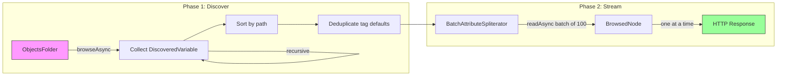
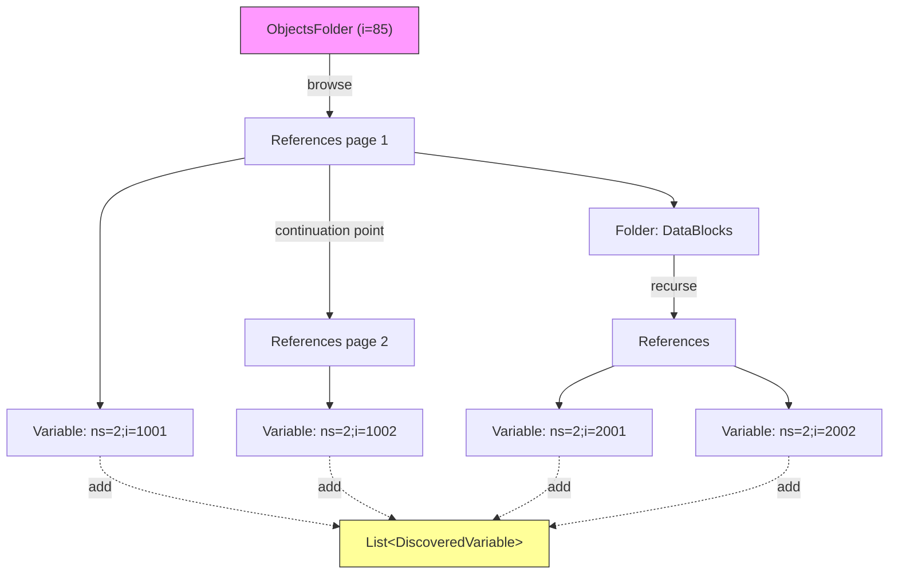
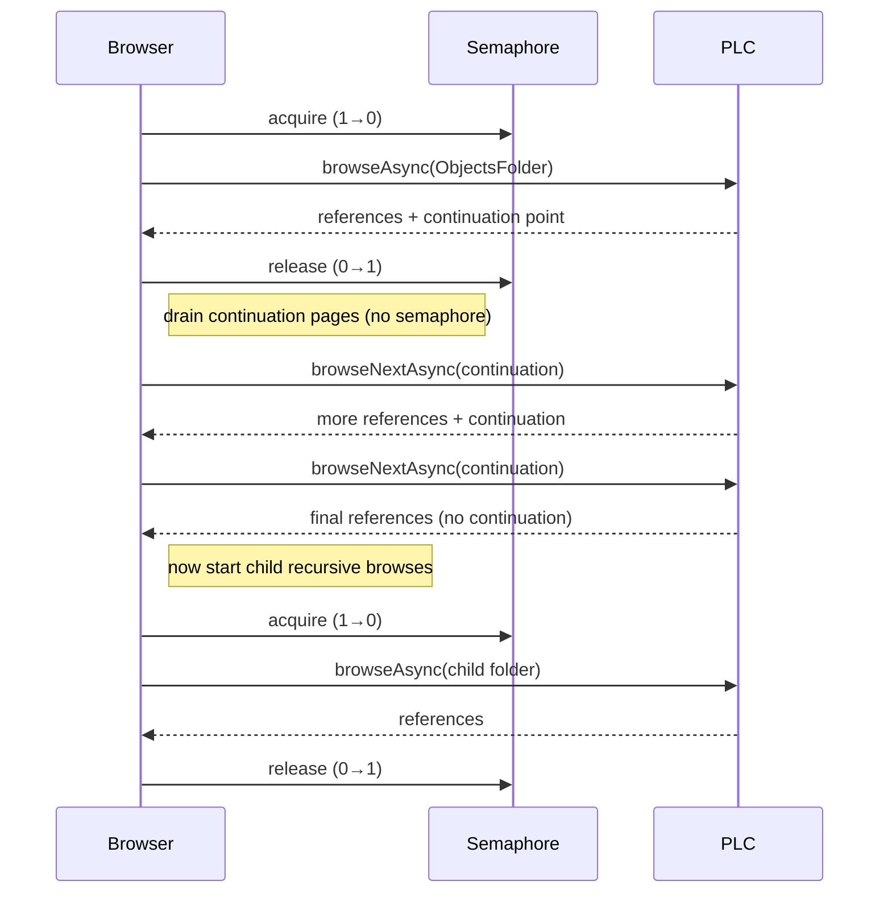
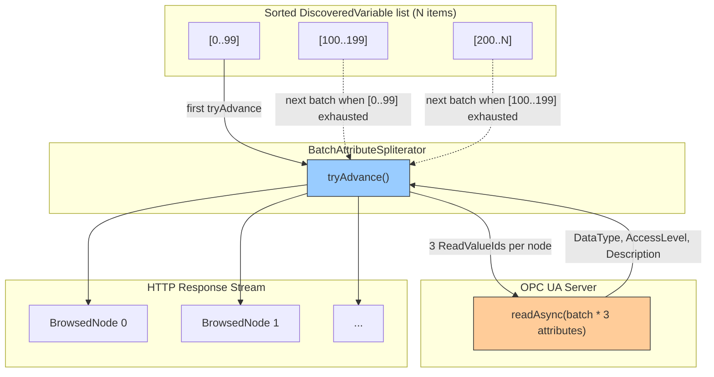
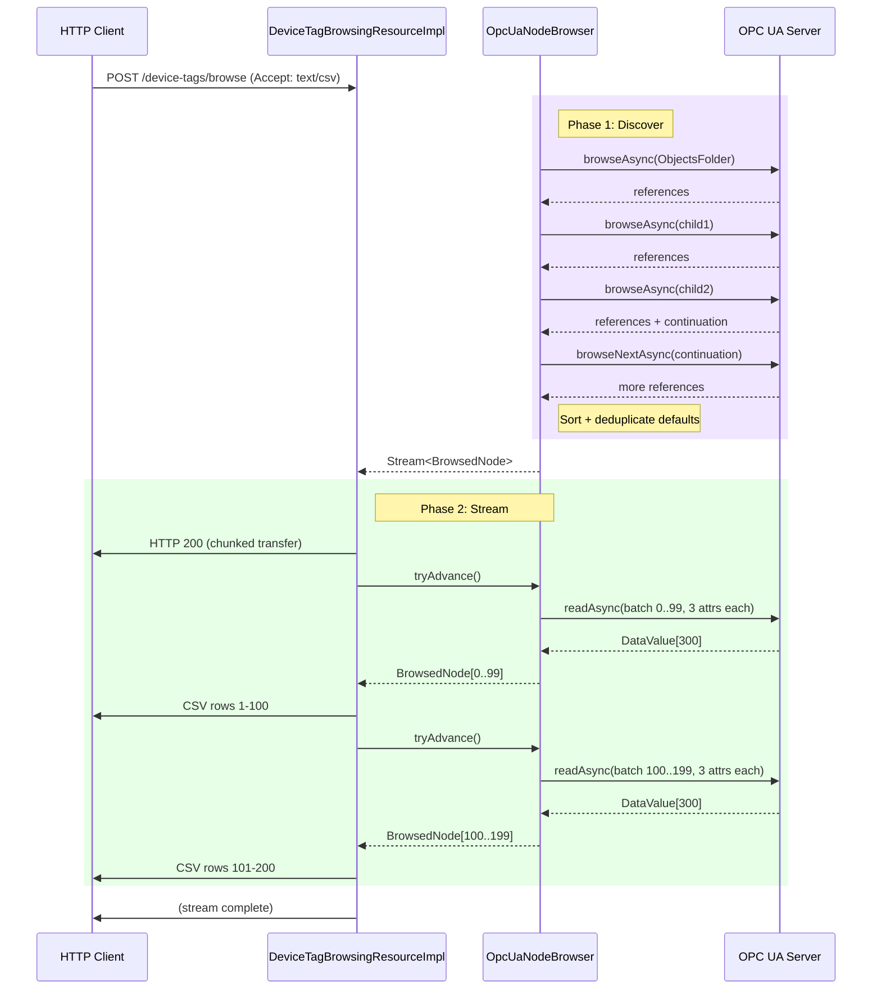

# OpcUaNodeBrowser — Two-Phase Streamed Browse

`OpcUaNodeBrowser` discovers every variable node in an OPC UA address space and
streams them as `BrowsedNode` records, complete with resolved attributes and
generated defaults. It does this in two phases: an async recursive **browse**
that collects lightweight references, followed by a lazy **batch-read** that
resolves attributes on demand as the caller consumes the stream.

## The Big Picture



**Why two phases?** Browsing is cheap (just node IDs and browse names), but
attribute reads are expensive (round-trip per batch). Phase 1 materialises only
small `DiscoveredVariable` records (~5 fields). Phase 2 lazily reads attributes
in batches of 100 as the HTTP response stream is consumed — at most one batch
of full `BrowsedNode` objects lives in memory at any time.

## Phase 1: Async Recursive Browse

Starting from `ObjectsFolder` (or a user-specified root), the browser walks the
entire hierarchical reference graph, collecting every `Variable` node it finds.



### Serialised Concurrency

Initial `browseAsync` calls are serialised through a single-permit semaphore.
Continuation-point follow-ups (`browseNextAsync`) **bypass** the semaphore
because they are part of the same logical browse and must be consumed promptly
before the server expires them.



**Why serialise initial browses?** Resource-constrained PLCs (e.g. Siemens
S7-1500) throttle concurrent browse requests, returning `Good` status with
incomplete references or `BadTooManyOperations`. This caused non-deterministic
node counts across runs. Serialising guarantees every request gets the PLC's
full attention.

**Why do continuation pages bypass the semaphore?** Continuation points are
server-side cursors with a limited lifetime. If follow-up `browseNextAsync`
calls compete with new recursive `browseAsync` calls for the semaphore, the
recursive browses may run first — and by the time the continuation point is
consumed, the PLC has expired it (`Bad_ContinuationPointInvalid`). This was
observed on Siemens S7-1500 at depth ≥ 3. The fix: `drainContinuationPages()`
consumes all pages immediately after the initial browse, then starts child
recursive browses.

### Deduplication

OPC UA address spaces are directed graphs, not trees. A node can be reachable
via multiple paths. A `ConcurrentHashMap`-backed `Set<NodeId>` tracks visited
nodes and deduplicates at two levels:

- **Folder nodes** — `visited.add(browseRoot)` in `browseRecursive` prevents
  re-traversal and infinite cycles.
- **Variable nodes** — `visited.add(nodeId)` in `handleBrowseResult` prevents
  duplicate entries in the result list.

### Status Code Enforcement

Every `BrowseResult` is checked for non-Good status:

```
if (!browseResult.getStatusCode().isGood()) {
    throw UncheckedBrowseException(...)
}
```

Without this, a throttled PLC silently returns zero references with Good-looking
empty results — entire subtrees vanish from the output without any error.

### After Collection

Once all variable references are collected, two post-processing steps run
before the stream is created:

1. **Sort by path** — `variables.sort(comparing(path))`. Since
   `DiscoveredVariable` is small (~5 fields), sorting here is cheap. This
   guarantees the output stream is ordered without needing to materialise the
   full `BrowsedNode` list.

2. **Deduplicate tag name defaults** — The full sanitised path is used as the
   default tag name (`/A/B/C` → `a-b-c`). When multiple nodes share the same
   path (e.g. Prosys simulation instances), a numeric suffix is appended:
   `name`, `name-2`, `name-3`.

## Phase 2: Lazy Batch Attribute Reads

The caller receives a `Stream<BrowsedNode>`. Under the hood, a custom
`BatchAttributeSpliterator` lazily reads attributes in batches of 100.



### How tryAdvance Works

```
tryAdvance(action):
    if currentBatch has remaining items:
        emit next item
        return true

    if no more variables:
        return false

    readNextBatch():
        take next 100 DiscoveredVariables
        build 300 ReadValueIds (3 attributes x 100 nodes)
        readAsync → server returns DataValue[300]
        for each variable:
            resolve DataType via DataTypeTree
            resolve AccessLevel from UByte
            resolve Description from LocalizedText
            build BrowsedNode with pre-computed tag default
        return List<BrowsedNode>

    emit first item from new batch
    return true
```

### Memory Profile

At any point during streaming, memory holds:

| What | Size | Lifetime |
|------|------|----------|
| `List<DiscoveredVariable>` | N x ~5 fields | Entire browse |
| `List<String>` tag defaults | N strings | Entire browse |
| Current `List<BrowsedNode>` batch | up to 100 | Until batch consumed |
| `DataValue[]` from readAsync | 300 values | Single readNextBatch call |

For 583 nodes (Prosys sim server), peak memory is the full DiscoveredVariable
list (small) plus one batch of 100 BrowsedNode records. The previous design
materialised all 583 BrowsedNode records at once — 6x the peak.

## End-to-End Flow



## Hardening Timeline

| Problem | Root Cause | Fix |
|---------|-----------|-----|
| Non-deterministic node counts (32 concurrent) | PLC returns BadTooManyOperations with zero references, silently dropping subtrees | Check `BrowseResult.getStatusCode()`, throw on non-Good |
| Non-deterministic at concurrency 4 | `browseNextAsync` bypassed semaphore, overlapping with `browseAsync` | Route initial browse ops through semaphore, reduce to 1 |
| Duplicate `tag_name_default` (parent-folder only) | `/A/B/Icon` and `/A/C/Icon` both produce `b-icon` | Use full sanitised path: `a-b-icon` vs `a-c-icon` |
| Duplicate defaults (identical paths) | Simulation instances share same browse path | Post-processing: append `-2`, `-3` suffix on collision |
| `Bad_ContinuationPointInvalid` on S7-1500 at depth ≥ 3 | Continuation point follow-ups competed with recursive browses for the semaphore; recursive browses ran first, continuation point expired on the PLC | `drainContinuationPages()` consumes all continuation pages immediately (bypassing semaphore), before starting child recursive browses |
