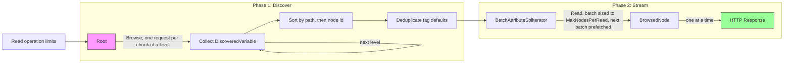
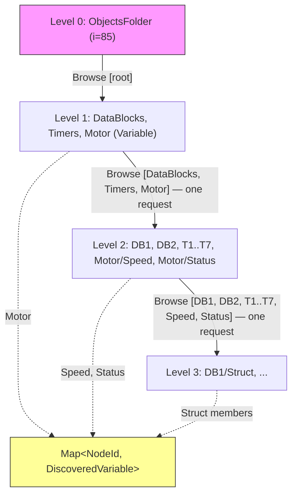
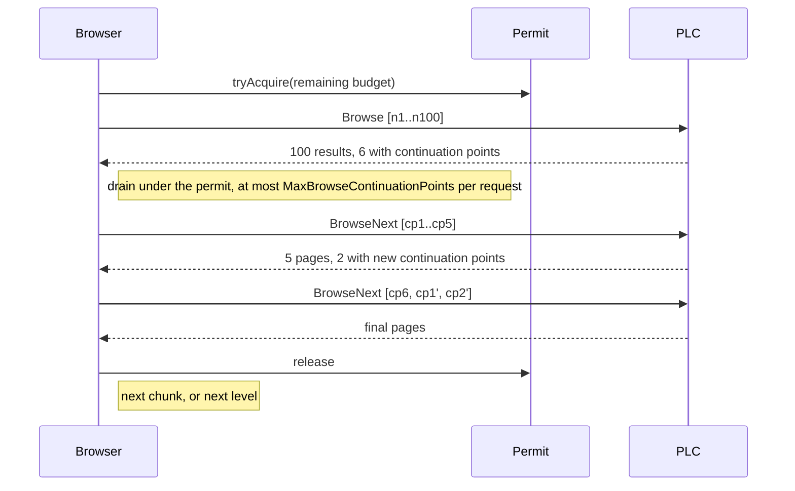
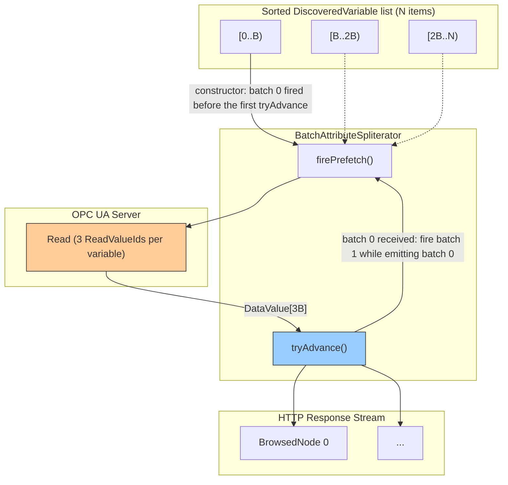
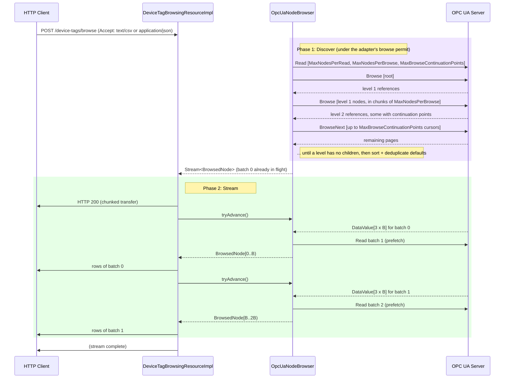

# OpcUaNodeBrowser — Two-Phase Streamed Browse

`OpcUaNodeBrowser` discovers every variable node in an OPC UA address space and
streams them as `BrowsedNode` records, complete with resolved attributes and
generated defaults. It does this in two phases: a level-wise **browse** that
collects lightweight references in as few requests as the server allows,
followed by a lazy, prefetching **batch-read** that resolves attributes as the
caller consumes the stream. Both phases size their requests to the operation
limits the server advertises, and shrink them further when the server rejects
what it advertised.

## The Classes

`OpcUaNodeBrowser` is the public entry point and only that: it parses the root,
wires the two phases together and maps every failure to a `BrowseException`.
The work is in package-private helpers, one per concern:

| Class | Concern |
|-------|---------|
| `OperationLimits` | the three advertised limits and every request size derived from them |
| `AddressSpaceWalker` | Phase 1: the level-wise traversal, chunking, retries of refused nodes |
| `ChunkBrowser` | one `Browse` for a chunk, its pages, and the accounting of every cursor |
| `Deadline` | the browse budget; every wait is measured against it |
| `ServiceFaults` | how faults, statuses and continuation points are read |
| `BatchAttributeSpliterator` | Phase 2: prefetching batch reads, halving, the stream contract |
| `AttributeResolver` | DataType / AccessLevel / Description from a `DataValue` |
| `TagDefaults` | tag names and topics from a browse path |
| `DiscoveredVariable`, `PendingNode` | the two records the phases exchange |
| `UncheckedBrowseException` | the failure of either phase, wrapped by the façade — the REST layer recognises it by simple name |

Dependencies run one way: façade → walker → chunk browser → (limits, faults,
deadline); façade → spliterator → (resolver, defaults). Each class has its own
test; `FakeOpcUaServer` in the test sources is the server they share.

## The Big Picture


```mermaid
flowchart LR
    L[Read operation limits] --> A
    subgraph "Phase 1: Discover"
        A[Root] -->|"Browse, one request per chunk of a level"| B[Collect DiscoveredVariable]
        B -->|next level| B
        B --> C[Sort by path, then node id]
        C --> D[Deduplicate tag defaults]
    end

    subgraph "Phase 2: Stream"
        D --> E[BatchAttributeSpliterator]
        E -->|"Read, batch sized to MaxNodesPerRead, next batch prefetched"| F[BrowsedNode]
        F -->|one at a time| G[HTTP Response]
    end

    style A fill:#f9f,stroke:#333
    style G fill:#9f9,stroke:#333
```

**Why two phases?** Browsing is cheap (node ids and browse names), attribute
reads are expensive (a round trip per batch). Phase 1 materialises only small
`DiscoveredVariable` records (~5 fields). Phase 2 reads attributes lazily as the
HTTP response is written — at most two batches of full `BrowsedNode` objects
exist at any time: the one being emitted and the one in flight.

**Budget.** One `browse()` call has a 120 s budget for Phase 1 — including the
wait for the browse permit — and each Phase 2 read gets the same 120 s on its
own. A browse never blocks past its budget, and every wait is interruptible.

### Operation limits

Before Phase 1 starts, one `Read` fetches the server's advertised limits, and
its round trip overlaps the start of the traversal:

| Node | Used for | Typical values |
|------|----------|----------------|
| `MaxNodesPerRead` (i=11705) | variables per Phase 2 read: `min(100, limit / 3)` — three attributes are read per variable, and the limit counts `ReadValueId`s, not nodes | S7-1500 1000, Codesys/WAGO 100 (→ 33 variables), Prosys 10000 |
| `MaxNodesPerBrowse` (i=11710) | nodes per `Browse` request: `min(100, limit)` | S7-1500 1000, WAGO 100, Prosys 10000 |
| `MaxBrowseContinuationPoints` (i=2735, a UInt16) | cursors per `BrowseNext`, per release request, and the chunk size when re-browsing nodes the server could not page | S7-1500 5, WAGO 50, Prosys 1000 |

A missing node, a failed read or a value of 0 means "not advertised" and the
defaults apply (100 nodes per browse, 100 variables per read). The advertised
value is a starting point, not a contract: a request refused as too big —
`Bad_TooManyOperations`, `Bad_ResponseTooLarge`, `Bad_RequestTooLarge`,
`Bad_EncodingLimitsExceeded`, `Bad_TcpMessageTooLarge` — is halved and sent
again, down to one node or one variable per request; only a rejection at size
one fails the browse.

## Phase 1: Level-wise Batched Browse

Starting from `ObjectsFolder` (or a user-specified root), `AddressSpaceWalker`
walks the hierarchical reference graph breadth-first. All nodes of a level are browsed in
chunks, one `Browse` request per chunk, and every continuation point of a chunk
is drained before the next chunk goes out. Variables found on the way are
recorded; every child — Object *or* Variable — is queued for the next level.


```mermaid
flowchart TD
    Root["Level 0: ObjectsFolder (i=85)"] -->|"Browse [root]"| L1["Level 1: DataBlocks, Timers, Motor (Variable)"]
    L1 -->|"Browse [DataBlocks, Timers, Motor] — one request"| L2["Level 2: DB1, DB2, T1..T7, Motor/Speed, Motor/Status"]
    L2 -->|"Browse [DB1, DB2, T1..T7, Speed, Status] — one request"| L3["Level 3: DB1/Struct, ..."]

    L1 -.->|"Motor"| VMap["Map&lt;NodeId, DiscoveredVariable&gt;"]
    L2 -.->|"Speed, Status"| VMap
    L3 -.->|"Struct members"| VMap

    style Root fill:#f9f,stroke:#333
    style VMap fill:#ff9,stroke:#333
```

**Why breadth-first in batches?** One request per node was the previous shape.
On a real PLC over a WAN link (95 ms RTT to the lab S7-1500) that put a
full-depth browse near the 120 s budget once nested variables were included;
a level of 480 nodes is now five round trips instead of 480.

**Why are Variables traversed?** Struct members, array elements and properties
are Variables under a Variable — `/DB1/Struct/A`, `/DB1/Arr/0`. A traversal
that stops at Variables silently loses them, and a data block whose members
are all such Variables browses as a single tag.

### The Browse Permit

Every `Browse` and every `BrowseNext` — `ChunkBrowser`'s whole job — runs under a single permit, shared by all
browses against the same adapter (`OpcUaProtocolAdapter` owns it, EDG-576).
The permit is held for the whole chunk: from the `Browse` until the last
continuation page of that chunk has been consumed.


```mermaid
sequenceDiagram
    participant Browser
    participant Permit
    participant PLC

    Browser->>Permit: tryAcquire(remaining budget)
    Browser->>PLC: Browse [n1..n100]
    PLC-->>Browser: 100 results, 6 with continuation points
    note right of Browser: drain under the permit, at most MaxBrowseContinuationPoints per request
    Browser->>PLC: BrowseNext [cp1..cp5]
    PLC-->>Browser: 5 pages, 2 with new continuation points
    Browser->>PLC: BrowseNext [cp6, cp1', cp2']
    PLC-->>Browser: final pages
    Browser->>Permit: release
    note right of Browser: next chunk, or next level
```

**Why serialise?** Resource-constrained PLCs (Siemens S7-1500) throttle
concurrent browse requests, returning `Good` with incomplete references or
`Bad_TooManyOperations`. That caused non-deterministic node counts across runs.
Serialising guarantees every request gets the PLC's full attention.

**Why drain under the permit?** Continuation points are server-side cursors
with a short lifetime and a small pool (five per session on the S7-1500). If a
chunk's cursors were left open while another browse — or the next chunk — ran,
the PLC would expire them (`Bad_ContinuationPointInvalid`, observed at depth
≥ 3) or refuse new ones. Draining before the permit is released means the pool
is empty whenever anyone else gets to browse.

**Why is the wait bounded?** A browse queued behind another one on the same
adapter waits with `Deadline.tryAcquire(permit)`: it fails with the
browse timeout when the budget runs out, and gives up promptly when its thread
is interrupted. An unbounded wait would let a concurrent request
outlive its own timeout.

### Continuation-Point Accounting

The server's cursor pool is the scarcest resource in the whole operation, so
`ChunkBrowser` tracks every cursor the server has handed out and guarantees
none is left behind:

- **Draining** sends at most `MaxBrowseContinuationPoints` cursors per
  `BrowseNext` (Milo hands out more per `Browse` than it accepts per
  `BrowseNext`); a `BrowseNext` refused as too many operations is halved.
- **Any failure after cursors were handed out** — a bad sibling in the same
  response, a non-Good continuation page, a missing result, a timeout —
  releases every cursor still open (`BrowseNext` with
  `releaseContinuationPoints = true`) before the failure propagates. The
  release is fire-and-forget, batched to the advertised capacity, and a batch
  refused as too many operations is halved down to one cursor per request.
- **A response that lands after the browse stopped waiting for it** (timeout,
  interrupt) may carry cursors nobody will drain. The in-flight future is not
  cancelled; a callback releases whatever the late response hands out.
- **`Bad_NoContinuationPoints`** on a result is not a failure: the server could
  not page that node *now*. Such nodes are browsed again in chunks of
  `MaxBrowseContinuationPoints` (or half the previous chunk when none is
  advertised); a single node still refused is retried three times with a 500 ms
  pause — another client (UaExpert, TIA Portal) may be holding the pool — and
  only then fails the browse with the node's path.

### Deduplication

OPC UA address spaces are directed graphs, not trees; a node can be reachable
via several paths. Two structures keep this straight, and keeping them apart
is what allows Variables to be traversed:

- **`visited` (`Set<NodeId>`)** guards the traversal: a node is queued for the
  next level once, whichever path found it first, so cycles terminate.
- **`variables` (`LinkedHashMap<NodeId, DiscoveredVariable>`)** records each
  Variable once, under the first path it was met on — breadth-first, that is
  the shallowest path.

(A single set doing both jobs was the original design; marking a Variable
"visited" when it was recorded is why its children were never browsed.)

### Status Code Enforcement

Every `BrowseResult`, initial or continuation page, is checked:

| Result | Handling |
|--------|----------|
| `Good` | references collected, continuation point drained |
| `Bad_NoContinuationPoints` | re-browsed in a smaller chunk (see above) |
| any other non-Good | `UncheckedBrowseException` with the node's path; open cursors released |
| missing (fewer results than descriptions) | same — one result per description is the service contract, a missing one is a subtree we know nothing about |

Without this a throttled PLC silently returns zero references with Good-looking
empty results, and entire subtrees vanish from the output without any error.

### After Collection

1. **Sort by path, then node id** — `DiscoveredVariable` is small, so sorting
   here is cheap and the output stream is ordered without materialising the
   full `BrowsedNode` list. The node-id tie-break makes collision suffixes
   (below) independent of the order the server listed the nodes in, so repeated
   browses are byte-identical.

2. **Deduplicate tag name defaults** — the full sanitised path is the default
   tag name (`/A/B/C` → `a-b-c`). When several nodes share a path (Prosys
   simulation instances), a numeric suffix is appended: `name`, `name-2`,
   `name-3`.

Between the phases `AttributeResolver.forClient` fetches the client's
`DataTypeTree` (Milo builds it on first use by browsing the DataType hierarchy,
then caches it per session).

## Phase 2: Lazy, Prefetching Batch Reads

The caller receives a `Stream<BrowsedNode>`. `BatchAttributeSpliterator`
reads three attributes per variable — DataType, AccessLevel, Description — in
batches of `OperationLimits.readBatchSize()` variables, and always keeps one
batch in flight ahead of the one being emitted.


```mermaid
flowchart TD
    subgraph "Sorted DiscoveredVariable list (N items)"
        V1["[0..B)"]
        V2["[B..2B)"]
        V3["[2B..N)"]
    end

    subgraph "BatchAttributeSpliterator"
        TA["tryAdvance()"]
        PF["firePrefetch()"]
    end

    subgraph "OPC UA Server"
        RD["Read (3 ReadValueIds per variable)"]
    end

    subgraph "HTTP Response Stream"
        BN1["BrowsedNode 0"]
        BNx["..."]
    end

    V1 -->|"constructor: batch 0 fired before the first tryAdvance"| PF
    PF --> RD
    RD -->|"DataValue[3B]"| TA
    TA --> BN1
    TA --> BNx
    TA -->|"batch 0 received: fire batch 1 while emitting batch 0"| PF
    V2 -.-> PF
    V3 -.-> PF

    style TA fill:#9cf,stroke:#333
    style RD fill:#fc9,stroke:#333
```

**Why prefetch?** Milo's channel is strictly serial, so prefetching adds no
concurrent load on the server: the next read is dispatched only after the
previous response has landed, but before the client has finished emitting the
current batch. Serialising a batch to CSV/JSON and the next read's round trip
cost about the same, so overlapping them roughly halves Phase 2 wall time on
large address spaces.

### How tryAdvance Works

```
constructor:
    nextBatchFuture = firePrefetch()          # batch 0 is on the wire already

tryAdvance(action):
    if currentBatch has remaining items:
        emit next item, return true
    if nextBatchFuture is null:               # end of the variable list
        return false
    currentBatch = await(nextBatchFuture)     # halves and re-reads on rejection
    nextBatchFuture = firePrefetch()          # next batch overlaps this one's emission
    emit first item of currentBatch, return true

firePrefetch():
    take the next batchSize DiscoveredVariables (snapshot)
    build 3 ReadValueIds per variable
    readAsync(...).orTimeout(120 s).thenApply(buildBatch)

buildBatch(batch, values):
    fail unless values.length >= 3 * batch.size()    # never misalign attributes
    for each variable: AttributeResolver turns the three DataValues into strings,
                       TagDefaults supplies the topics, the tag name is precomputed
```

`await()` is where the advertised read limit meets reality: a
`Bad_TooManyOperations` (or response-too-large) fault halves `batchSize` and
re-issues the *same slice*; only a rejected read of a single variable fails the
stream. `estimateSize()` stays exact through all of this (the `SIZED`
characteristic counts the in-flight batch as remaining).

### Memory Profile

| What | Size | Lifetime |
|------|------|----------|
| `List<DiscoveredVariable>` | N × ~5 fields | entire browse |
| `List<String>` tag defaults | N strings | entire browse |
| current `List<BrowsedNode>` batch | ≤ batchSize (≤ 100) | until consumed |
| in-flight batch (`DataValue[]` → `List<BrowsedNode>`) | ≤ 3 × batchSize values | one read |

For 583 nodes (Prosys simulation server) the peak is the full
`DiscoveredVariable` list (small) plus two batches of `BrowsedNode` records.
The original design materialised all 583 `BrowsedNode` records at once.

## End-to-End Flow


```mermaid
sequenceDiagram
    participant Client as HTTP Client
    participant REST as DeviceTagBrowsingResourceImpl
    participant Browser as OpcUaNodeBrowser
    participant PLC as OPC UA Server

    Client->>REST: POST /device-tags/browse (Accept: text/csv or application/json)

    rect rgb(240, 230, 255)
        note right of Browser: Phase 1: Discover (under the adapter's browse permit)
        Browser->>PLC: Read [MaxNodesPerRead, MaxNodesPerBrowse, MaxBrowseContinuationPoints]
        Browser->>PLC: Browse [root]
        PLC-->>Browser: level 1 references
        Browser->>PLC: Browse [level 1 nodes, in chunks of MaxNodesPerBrowse]
        PLC-->>Browser: level 2 references, some with continuation points
        Browser->>PLC: BrowseNext [up to MaxBrowseContinuationPoints cursors]
        PLC-->>Browser: remaining pages
        note right of Browser: ... until a level has no children, then sort + deduplicate defaults
    end

    Browser-->>REST: Stream<BrowsedNode> (batch 0 already in flight)

    rect rgb(230, 255, 230)
        note right of REST: Phase 2: Stream
        REST->>Client: HTTP 200 (chunked transfer)
        REST->>Browser: tryAdvance()
        PLC-->>Browser: DataValue[3 x B] for batch 0
        Browser->>PLC: Read batch 1 (prefetch)
        Browser-->>REST: BrowsedNode[0..B)
        REST->>Client: rows of batch 0
        REST->>Browser: tryAdvance()
        PLC-->>Browser: DataValue[3 x B] for batch 1
        Browser->>PLC: Read batch 2 (prefetch)
        Browser-->>REST: BrowsedNode[B..2B)
        REST->>Client: rows of batch 1
    end

    REST->>Client: (stream complete)
```

## Hardening Timeline

| Problem | Root Cause | Fix |
|---------|-----------|-----|
| Non-deterministic node counts (32 concurrent) | PLC returns `Bad_TooManyOperations` with zero references, silently dropping subtrees | Check `BrowseResult.getStatusCode()`, throw on non-Good (EDG-217) |
| Non-deterministic at concurrency 4 | `browseNextAsync` bypassed the semaphore, overlapping with `browseAsync` | Route initial browse operations through the semaphore, reduce it to one permit (EDG-217) |
| Duplicate `tag_name_default` (parent-folder only) | `/A/B/Icon` and `/A/C/Icon` both produce `b-icon` | Use the full sanitised path: `a-b-icon` vs `a-c-icon` (EDG-217) |
| Duplicate defaults (identical paths) | Simulation instances share the same browse path | Post-processing: append `-2`, `-3` on collision (EDG-217) |
| `Bad_ContinuationPointInvalid` on S7-1500 at depth ≥ 3 | Continuation pages competed with recursive browses for the permit; the PLC expired the cursor before it was consumed | Drain every continuation page right after the `Browse` — bypassing the permit in EDG-217, under the permit since EDG-1034 |
| Concurrent REST browses on one adapter overlapped on the device | Each `browse()` call created its own `Semaphore(1)` | One permit per adapter, owned by `OpcUaProtocolAdapter`, shared by every browser (EDG-576) |
| Phase 2 wall time dominated by serial read-then-serialise | Each batch was read only when the previous one was fully emitted | Prefetch: batch N+1 in flight while batch N is serialised (EDG-486) |
| Collision suffixes differed between runs | Sort by path only; nodes sharing a path kept the server's order | Tie-break the sort on node id (EDG-486) |
| HTTP 500 `Bad_TooManyOperations` on WAGO PFC200 (Codesys) | 100 variables × 3 attributes = 300 `ReadValueId`s against a `MaxNodesPerRead` of 100 | Size the read batch from the advertised limit; halve and re-read the same slice on rejection (EDG-1034) |
| Struct members, array elements, properties missing from every browse | One `visited` set marked Variables as traversed when they were recorded | Separate `variables` map from `visited` set; traverse Variables (EDG-1034) |
| Full-depth browse of the S7-1500 near the 120 s budget over a 95 ms link | One `Browse` request per node | Level-wise traversal, one request per chunk of `MaxNodesPerBrowse` nodes (EDG-1034) |
| `Bad_NoContinuationPoints` at `/S7-1500/Timers` | A chunk of 100 nodes with six paging folders against a pool of five | Re-browse refused nodes in chunks of `MaxBrowseContinuationPoints`; bounded retries at one node (EDG-1034) |
| Six-cursor `BrowseNext` refused by Milo, then the release refused too, starving every later browse | Server hands out more cursors per `Browse` than it accepts per `BrowseNext` | Batch `BrowseNext` and release requests to the advertised capacity, halve on refusal (EDG-1034) |
| A queued browse could outlive its timeout | `acquireUninterruptibly()` on the permit, outside the budget | `tryAcquire(remaining budget)`, interruptible (EDG-1034 review) |
| A bad sibling in a chunk leaked the other nodes' cursors | Failure thrown before the response's cursors were tracked | Track every cursor of a response before judging any status; release on failure (EDG-1034 review) |
| A response landing after the timeout leaked its cursors | The timed wait returned before cursor tracking started | Callback on the in-flight future releases what a late response hands out (EDG-1034 review) |
| A release batch refused as too many operations was only logged | Release trusted the advertised capacity | Halve refused release batches down to one cursor per request (EDG-1034 review) |
| A short `Read` response crashed with an index error, or could misalign attributes | Result count trusted | Fail the batch unless one `DataValue` per `ReadValueId` came back (EDG-1034 review) |
