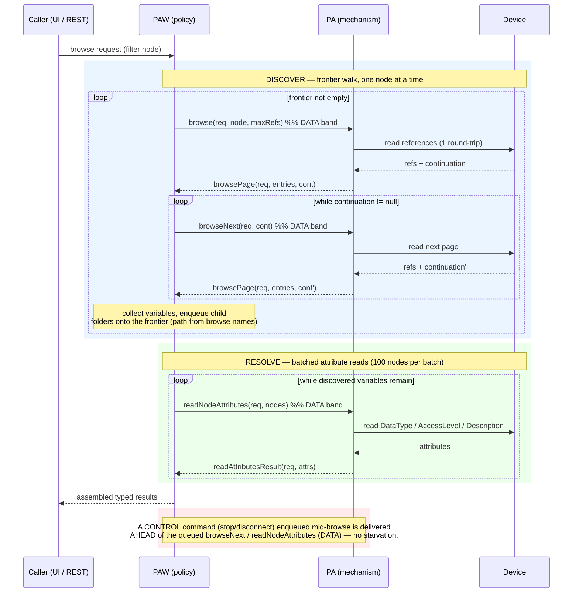
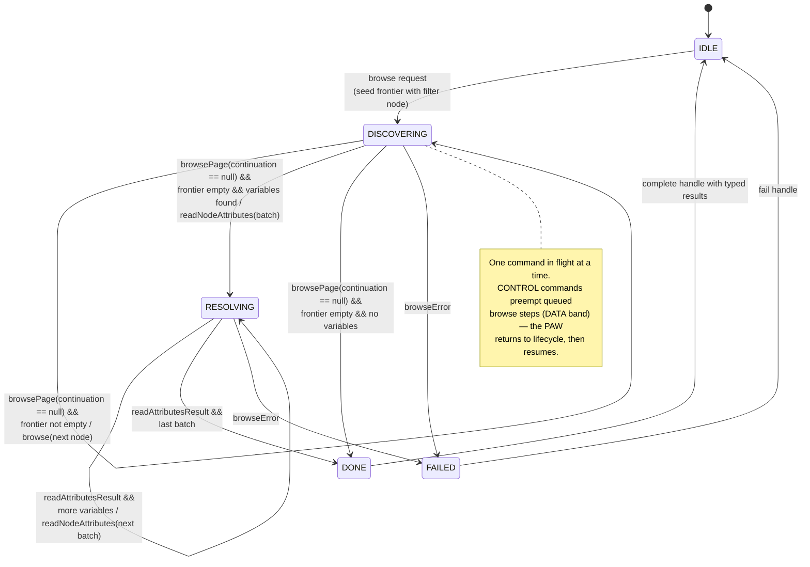

# EDG-737 — Paginated Browse: Design (message flow + state machine)

How browse works in the SDK v2 contract after the Finding-B change: the protocol adapter (PA) is pure
mechanism and serves **one page (or one batch) per command**; the framework (PAW) owns the policy — the
frontier traversal, the visited set, the continuation drain, and the attribute batching. Browse is two phases:
**DISCOVER** walks the address space and assembles the flat node list, then **RESOLVE** reads the discovered
variables' attributes (datatype, access, description) so the framework can build typed tag definitions.

## Contract

| Direction | Operation | Band | Meaning |
|-----------|-----------|------|---------|
| PAW → PA | `browse(requestId, filter, maxReferences)` | DATA | DISCOVER: first page below the filter node; `maxReferences=0` lets the device decide, `>0` forces pagination |
| PAW → PA | `browseNext(requestId, continuation)` | DATA | DISCOVER: next page for an open continuation |
| PA → PAW | `browsePage(requestId, entries, continuation?)` | event | one page; each entry is `{node, type, selectable, browseName}`; `continuation == null` ⇒ last page |
| PAW → PA | `readNodeAttributes(requestId, nodes)` | DATA | RESOLVE: read the discovered nodes' attributes in one batched round-trip |
| PA → PAW | `readAttributesResult(requestId, attributes)` | event | one `ResolvedAttributes` per node, reported once for the batch |
| PA → PAW | `browseError(requestId, reason)` | event | a DISCOVER page or RESOLVE batch failed (e.g. expired continuation point) |

`BrowseContinuation` is an opaque, adapter-owned token (e.g. a base64-encoded OPC-UA continuation point). Each
page is a single mailbox round-trip, so the dispatch thread is released between pages. RESOLVE rides the same
DATA band and reads attributes in batches (100 nodes per round-trip), so a large variable set never starves
lifecycle commands either. A single `requestId` correlates a browse's DISCOVER pages and RESOLVE batches.
`ResolvedAttributes` carries the protocol datatype id as a string (the SDK imposes no cross-protocol datatype
vocabulary — the schema/import layer maps it) plus the SDK's `AccessFlags` and a description.

**Browse name.** Each `browsePage` entry carries the node's `browseName` — its human-meaningful name within its
parent (for OPC-UA the BrowseName attribute, e.g. `Temperature`), distinct from the `nodeId` machine address.
It rides the browse *entry*, not RESOLVE, on purpose: the PAW assembles each node's **path** from its ancestors'
browse names while walking (`/Plant/Line1/Temperature`), and derives a default **tag name** from that path
(`plant-line1-temperature`). The parentage is known only during the walk, so this cannot be reconstructed from a
per-node RESOLVE read afterwards — the name must be on the discovery entry.

## Message flow

## State machine (PAW browse engine)

The engine is a two-phase sub-FSM gated on the connection resting in `CONNECTED`: **DISCOVERING** (paginated
frontier walk) then **RESOLVING** (batched attribute reads). Exactly one PA command is in flight at a time in
either phase, and the same per-step watchdog arms each command.

### Transitions

| From → To | Trigger (event) | Guard | Action |
|-----------|-----------------|-------|--------|
| `[*] → IDLE` | engine constructed | — | wait for a browse request |
| `IDLE → DISCOVERING` | browse request | — | seed the frontier with the filter node, mark it visited, issue `browse(filter, maxRefs)` |
| `DISCOVERING → DISCOVERING` *(drain)* | `browsePage` | `continuation != null` | issue `browseNext(continuation)` — finish the **current** node's pages before any sibling |
| `DISCOVERING → DISCOVERING` *(advance)* | `browsePage` | `continuation == null` && frontier not empty | collect variables / enqueue child folders (each entry's `browseName` extends the parent path), pop the next frontier node, issue `browse(next node)` |
| `DISCOVERING → RESOLVING` | `browsePage` | `continuation == null` && frontier empty && variables found | sort the variables, issue `readNodeAttributes(first batch)` |
| `DISCOVERING → DONE` | `browsePage` | `continuation == null` && frontier empty && no variables | nothing to resolve — assemble an empty result |
| `RESOLVING → RESOLVING` | `readAttributesResult` | more variables remain | append the resolved nodes, issue `readNodeAttributes(next batch)` |
| `RESOLVING → DONE` | `readAttributesResult` | last batch | assemble the typed node list |
| `DISCOVERING → FAILED` / `RESOLVING → FAILED` | `browseError` | — | abandon (expired continuation point, transport error, step watchdog) |
| `DONE → IDLE` | — | — | hand the assembled typed results to the caller's `BrowseHandle`, reset |
| `FAILED → IDLE` | — | — | report the failure to the `BrowseHandle`, reset |

The two DISCOVER self-loops are the crux of the walk: **drain before advance**. A page that carries a non-null
continuation (loop 1) is drained to completion — `browseNext` after `browseNext` — *before* the engine pops
the next folder off the frontier (loop 2). DISCOVER terminates only when a page closes (`continuation == null`)
**and** the frontier is empty; if it found variables it hands off to RESOLVE, otherwise straight to `DONE`.
RESOLVE then self-loops one batch (100 nodes) per round-trip until every discovered variable is typed. Exactly
one PA command is outstanding at any moment across both phases, and the PAW thread returns to its mailbox
between steps — the interleave point where a queued `CONTROL` command (`Stop`/`Disconnect`) overtakes the next
`browseNext`/`readNodeAttributes` and drives the active phase to `FAILED` via the cancel path (folded into
`browseError` above rather than drawn as a separate edge).

## Why this fixes Finding B

The previous single-shot `browse(filter) → browseResult(list)` made the PA walk the whole address space inside
one `do*` call on its single dispatch thread, occupying it for the entire (paginated, multi-round-trip) walk
and starving polls and lifecycle commands. Decomposing into `browse`/`browseNext` page commands creates an
interleave point after every page: the dispatch thread is free between pages, and because browse rides the
**DATA** band, a queued `CONTROL` command (`Stop`/`Disconnect`) is delivered ahead of the next page. The PA
stays pure mechanism (one page per command); all traversal policy lives in the PAW. RESOLVE keeps the same
property: attribute reads are a batched DATA-band command, so the dispatch thread is free between batches too —
the PA never holds it for the whole resolve.

## Verification

Exercised end-to-end against an embedded OPC-UA (Milo) server (`OpcUaFoundationConformanceTest`):

- **DISCOVER pagination** — `maxReferences=1` forces continuation-point pagination; pages (with a simulated
  per-page device delay) assemble into the full variable set.
- **CONTROL preemption** — a `disconnect` fired mid-browse is handled before the queued `browseNext`.
- **RESOLVE** (`browse_thenResolve_resolvesDeclaredAttributesOfDiscoveredVariables`) — after DISCOVER, one
  `readNodeAttributes` batch resolves every discovered variable's attributes, reported once; the Int32 and
  Double test nodes resolve to their declared OPC-UA datatype ids (`NodeIds.Int32` / `NodeIds.Double`) and a
  readable `AccessFlags`.
- **Whole-engine, large tree** (`OpcUaBrowseEngineConformanceTest`) — a reference engine
  (`ReferenceBrowseEngine`, the traversal policy the production PAW will own) walks a deep, branching address
  space (`TestNamespace.growLargeTree`, ~500 variables by default, parameterized for soak via
  `-Dedg737.browse.*`) through both phases and asserts the result is sound: **completeness** (exactly the
  generated variables), **dedup** (a variable shared by two folders discovered once), **termination** (a
  reference cycle does not loop — each folder browsed exactly once), **pagination** (small `maxReferences`
  forces continuations), **typing** (each variable's datatype matches the generator), **path assembly** (each
  variable's path, built from browse names, matches the generated hierarchy) and **default tag names** (derived
  from the path, non-empty and unique), and **batching** (`readNodeAttributes` issued ⌈n/100⌉ times). The
  synchronous `DrainOnCallDispatcher` makes the whole walk deterministic — one `drainAll()`, no timing
  dependence.
- **Tag-name policy units** (`ReferenceBrowseEngineTest`) — `sanitize` / `tagNameDefault` / `dedupDefaults` as
  pure functions (path → `plant-line-1-temperature`, collision suffixing), no server.
